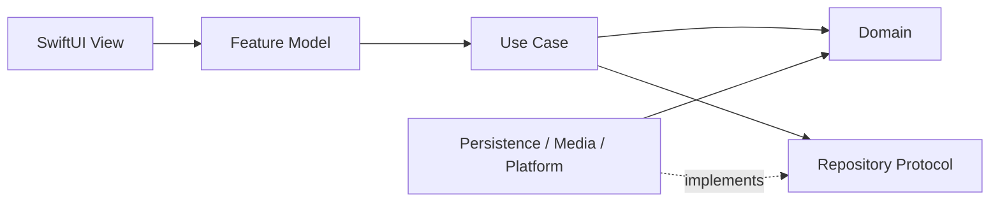
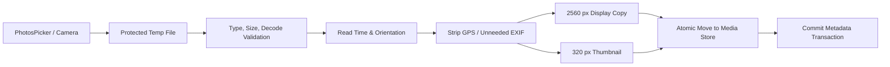

# Mom-Baby P0-L iOS 客户端详细设计

| 项目 | 内容 |
| --- | --- |
| 文档版本 | v1.1 |
| 日期 | 2026-08-21 |
| 适用范围 | 本地 MVP（P0-L） |
| 目标 | 无账号、无业务服务端、离线完整可用 |

> **基线说明：** 本文固定对应 [`MVP-PRD.md`](./MVP-PRD.md) v0.4，并受已接受的 [`ADR-001`](./ADR-001-MVP-SCOPE-AND-DATA-BOUNDARY.md) 强制约束，是 P0-L 的 iOS 实施基线。P1-S/P1-C/P1-R0 各自立项，不得借客户端预留或文案静默扩大 P0-L。

> **实施合同：** 本文正文与附录 A 的 v1 DDL 共同构成 P0-L 客户端实施基线；字段、外键、删除动作、触发器和状态枚举不得由各 Feature 自行推断。公开发布所需的完整恢复能力另由 [`MVP-LOCAL-ARCHIVE-SPEC.md`](./MVP-LOCAL-ARCHIVE-SPEC.md) 冻结。

## 1. 设计目标与非目标

### 1.1 目标

- 在无网络、无账号情况下完成 PRD 的首次使用、照护记录、计时、用品追溯、成长和相册闭环。
- App 被切后台、锁屏、系统终止或设备重启后，计时事实仍可恢复。
- 数据库层保证幂等、引用完整性、不可变用品版本和关键并发约束。
- 宝宝数据与哺乳者成人数据保持独立所有权，删除一个数据主体不能越权级联删除另一个主体的数据。
- 所有统计均能从原始数据重建，不保存不可解释的累计值。
- 本地架构保持可迁移，但 P1-S 的当前默认方向是自建零知识密文同步服务；CloudKit 仅是不可选研究项，只有 Apple 书面确认、能力验证和新的 Accepted ADR 后才能重新进入选型。

### 1.2 非目标

- P0-L 不做账号、跨设备同步、家庭邀请、远程删除、服务端设备租约。
- 不做主动召回公告监测、远程推送或后台抓取。
- 不接 HealthKit，不输出医疗诊断或生长“正常/异常”结论。
- 不做原图永久备份、Live Photo、视频或完整照片 ZIP。
- 不为未来能力预埋正在运行的网络请求、SDK 或空账号体系。

### 1.3 本机身份与设备信任边界

P0-L 采用**一次安装、一个受信任成人**的明确边界。`local_actor` 表示本安装中自我声明的监护人/哺乳者操作者，用于数据归属、导出隔离和未来迁移，不表示 App 已验证现实世界身份。

`LocalAuthentication` 只能确认某位拥有设备生物识别或设备密码权限的人通过了认证，不能告诉 App 是哪一位成人，也不能阻止知道设备密码或已录入生物信息的家庭成员沿用当前 `local_actor`。因此：

- App 锁只防止未获设备解锁权限的人随手打开，不作为哺乳者人员身份认证；
- P0 不提供同一安装上的多人切换，也不宣传“共享一台已解锁 iPhone 时仍能区分不同成人”；
- 建档和首次启用哺乳模块时必须展示该限制；用户不能接受时，应使用个人设备并开启 App 锁，或等待 P1-C 的账号/成员能力；
- 成人域与宝宝域仍严格分表、分导出、分删除；这是数据模型边界，不是共享设备上的强身份隔离；
- 若产品将“其他家庭成员绝不能沿用哺乳者身份”保留为硬承诺，必须另立账号或独立凭据方案，不能用 Face ID/Touch ID 冒充该能力。

## 2. 工程基线

### 2.1 版本建议

- Xcode：使用团队发布时统一的稳定版，不以 beta SDK 出包。
- Swift：Swift 6 language mode，开启严格并发检查。
- 最低部署版本：暂定 iOS 18.0；正式锁定前用目标家庭设备访谈/TestFlight 数据验证。
- 设备：iPhone 优先；iPad 仅保证兼容，不设计专属双栏工作流。
- 屏幕方向：iPhone 首版只支持竖屏。相机系统界面按系统能力处理。

当前工程的 iOS 26.5 最低版本应在 T0 下调。若最低版本最终仍高于 iOS 18，必须有明确设备覆盖数据，而不是沿用建项目时的默认值。工程当前还处于 Swift 5、App target 默认 MainActor，并声明 iPhone 横屏；T0 必须切到 Swift 6 完整严格并发检查，并把方向配置与产品决定统一。

### 2.2 依赖选择

运行时依赖建议只保留：

- **GRDB.swift：** SQLite schema、migration、事务、查询观察和测试数据库。

系统框架：

- SwiftUI / Observation；
- Foundation / OSLog；
- PhotosUI / AVFoundation / ImageIO / UniformTypeIdentifiers；
- Vision（端上 OCR 和码识别）；
- LocalAuthentication / Security / CryptoKit；
- UserNotifications 仅在未来 Backlog 的本机提醒或 P1-R0 的本地召回通知正式立项时接入；
- MetricKit 仅用于本机诊断回调，不自动上传业务内容。

SwiftData 在 iOS 18 已提供 `ModelActor`、事务、`#Unique`、`#Index` 和版本迁移，做一般本地记录 App 完全可行；但它不直接表达本方案依赖的部分唯一索引、SQL CHECK/trigger 约束和精细查询计划，而且 unique 冲突行为不应被当作业务锁。当前领域有二十余张相互引用的表、不可变版本、幂等 ledger 和未来自定义同步，因此默认选择 GRDB，把关键不变量下沉到 SQLite。

如果团队明确坚持 Apple-only 依赖，可在 T0 做一个限时 Spike：用 SwiftData + 单一 `@ModelActor` + `ActiveResourceLock` + `OperationReceipt` 实现“双边原子开始、单侧唯一占用、重复 finish、版本迁移”四个用例。只有故障注入与磁盘数据库测试全部通过，才可替换 GRDB 决策。两种持久化只能选一种，SwiftData 不得仅作为 Preview 的第二套业务模型。

## 3. 模块与依赖方向

从 T0 就建立一个仓库内 Local Swift Package；这不是按团队人数优化，而是并发隔离和可测试性的正确性边界：

- App target 保持默认 MainActor，只包含 App、Features、DesignSystem 和 iOS 组合根；
- `MomBabyCore` package 使用 Swift 6、默认 nonisolated，至少拆为 `Domain`、`Persistence`、`MediaProcessing` targets；
- `Domain` 与 `Persistence` 支持 macOS test host；依赖 UIKit/PhotosUI 的相机和照片选择适配器留在 App target；
- `MediaProcessing` 的解码、缩放、OCR 入口由专用 worker actor 串联资源状态，实际 CPU 工作在明确的非主执行器上完成。

```text
MomBabyApp/                         # App target，默认 MainActor
├── App/
│   ├── MomBabyApp.swift
│   ├── AppEnvironment.swift
│   ├── AppRouter.swift
│   └── AppLifecycle.swift
├── DesignSystem/
│   ├── Tokens/
│   ├── Components/
│   └── Accessibility/
├── Platform/
│   ├── Clock/
│   ├── FileSystem/
│   ├── Keychain/
│   ├── LocalAuth/
│   ├── Notifications/
│   └── Logging/
├── PlatformAdapters/
│   ├── PhotosPicker/
│   ├── Camera/
│   └── LocalAuthentication/
├── Features/
│   ├── Onboarding/
│   ├── Today/
│   ├── Nursing/
│   ├── Pumping/
│   ├── BottleFeed/
│   ├── Diaper/
│   ├── Sleep/
│   ├── Growth/
│   ├── Moments/
│   ├── Supplies/
│   ├── History/
│   └── Settings/
└── Resources/
    ├── GrowthStandards/
    ├── Privacy/
    └── Localizable.xcstrings

MomBabyCore/                        # Local Swift Package，默认 nonisolated
├── Sources/Domain/
│   ├── Models/ Values/ Validation/
│   ├── TimerStateMachine/ Summaries/
│   └── UseCases/ RepositoryProtocols/
├── Sources/Persistence/
│   └── Database/ Migrations/ Records/ Repositories/ Maintenance/
└── Sources/MediaProcessing/
    └── Import/ Metadata/ Processing/ OCR/
```

依赖只允许从外向内：



`Domain` 不 import SwiftUI、GRDB、PhotosUI 或 UIKit；`Persistence` 只向外实现 Domain protocols；`MediaProcessing` 不向 Domain 暴露 UIKit 图像对象。这样计时、汇总、字段校验、权限规则和 SQLite 事务可以在 macOS test host 快速运行，而 iOS-only 适配器由 iOS 测试 target 覆盖。

## 4. 状态管理与并发

### 4.1 UI 状态

- 每个一级功能使用一个 `@MainActor @Observable` Feature Model。
- View 只持有显示状态和短生命周期表单草稿，不直接调用数据库。
- 导航由类型安全 Route 驱动；详情路由携带实体 UUID，不携带完整可变实体。
- 首页、历史、用品列表通过数据库 observation 接收新快照；写入成功后无需手工修改多个 UI 数组。

### 4.2 依赖注入

`AppEnvironment` 组合以下协议：

```swift
struct AppEnvironment {
    let careEvents: any CareEventRepository
    let timers: any TimerRepository
    let supplies: any SupplyRepository
    let growth: any GrowthRepository
    let moments: any MomentRepository
    let consents: any ConsentRepository
    let mediaStore: any MediaStore
    let clock: any AppClock
    let uuid: any UUIDGenerating
    let logger: any PrivacyLogger
}
```

生产环境使用真实数据库、文件系统和系统时钟；Preview/测试使用内存数据库、临时目录、`TestClock` 和确定性 UUID。

### 4.3 并发规则

- UI 与 Feature Model 固定在 MainActor。
- Domain/Persistence/MediaProcessing package targets 默认 nonisolated；禁止通过 App target 的默认 MainActor 隐式继承隔离。
- 数据库访问由 GRDB 的 writer/reader 调度管理；repository 接口为 `async throws` 和 `AsyncSequence`，实现不得回到 MainActor 做 SQL。
- 媒体导入由 `MediaImportWorker` actor 管理 journal 和状态；解码、缩放、OCR 在明确的非主执行器上完成，并设置取消点与内存上限。
- 任何跨线程传递的领域对象使用不可变 `struct`，不把数据库 row 对象或 UIKit 图像对象跨 actor 共享。
- 不使用 detached task 承担必须完成的保存；用户保存动作始终由结构化 task 持有。
- App 进入后台时不等待每秒计时任务，因为计时从时间戳派生；只需确保最后一个用户动作的事务已经提交。
- 媒体处理进入后台时只申请短时 `beginBackgroundTask` 完成当前原子落盘；来不及完成则留下 import journal，下一次前台恢复，不依赖不确定的长期后台执行。

## 5. 时间、日期与数值表示

### 5.1 时间类型

| 语义 | 存储格式 |
| --- | --- |
| 真实时刻 | UTC Unix epoch milliseconds，`INTEGER` |
| 事件时区 | IANA identifier，如 `Asia/Shanghai`，`TEXT` |
| 宝宝家庭时区 | IANA identifier，`TEXT` |
| 出生日期/测量日期 | ISO local date `YYYY-MM-DD`，`TEXT` |
| 时长 | 从 segment 或起止时刻派生的整秒，`INTEGER` |

出生日期和测量日期不是某个午夜时刻，不能存成 UTC `Date` 后再跨时区解释。所有“今天”查询先用 `Calendar(identifier: .gregorian)` 和宝宝家庭时区求该自然日的 UTC 起止边界，再查询事件重叠。

月龄用 Gregorian calendar 对“出生 local date → 目标 local date”计算 year/month/day components，不用秒数或固定 30 天除法；结果为负时属于数据错误而不是可展示状态。

`BabyProfile.home_time_zone` 是宝宝域时区唯一权威源，`LactatingProfile.home_time_zone` 是未关联宝宝的成人吸奶记录时区唯一权威源；`app_setting` 不保存第二份副本。成人记录仍保存自己的 `event_time_zone`，未关联宝宝时按成人时区分组；存在有效 `related_baby_id` 的首页关联汇总按宝宝家庭时区边界计算。修改任一 profile 时区只重算对应分组/缓存，不改写 UTC 或事件发生时区。

修改宝宝家庭时区只逐 `moment_asset → MediaAsset(purpose=moment)` 的 `captured_at` 模拟新分桶，而不是扫描奶粉、奶瓶证据或头像：同一 Moment 若跨成多个自然日，保留含原 cover/首张 asset 的桶及原 Moment ID/caption，其他桶使用 `UUIDv5(original_moment_id, grouping_generation, local_date)` 创建新 Moment、复制 caption 并记录 `derived_from_moment_id`；多个原 Moment 落到同一天也不自动合并，以免吞掉不同说明。每桶重算 `group_local_date`、最早 `occurred_at` 和稳定 asset 顺序，随后清空日汇总缓存并递增 generation。预览明确显示 split 数和日期变化，事务可幂等重跑。

修改出生日期先列出受影响数量，并检查 `CareEvent.group_local_date`、`GrowthRecord.measured_local_date`、`Moment.group_local_date`/其 moment asset，以及仍有有效 `related_baby_id` 的 `PumpingRecord.related_baby_local_date` 是否早于拟定生日。奶粉/奶瓶证据图和其他不表达宝宝年龄的媒体不参与生日约束。存在一条即拒绝提交，导航用户先修正、解除关联或删除，并显示最早冲突；全部合法后才更新生日和重算照片月龄/成长年龄轴，不静默修改原始发生、测量或拍摄时间。

手工输入日期时间时，表单显式显示其解释时区。遇到夏令时不存在的本地时间必须拒绝并给出相邻合法时间；遇到重复本地时间必须显示两个 UTC offset 让用户选择。照片时间优先级固定为：系统选择器明确提供的绝对创建时刻 → 带 offset 的 EXIF 时刻 → 无 offset EXIF 按宝宝家庭时区解释并要求确认 → 当前时间并要求确认。保存后同时保留 UTC、IANA 时区和当时 offset，不能在日后用不同规则悄悄重解释。

### 5.2 数值类型

- 奶量：整数毫升 `Int`；
- 体重：整数克 `Int`，显示时按 0.01 kg 精度格式化；
- 身长/身高：整数毫米 `Int`，显示时按 0.1 cm 格式化；
- 百分比和图表坐标只用于显示，不回写权威业务值；
- 禁止用本地化字符串参与计算。

### 5.3 稳定排序

具有绝对发生时刻的时间线项统一使用：

```text
occurred_at_ms DESC,
created_at_ms DESC,
id DESC
```

同一毫秒内创建的记录也不会随机跳动。

`GrowthRecord` 只有测量 local date，没有虚构的发生时刻。时间线先按 `timeline_local_date DESC` 分日；日内 timed item 按上述 tuple 排序，date-only growth 固定放在当日 timed item 之后，再按 `created_at_ms DESC, id DESC`。历史分页使用完整复合 keyset cursor，不用 `OFFSET`，因此后台插入或删除不会让下一页重复/漏项。

## 6. 本地数据库设计

### 6.1 文件与连接

- 活动 vault 指针：`Library/Application Support/MomBaby/CurrentVault`，只允许 `active:<vault-uuid>` 或 `unavailable:<operation-uuid>` 两种内容，不保存任意路径，并以同卷原子 replace 更新；
- 主库：`Library/Application Support/MomBaby/Vaults/<vault-id>/store.sqlite`；媒体、journal 和迁移状态都位于同一 vault root；
- SQLite WAL：与主库同目录并使用相同文件保护；
- 使用 `DatabasePool`，写入串行、读取并发；
- 每次连接显式启用并读回 `foreign_keys=ON`、`journal_mode=WAL`、`synchronous=FULL`、`secure_delete=ON` 和有限 `busy_timeout`；`FULL` 是“UI 已显示保存成功即经受系统崩溃/断电”的 P0 耐久性选择，若真实最低设备基准不能满足 300 ms，只能通过单独 ADR 降级并同步修改成功语义，不能静默改成 `NORMAL`；
- SQLite 临时排序、索引和迁移数据使用 `temp_store=MEMORY` 并设置连接 cache/heap 上限；确需落盘的导入、迁移和 `VACUUM` 临时文件只能进入预先创建、已设置 `NSFileProtectionComplete` 且请求排除备份的 vault staging root；
- schema version 存在 GRDB migration 表；
- 每次启动运行轻量 `PRAGMA quick_check` 的节流版本，完整校验只在诊断或升级后执行。

`MomBaby`、`Vaults`、具体 vault、staging 和 trash 目录必须在创建任何子文件**之前**先设置并读回 Data Protection/backup exclusion；逐文件校验仍然保留，目录属性只是消除“文件已写入、属性尚未设置”的时间窗。数据库、WAL 和 SHM 全部设置 `NSFileProtectionComplete`。属性设置或 read-back 失败时 vault 进入 `protection_blocked`，不得继续建档或写敏感文件；修复成功后才能解锁，不能只记日志。

收到 protected data 即将不可用事件时关闭连接，重新可用后再打开并刷新 observation。迁移前快照使用 SQLite Online Backup API/GRDB backup 在一致性读事务中生成，不直接复制可能仍依赖 WAL 的主文件；快照和 staging 文件同样使用 Complete protection。快照只服务正在执行的 migration：成功完成并经过两次完整启动/校验后删除；用户删除数据时立即作废并删除所有早于该删除 revision 的 App 管理快照，不能让 TTL 变成隐藏副本保留期。

### 6.2 本地基础实体

PRD 缺少纯本地根对象，客户端补充以下实体：

| 表 | 用途 |
| --- | --- |
| `local_vault` | 一次安装内的本地安全域；P0 只有一条，但不用全局魔法常量 |
| `local_actor` | 当前设备上的成年操作者；区分监护人身份和哺乳者身份 |
| `device_installation` | 当前安装实例、数据库创建时间和本地 schema 信息；P0 不上传 |
| `consent_record` | child/adult 分域的政策版本、范围、授予/撤回时间 |
| `operation_ledger` | 幂等操作 ID、操作类型、目标、完成结果和时间 |
| `app_setting` | 模块排序、可选 App 锁、备份说明确认等非敏感设置；不重复保存宝宝家庭时区 |
| `growth_standard_version` | 内置标准包版本、checksum、来源和启用状态 |

`created_by` / `updated_by` 在 P0 指向 `local_actor.id`。未来绑定账号时新增映射，不重写历史操作者 ID。

`local_vault.id` 和 `local_actor.id` 属于用户数据。真正的 `device_id` 存于 ThisDeviceOnly Keychain；另创建排除备份的随机 `restore_sentinel`，数据库只保存其 hash 与 backup-policy generation。若旧版本数据库出现但 sentinel/设备密钥不存在或 generation 不一致，按“从历史备份恢复”处理：创建新 `device_installation`、冻结陈旧运行态、重新应用保护/排除属性，并在首次启动展示备份边界复核，不能沿用旧设备身份。

### 6.3 业务表

沿用 PRD 的领域实体并作以下实现修正：

| 领域 | 表 |
| --- | --- |
| 宝宝 | `baby_profile` |
| 宝宝事件 | `care_event`, `feeding_detail`, `diaper_detail` |
| 成人哺乳 | `lactating_profile`, `nursing_side_detail`, `pumping_record` |
| 计时 | `timer_session`, `timer_channel`, `timer_segment` |
| 奶粉 | `formula_product`, `formula_product_version`, `formula_container`, `formula_container_version`, `formula_evidence`, `formula_use` |
| 奶瓶 | `bottle_item`, `bottle_identity_version`, `bottle_evidence`, `bottle_use` |
| 生长 | `growth_record` |
| 相册 | `moment`, `media_asset`, `local_media_replica`, `moment_asset` |
| 媒体导入 | `media_import_job`, `media_import_item` |
| 删除/维护 | `pending_purge`, `pending_purge_file`, `maintenance_checkpoint`, `migration_journal`, `migration_file_item` |
| 归档 | `archive_export_session`, `archive_media_pin` |
| 未来同步 | `sync_metadata`, `sync_outbox`, `conflict_copy`；P0 不创建数据，可延后 migration 添加 |

`MediaAsset` 只表示逻辑资产；设备路径、生成状态和文件校验值属于 `local_media_replica`。这样未来同步时不会把设备 A 的沙盒路径写给设备 B。

`baby_profile.home_time_zone` 与 `lactating_profile.home_time_zone` 都是必填 IANA identifier，并分别维护 `grouping_generation`；成人 profile 默认取启用哺乳/吸奶功能时的设备时区，之后只能通过显式设置修改。

计时使用附录 A 定义的 `active_resource_lock`。它用显式 `baby_id`、`lactating_profile_id`、`side`、`session_id`、`channel_id` 表达不同锁形态，CHECK 与 insert trigger 共同验证 owner、slot、session type、channel 和开放 segment 一致；不得退回无法建立 owner 外键的单一 `resource_owner_id` 多态字段。segment trigger 同时直接阻止同一 channel 的任何区间重叠，以及同一哺乳者同侧出现两个开放 segment，因此即使 repository 漏写锁也不会破坏核心事实。

### 6.3.1 v1 schema 权威来源

附录 A 给出 P0-L 全部表、字段、nullability、FK/cascade、CHECK、index 和 trigger。实现规则如下：

- migration `v1_create_local_vault` 必须逐句使用该 DDL；任何变化先更新文档、schema fixture 与 schema fingerprint；
- `PRAGMA foreign_key_check`、`integrity_check` 及附录中的领域一致性查询必须在 v1 fixture 和每次升级 fixture 上通过；
- IANA 时区、Unicode grapheme 数、跨行 FormulaUse 金额合计和“Moment 最终必须有 1～9 张”等 SQLite 无法在 commit 时完整表达的规则，由单一 repository 事务校验，并在提交前后断言；
- 所有用户可见列表显式 `ORDER BY`；不得依赖 rowid 或 SQLite 当前查询计划的偶然顺序。

### 6.4 每张表的公共字段

普通可变实体：

```text
id TEXT PRIMARY KEY                 -- lowercase UUID
local_revision INTEGER NOT NULL
created_at_ms INTEGER NOT NULL
updated_at_ms INTEGER NOT NULL
created_by_actor_id TEXT NOT NULL
updated_by_actor_id TEXT NOT NULL
deleted_at_ms INTEGER NULL
```

不可变版本行没有 `updated_at` 和 `deleted_at`；正常编辑只插入新版本。彻底删除数据主体时，版本行仍必须物理删除，不能用“不可变”阻止用户删除。

### 6.5 关键数据库约束

至少建立以下约束/索引：

```sql
CREATE UNIQUE INDEX one_open_segment_per_channel
ON timer_segment(channel_id)
WHERE ended_at_ms IS NULL;

CREATE UNIQUE INDEX one_active_nursing_per_baby
ON timer_session(baby_id)
WHERE type = 'nursing'
  AND state IN ('ready','running','paused','waiting_for_side','finalizing');

CREATE UNIQUE INDEX one_active_sleep_per_baby
ON timer_session(baby_id)
WHERE type = 'sleep'
  AND state IN ('ready','running','paused','finalizing');

CREATE UNIQUE INDEX one_active_pumping_per_profile
ON timer_session(lactating_profile_id)
WHERE type = 'pumping'
  AND state IN ('ready','running','paused','waiting_for_side','finalizing');

CREATE UNIQUE INDEX unique_segment_start_per_command_channel
ON timer_segment(start_command_id, channel_id);

CREATE UNIQUE INDEX unique_finish_command
ON timer_session(finish_command_id)
WHERE finish_command_id IS NOT NULL;

CREATE UNIQUE INDEX unique_product_version
ON formula_product_version(product_id, version);

CREATE UNIQUE INDEX unique_container_version
ON formula_container_version(container_id, version);

CREATE UNIQUE INDEX unique_bottle_version
ON bottle_identity_version(bottle_id, version);

CREATE UNIQUE INDEX one_active_baby_per_vault
ON baby_profile(local_vault_id)
WHERE deleted_at_ms IS NULL;
```

另外需要：

- `local_vault` 使用固定 singleton slot + `CHECK(singleton_slot = 1)`，数据库层保证 P0 只有一个 vault；
- `active_resource_lock` 对 resource type/slot 做 CHECK，并通过 session 外键避免孤儿锁；
- `timer_session.type/state`、`timer_channel.channel/state`、喂养/尿布/测量方式等枚举全部用 CHECK allowlist；
- 奶瓶量 `1...2000 ml`、吸奶量 `0...2000 ml`、体重 `100...50000 g`、长度 `200...1500 mm`、备注 Unicode scalar 上限和起止顺序在 value object 与数据库 CHECK/trigger 双层保证；跨行软确认只在 Domain；
- `care_event(type)` 与 `feeding_detail(mode)` 的组合必须一致；
- `related_event_id`、`related_baby_id` 与 session 的 `baby_id` 使用可空外键，但宝宝侧外键采用 `RESTRICT`；删除流程必须先在受控事务里执行一次性解绑并通过提交前断言，不能依赖 FK 的隐式 `SET NULL`，成人记录更不能被宝宝删除级联带走；
- 版本主体的 `current_version_id` 必须指向同一主体；通过 repository 事务加触发器双重保证；
- `FormulaUse` 每次喂养最多两条；已知贡献量之和必须等于 `feeding_detail.amount_ml`；
- `moment_asset` 仅可引用 `purpose = 'moment'` 的资产；
- `timer_channel` 的 `(session_id, channel)` 唯一；
- 完成记录 ID 与 session 一对一，重复 finish 返回原结果。

SQLite 不适合表达的跨行总和约束统一收敛在单一 repository 事务中，并用数据库集成测试覆盖，不能散落在 View 中。

`operation_ledger` 与正式记录关联的 receipt 至少保留到对应记录删除；无持久实体的短期 UI 命令可在 90 天后增量清理。清理不能移除仍处于 active/stale/finalizing session 的操作 ID。

### 6.6 查询索引

- `care_event(baby_id, deleted_at_ms, occurred_at_ms DESC)`；
- `care_event(baby_id, type, deleted_at_ms, occurred_at_ms DESC)`；
- `growth_record(baby_id, measured_local_date DESC)`；
- `moment(baby_id, group_local_date DESC)`；
- `timer_session(state, last_activity_at_ms)`；
- `formula_container(status, opened_at_ms DESC)`；
- `formula_container_version(trace_provider, trace_code_normalized)`；
- `formula_use(container_version_id, feeding_event_id)`；
- `bottle_use(bottle_version_id, feeding_event_id)`。

全文搜索不是 P0 必需。品牌、产品、批次和原始码通过规范化辅助列和普通索引即可满足本地规模。

## 7. Repository 与 Use Case

### 7.1 Repository 责任

- 只暴露领域模型或专用 read model，不把 SQL row 暴露给 UI；
- 单个业务操作对应单一事务入口；
- 校验引用、权限域和 revision；
- 写入 `operation_ledger`；
- 返回提交后的实体快照；
- 发布由数据库 observation 触发的读模型更新。

### 7.2 主要 Use Case

```text
CompleteOnboarding
PreviewBabyProfileChange / UpdateBabyProfile
PreviewLactatingProfileChange / UpdateLactatingProfile
ConfigureHomeModules
StartNursing / PauseNursing / ResumeNursing / SwitchNursingSide / FinishNursing
BackfillNursing / EditNursing / DeleteNursing / UndoDeleteNursing
StartPumping / StartPumpSide / PausePumpSide / ResumePumpSide / FinishPumpSide / FinishPumping
BackfillPumping / EditPumping / DeletePumping / UndoDeletePumping
RecordBottleFeed / EditBottleFeed / DeleteBottleFeed / UndoDeleteBottleFeed
RecordDiaper / EditDiaper / DeleteDiaper / UndoDeleteDiaper
StartSleep / FinishSleep / BackfillSleep / EditSleep / DeleteSleep / UndoDeleteSleep
CreateFormulaContainer / ReviseFormulaContainer / LinkFormulaUse
CreateBottle / ReviseBottle / DeactivateSupply
SearchSupplyTrace / OpenOfficialLookup
RecordGrowth / EditGrowth / DeleteGrowth / UndoDeleteGrowth
ImportMomentAssets / SaveMoment / EditMoment / DeleteMoment / UndoDeleteMoment
SaveMomentAssetToPhotos
ObserveToday / ObserveHistory / ObserveActiveSessions
ResolveStaleTimer / AbandonTimer
ExportBabyData / ExportAdultData / ExportFormulaEvidence
DeleteBabyVault / DeleteAdultData
```

每个 Use Case 的输入使用经过类型约束的 value object，例如 `MilkAmountML`、`WeightGrams`、`LocalDay`、`TimeZoneID`，避免重复实现边界判断。

`ConfigureHomeModules` 只改变入口可见性和最多四个首页位置，不删除数据、不改变汇总。nursing/pumping/sleep 存在 active 或 stale session 时可以移出快捷位，但不能设为 disabled；全局活动条始终由 `ObserveActiveSessions` 展示返回、处理和结束入口。`SearchSupplyTrace` 只检索用户已确认的本地字段；`OpenOfficialLookup` 必须由用户再次点击，展示接收方与将发送的字段，默认只打开官方首页而不把码值拼入 URL。`SaveMomentAssetToPhotos` 单张执行、只请求 add-only 权限，并在确认页说明系统相册可能由用户设置同步到 iCloud Photos。

手工补录亲喂/吸奶也必须生成已经闭合的 `TimerSegment`，不能另建一套仅含总时长的事实模型。补录或编辑亲喂时，若成人关联仍有效且当前 actor 有权控制成人域，则在一个本地事务同时更新成人分段/`NursingSideDetail` 与宝宝 `FeedingDetail` 权威总时长快照；若关联已撤销，只允许各自数据主体单独纠错，并在 UI 明示另一侧快照不会联动。

事后纠错不把 terminal session/channel 重新置为 running，也不创建开放 segment 或 active lock。repository 使用新的 correction `command_id`、expected revision 和单一事务，只允许修改已闭合 segment 的起止时间、增加/删除一条**已闭合**的遗漏分段，并同步重算 session/event/record 时间、channel/detail cache 与首页投影；原 start/end/finish command ID、session 类型/主体、channel identity 和 final record identity 不变。事务末尾重新验证非重叠、时长上限、终态、双向引用和全部 cache；失败整体回滚。这样既保留 PRD 的可纠错能力，也不能把历史计时“重开”。

## 8. 计时状态机

### 8.1 共同规则

- Feature Model 对每个 session/action 建立 single-flight；一次触摸意图在 UI、超时重试和恢复过程中复用稳定 `command_id`，直到 repository 返回确定结果，不能在每次 retry 时重新生成 UUID。
- repository 同时要求 `expected_session_revision`、`expected_state`，切侧还要求 `expected_from_side`。只有 compare-and-swap 成功才变更；两个不同 command ID 的快速双击中至多一个成功，另一个返回 `stale_intent` 并刷新状态。
- 双边一次命令可生成两条 segment；两侧共享 `command_id`，以 `(start_command_id, channel_id)` 唯一，或从 command+channel 派生确定性 segment operation ID。命令级 receipt 与每侧 segment 幂等键不得混用。
- `TimerSegment` 是时长唯一事实源，cache 只为列表性能服务，可随时重算。
- UI 计时显示使用当前时刻减去开放 segment 的 `started_at`，加上已关闭 segment；不每秒写数据库。
- 计时页面用 `TimelineView` 或可取消的 UI tick 刷新，tick 丢失不影响业务数据。
- App 恢复前台后立刻从数据库重新读取 session，不相信内存状态。

### 8.2 亲喂

开始侧别事务：

1. 验证儿童档案、成人身份和同侧占用；
2. 写入 `operation_ledger` pending；
3. 创建 session、左右 channel（只选开始侧，另一侧可预建未选）；
4. 创建第一条开放 segment；
5. session 进入 running；
6. 标记 operation succeeded 并提交。

切侧事务：

1. 若 operation 已完成，返回上次结果；
2. 以 expected revision/state/from-side 做 CAS；
3. 原子关闭当前开放 segment 并释放当前侧锁；
4. 获取另一侧锁；若占用则整个事务不改状态并返回冲突；
5. 选择/恢复另一 channel、创建新 segment并更新 `last_activity_at`。

结束事务必须原子完成：

1. 关闭开放 segment；
2. 从全部 segment 派生左右秒数和总有效秒数；
3. 验证不变量与异常值确认 token；
4. 创建唯一宝宝 `CareEvent` + `FeedingDetail` 权威总时长快照；
5. 创建成人 `NursingSideDetail`，关联该事件；
6. 写 `final_record_id` 并把 session 标为 finished；
7. 提交后 UI 才显示“已保存”。

事务失败则全部回滚，原 session 可继续恢复。`finalizing` 可以作为事务内部状态或恢复标记，但不得留下“事件已创建、segment 未关闭”的半完成结果。

锁生命周期明确如下：session 级 `nursing/pumping/sleep` 锁从开始持有到 finished/abandoned；侧别锁仅在该侧存在开放 segment 时持有，pause/finish-side/switch 释放，resume/start-side 必须重新获取；abandon 原子关闭或废弃开放 segment并释放全部锁，且不生成正式记录。这样暂停左侧期间允许另一 session 使用左侧，但恢复必须在左侧空闲后才能成功。

### 8.3 吸奶

- 单边只创建所选 channel；双边在开始时预建 left/right selected channel。
- “双边同时开始”在同一事务插入两条开放 segment；任一失败则全回滚。
- 每侧独立处理 running/paused/ended/abandoned。
- 只要存在 running，session=running；没有 running 但有 paused，session=paused；已有 ended 但仍有 selected+not_started，session=waiting_for_side。
- 所有 selected channel ended 后才允许完成；未开始的一侧必须显式改为 unselected/abandoned。
- 最终 pattern 从 segment 实际重叠派生，不信任开始页选项。
- 有效吸奶时长计算左右所有闭区间的并集；左右秒数可以分别展示，但总时长不能相加造成双倍。
- 只填总量时写 `total_ml`，`left_ml/right_ml` 保持 null，绝不能把总量伪装成左侧量。
- `PumpingRecord` 属于成人域，不创建宝宝 `CareEvent`。

### 8.4 睡眠

- 结构上复用 timer session，但不创建左右 channel；使用 generic channel。
- 结束后创建 `CareEvent(type=sleep)`，真实起止时间为权威值。
- 时间线归开始日；日汇总按 `[start,end)` 与自然日 `[dayStart,dayEnd)` 的交集计算。
- 超过 24 小时仍开放时标记 stale，要求用户结束或中断；不自动补事实。

### 8.5 系统时间异常

每个动作持久化 wall clock；当前进程内另由注入的 `ContinuousClock` 取样。它在锁屏/系统休眠期间仍推进，不能使用会排除休眠时间的 `ProcessInfo.systemUptime` 来判断正常夜间计时异常。`ContinuousClock.Instant` 只用于本次进程生命周期，不序列化，也不在进程终止或设备重启后比较。

只在当前进程仍连续存活时比较 wall elapsed 与 continuous elapsed；偏差超过阈值（建议 120 秒）则标记 `clock_anomaly` 并要求用户确认。P0 不引入尚未批准的 System Boot Time Required Reason API，也不序列化 `ContinuousClock.Instant`，因此**进程终止、设备重启或历史备份/归档恢复后不能证明单调时钟连续性**：session 写入 `clock_verification_state=wall_only_after_process_loss`，结束前必须展示绝对起止时间并由用户确认；用户可填写实际结束或标记中断，不能直接把 wall clock 差值伪装成已验证精确时长。超过 PRD stale 阈值或起止显著不合理时只能进入同一确认流程。

容量预检使用 Disk Space Required Reason API，当前用途对应 `E174.1`。若未来希望跨进程验证单调连续性，必须先立 boot identity/API ADR、更新 Privacy Manifest、威胁模型和验收；在此之前禁止调用或间接依赖 `systemUptime`/`mach_absolute_time` 等 System Boot Time API。最终声明始终以提交时 Apple 清单和 Xcode privacy report 为准。

## 9. 首页、时间线与汇总

### 9.1 统一时间线

不强迫 Growth 和 Moment 伪装成 `CareEvent`。建立只读 `TimelineItem` union projection：

```swift
enum TimelineItem {
    case care(CareEventSummary)
    case growth(GrowthSummary)
    case moment(MomentSummary)
}
```

SQL 分别分页读取后按稳定排序归并，或建立只读 SQL view。P0 数据规模下优先使用单次 union query，避免维护可能漂移的 timeline 表。

### 9.2 今日汇总

一次数据库 read transaction 内计算：

- 已完成亲喂总秒数；
- 奶瓶实际喝下量和次数；
- 本人吸奶量和次数；
- 换尿布总次数及 wet/dirty 分类数；
- 已结束睡眠与目标自然日的重叠秒数，加上进行中睡眠 `[started_at, now)` 与目标日的交集；完成后同一 session 只转为正式事实，不能重复计入；
- 上次宝宝喂养、上次本人吸奶、上次尿布；
- 当前运行 session。

“both”尿布只计一条换尿布，但 wet/dirty 各加一。吸奶从不进入宝宝摄入和上次宝宝喂养。

宝宝卡片/流水的目标日使用 `BabyProfile.home_time_zone`；本人吸奶卡使用 `LactatingProfile.home_time_zone` 统计未关联成人记录，关联宝宝的摘要按宝宝日边界展示。若两个时区的“今天”不同，卡片显式标注时区/日期，不能把两套自然日先混成一个累计值。

### 9.3 缓存策略

P0 首先直接查询。只有真实设备基准未达标才增加 `daily_summary_cache`；缓存必须带 source revision watermark，并提供完全重建命令，绝不能成为唯一数据。

## 10. 奶粉、奶瓶与端上识别

### 10.1 不可变身份版本

- `FormulaProduct`、`FormulaContainer`、`BottleItem` 是稳定主体；
- 编辑身份内容时插入 version+1，再更新 current pointer；
- 历史 `FormulaUse/BottleUse` 继续引用原 version；
- 用户明确选择迁移历史记录时，逐条创建 audit operation；
- 停用只影响未来预选，不隐藏历史使用。

### 10.2 OCR 与码识别

- 使用 Vision 在设备上识别印刷文字；
- 使用 Vision/AVFoundation 识别 QR、EAN、Code 128 等支持码制；
- 保存原始识别文本、规范化辅助值、置信度和用户确认时间；
- 用户确认后的结构化字段才是业务事实；
- 未知 URL 只按文本显示，不自动打开、不预取、不发送给第三方；
- 识别失败仍保留证据图和手工输入路径。

### 10.3 两罐混用

- 一次配方奶允许 1～2 条 `FormulaUse`；
- 单罐时自动写已知贡献量=实际喝下量；
- 两罐且未知分摊时两条 `contribution_ml=NULL, contribution_known=false`；
- 罐详情可显示该次整瓶量，但“已知罐级累计”不增加未知贡献；
- 已知两罐贡献时 repository 校验均 >0 且总和等于瓶喂量。

## 11. 媒体管线

### 11.1 导入流程



若任一步失败，删除临时产物并保留表单草稿；只有文件原子移动和数据库事务都成功后才显示资产已保存。为处理“文件成功、数据库失败”或反向情况，启动维护任务扫描 orphan file 和 missing replica，但不得自动删除尚在 undo 窗口的文件。

### 11.1.1 可重放导入状态机

媒体导入不能依靠“扫描到陌生文件就删除”。附录 A 的 `media_import_job/item` 是唯一协调源：

1. `draft → staging`：先在数据库创建 job/item、稳定 asset UUID、预期相对路径和 `operation_epoch=0`，再把系统提供的临时表示立即复制到预先受保护的 job staging；不持久化 security-scoped URL/bookmark；
2. `staging → processing`：协调器先 claim job，串行 worker 再在事务中 claim 单个 item；每次 claim 都写随机 `claim_id`、令 `operation_epoch += 1`、设置 `heartbeat_at_ms=now` 与 `claim_expires_at_ms=now+120s`。续租必须以当前 `(id, claim_id, epoch)` CAS 更新，过期、时钟倒拨或进程重启都由新 owner 递增 epoch 接管；解码、方向/透视、去 EXIF、OCR、display/thumbnail 生成都只写 item 专属 staging；
3. `processing → moving`：记录每个产物的 SHA-256、尺寸与最终相对路径后，逐文件同卷 rename；每次系统调用返回后以 `(item_id, claim_id, epoch)` CAS 记录实际位置，旧 completion 不能覆盖新 claim；
4. `moving → committing`：所有产物都存在且 hash 匹配后，在一个数据库事务创建 `media_asset`、`local_media_replica` 及 Moment/evidence 关系，并把 item/job 标为 `completed`；UI 只观察这次提交；
5. 取消、失败或后台到期写 `desired_action=cancel|retry`，不能与正在进行的系统调用竞跑；worker 完成本次 claim 后重新读 intent，再回收或继续；
6. 启动、protected data 重新可用和进入前台时恢复未完成 job。claim 不跨进程生效，新进程递增 epoch 接管；源/staging/final 三处的存在性和 hash 决定幂等收敛；
7. orphan scanner 先加载所有 active import、purge、migration、archive pin 的路径集合，只处理不在任何集合内且年龄超过 24 小时的文件；第一次只移到 quarantine 并记 checkpoint，下一次扫描仍无引用才删除；
8. `completed/cancelled/failed` job 的无业务诊断元数据保留 7 天后增量清理；staging 在完成/取消后尽快清除。job 中的 caption 等表单草稿属于敏感数据，随 job 一起受保护和删除。

媒体故障注入必须覆盖每次 DB commit 前后、每个 rename 前后、claim 过期、旧 worker completion、取消/重试竞态和 orphan scanner 同时运行。

### 11.1.2 不可信图片资源上限

20 MB 只是输入字节上限，不是解码安全边界。`CGImageSource` 创建时禁止 eager cache，先读取并以 checked arithmetic 校验属性；P0 默认限制如下，修改必须有最低设备内存基准：

- 单边像素尺寸 `1...20,000`，`width × height ≤ 80,000,000` pixels；乘法溢出直接拒绝；
- 只接受单帧静态 HEIC/JPEG/PNG；多帧、动画、RAW、PDF、伪装 MIME 或无法确定类型的输入拒绝；
- 单 item 全部同时存在的解码/中间 bitmap 预算 100 MB；worker 全局最多一个大图 decode，并在每个阶段使用 autorelease pool 与取消点；
- display copy 使用 ImageIO thumbnail/downsample 直接解到最长边 2560，thumbnail 直接解到最长边 320，禁止先创建原尺寸 `UIImage`；
- OCR/码识别只接收受限尺寸的派生 bitmap；追溯证据若需要更高质量，采用 tile/downsample 或单独上限，仍不得绕过 80 MP 与总内存预算；
- 所有整数、frame count、metadata length、ICC/EXIF block 和输出预计容量均设上限；失败只返回通用错误组，不把恶意元数据写日志。

### 11.2 目录布局

```text
Library/Application Support/MomBaby/Media/
├── moment/ab/<asset-id>.heic
├── avatar/cd/<asset-id>.heic
├── formula/ef/<asset-id>.heic
├── bottle/12/<asset-id>.heic
└── thumbnails/34/<asset-id>.jpg
```

前两位散列分目录，避免大量文件集中。数据库只存相对路径和 SHA-256，不存绝对沙盒路径。

### 11.3 成长照片

- PhotosPicker 最大选择数 9，并只匹配静态图片；
- 读取失败（例如 iCloud 原图未下载）显示可重试，不创建空资产；
- 每张照片保留经确认的 captured time；
- 以宝宝家庭时区得到 group local date，跨日自动拆成多个待确认 Moment；
- `Moment.group_local_date` 是分组语义，`occurred_at` 取组内最早照片，仅用于排序；编辑照片时间导致跨日时重新询问是否移动分组；
- 保存展示副本而非承诺原图；删除 App 副本不操作系统照片原图。

### 11.4 追溯证据

- 处理后长边在来源允许时不少于 2560 px；
- 批次图保存后必须能放大辨认；码图保存后再次跑一次解码验证；
- 若重编码破坏可读性，保留更高质量副本并明确占用空间；
- purpose 永远不是 moment，不出现在成长相册 union query 中。

### 11.5 容量与清理

- 保存前检查 volume available capacity；
- 缩略图属于可再生缓存并请求排除系统备份；政策 Gate 通过前，用户生成展示副本和证据图也请求排除；
- 删除先移动到受保护 trash 并写 `pending_purge`，undo 窗口后物理删除；
- App 启动和进入后台时做有上限的增量清理，不做长时间阻塞扫描。

所有 database/WAL/SHM、media、thumbnail、trash、import journal、migration snapshot 和 export staging 文件在每次 create/copy/download/final move 后都由统一 `ProtectedFileStore` 设置并读回验证 Data Protection 与 backup exclusion 属性；SQLite WAL/SHM 在连接建立或重建 checkpoint 后也重新校验，不依赖父目录“继承”。容量查询属于 Required Reason API，随 `PrivacyInfo.xcprivacy` 和依赖扫描一起验收。

## 12. 生长标准与图表

- 将 WS/T 423—2022 官方表转换成版本化只读资源包，生成过程脚本、原始来源 URL、转换版本和 SHA-256 一并入库；
- 已随公开 writer 发布并可能被归档引用的标准资源版本在 reader 中长期保留；恢复时只在本地受签名 App bundle 的资源 hash 与 `growth_standard_version.resource_sha256` 一致时激活，绝不从归档或 URL 执行/信任替代资源。若资源确实不可用，业务测量仍完整恢复，只显示个人趋势、标准名称/版本和明确原因；
- App 启动时校验资源 checksum，失败则只显示个人趋势并报告本地诊断，不显示错误参考带；
- sex group、metric、measurement posture、age node 构成查询键；
- 只连接官方年龄节点，不在 P0 输出插值百分位或 Z-score；
- 图表 View 接收已经筛选正确的标准 series，不在绘制层猜测性别或测量方式；
- 图表和详情固定展示标准名称、版本、适用年龄/测量方式、来源入口，以及“仅供生长趋势参考，不能替代儿科医生评估”；无参考分组、方式不匹配、资源校验失败或超龄时只显示个人趋势和明确原因，不能隐藏式降级；
- 每个系列至少 3 个官方节点做黄金测试，另测无分组、方式不匹配和超龄降级。

## 13. 同意、权限与数据主体

### 13.1 同意记录

`ConsentRecord` 至少包含：

```text
id, subject_type(child|adult), subject_local_id,
guardian_actor_id, policy_version, scope_json,
granted_at_ms, withdrawn_at_ms, notice_hash
```

同意文案使用随 App 发布的版本化资源，`notice_hash` 证明当时展示的具体内容。儿童同意和哺乳者成人同意不能合并成一个布尔值。

### 13.2 本地权限

P0 虽只有一个设备操作者，repository 仍要求显式 `ActorContext`：

- 宝宝 CRUD 需要 guardian actor；
- 左右侧与吸奶 CRUD 需要对应 lactating profile owner；
- 删除宝宝时由 repository 事务显式解绑成人关系并写入 `baby_context_detached_at_ms`，随后再删除宝宝域；另行询问成人数据保留/删除；
- 导出宝宝数据不能带左右侧或吸奶明细；成人导出由本人单独触发。

这不是为了在本机模拟复杂 RBAC，而是避免未来同步时才发现数据已经无法分域。

### 13.3 撤回与重新同意状态机

有效状态不另存一个可漂移的布尔值，而是在同一 read snapshot 中由档案的 `current_consent_id` 和对应 `ConsentRecord.withdrawn_at_ms` 推导：当前记录与主体/actor/vault 匹配且未撤回时为 `active`；当前记录已撤回、缺失或不匹配时分别进入 `restricted_child_consent` / `restricted_adult_consent`。所有 Feature 查询和 command 都先经 `ConsentGate`；受限态不能通过深链、快捷入口、历史页、后台 worker 或直接 repository 调用绕过，只开放撤回说明、对应主体导出、删除和重新同意。

撤回必须由单一 `ConsentTransitionCoordinator` 在 DataActor 的 deferred writer transaction 中幂等执行，不能先把 `withdrawn_at_ms` 提交后再异步收尾：

1. 锁定目标 consent/profile revision，拒绝新 command，取得与计时/import/export/purge 的 barrier，并在同一个 read snapshot 固定本次命中的 session ID 集；相同 command ID 重试返回第一次结果；
2. 儿童撤回时，把该宝宝全部非终态 sleep 与照护 session 闭合为 `abandoned`，闭合开放 segment、释放 session/side lock，但不生成新的 `CareEvent`/`PumpingRecord`；涉及该宝宝的成人 session 同步中断并按 §14.2 的跨域顺序解绑，同时清空这些 session 对应宝宝 `CareEvent.source_timer_session_id`、左右侧详情 `related_event_id` 与吸奶记录 `related_baby_id/local_date`。成人本人数据保留；既有宝宝 `CareEvent + FeedingDetail` 事实、总时长快照与最后确认汇总冻结，不改写、不删除；
3. 成人撤回时，把该 profile 的非终态 nursing/pumping session 以同样方式收敛且不生成新事实；清空宝宝事件的 `source_timer_session_id`、左右侧详情的 `related_event_id`、吸奶记录的 `related_baby_id/local_date`，并按需写 `baby_context_detached_at_ms`。既有宝宝 `CareEvent + FeedingDetail` 起止/总时长快照冻结，禁止从成人明细重算、修补或删除；
4. 运行领域 verifier，逐个确认步骤 1 固定的 session 已进入终态，且没有目标主体的 active lock/开放 segment、儿童或成人任一撤回后均没有跨域 source/detail/related-baby 关系、也没有撤回事务中新生成的事实，最后才单调写入当前 consent 的 `withdrawn_at_ms` 并提交；任一步失败整笔回滚，App 保持原 active 状态；
5. commit 后清空相关 observation/summary cache 并切到受限界面；受限态不运行汇总刷新、媒体导入、OCR、归档导入或其他非必要后台处理。导出和删除仍走各自受控 coordinator，不借撤回静默删除任何主体。

重新同意不能清空旧行的 `withdrawn_at_ms`。用户重新阅读当前版本 notice 并确认范围后，在一个事务中新建 append-only `ConsentRecord`、校验 notice hash/主体/actor/vault，将 profile 的 `current_consent_id` 切到新记录，再提交为 active。旧 session 不恢复、旧成人—宝宝关系不重绑、冻结的宝宝快照不因重新同意而追溯重算；只有 commit 后新建的操作使用新同意。若数据已删除则重新建档，不以重新同意恢复已清理内容。

状态机必须覆盖 child/adult 分别撤回、撤回时每类 active timer、barrier 竞争与杀进程、导出/删除、旧 consent 不可复活、新 consent 原子切换、深链/worker 负向访问；成人撤回与重新同意前后，除规定清空的 `source_timer_session_id` 与跨域关系元数据外，宝宝照护事实投影（事件 type/occurred/ended/timezone/date/note 与 `FeedingDetail` mode/milk/amount/权威总时长）必须按规范化投影 hash 逐字节不变。UI 的“待确认中断”只表示 session 被保守闭合且可由用户查看/更正；在受限态解除前不能进入编辑页。

## 14. 删除、撤销、导出与恢复

### 14.1 单条删除

SQLite 事务不能原子回滚文件 move，因此删除使用可重放 journal，而不是声称“一个事务恢复数据库和文件”。`pending_purge` 保存 state/revision、intent revision、实体与关系 ID、undo deadline 和 `desired_action(delete|restore|purge)`；`pending_purge_file` 逐文件保存原/目标相对路径、expected SHA-256、physical phase、operation epoch 和当前 claim ID。两表都不复制备注、奶量等业务 payload。所有 move/restore/purge 只能由非主线程的单一串行 `PurgeFileWorker` 执行，禁止 detached task 或其他 repository 直接移动这些文件：

1. `visible → db_hidden`：数据库事务写 `deleted_at_ms`、创建 journal，并显式解绑成人关系；UI 查询立刻隐藏该行并展示 10 秒撤销；
2. `db_hidden → staging_files → undoable`：事务提交后 worker 每次只 claim 一个文件，在数据库先写入唯一 claim ID、递增 operation epoch 和 `move_to_trash_claimed`，再执行同卷 move；完成后按 claim ID CAS 写 `at_trash`。遇到“源不存在/目标已存在”先校验两侧 hash，再判定已经完成、需要收敛或损坏；系统照片原图永不操作；
3. 用户撤销只以 intent revision CAS 将 `desired_action` 写为 `restore`，不与已经开始的文件调用竞跑，也不立即让业务行可见。当前文件调用完成后，旧 worker 必须重新读取 desired action；它不得继续 claim 下一个 `move_to_trash`。同一个串行 worker 随后逐文件 claim `restore_to_source`、移回并校验，再用数据库事务清除 `deleted_at_ms`、恢复仍合法的关系并完成 journal。权限/目标已变化时保持解绑并提示；只有最后事务完成后 UI 才重新显示；
4. 超时同样以 intent revision CAS 把 `desired_action` 从 `delete` 改为 `purge`；它与撤销只能一个成功。worker 等当前 move 收敛后，逐文件 claim 并幂等删除 trash 文件，再物理删除业务行/专属详情和 journal；
5. 文件调用返回后即使 desired action 已改变，worker 也只用原 claim ID/operation epoch 记录经 hash 验证的实际位置，不得覆盖新的 desired action 或把业务行恢复可见；下一步始终由最新 desired action 决定。因此撤销可能短暂等待当前单文件 move 完成，但不会被旧任务再次移入 trash；
6. 崩溃恢复时根据逐文件 phase、claim epoch、源/目标是否存在和 hash 收敛；claim 没有跨进程所有权，新进程递增 epoch 后接管，旧进程不可能再提交。启动、进入前台和后台短任务逐条恢复 `db_hidden/staging_files/restoring/purging`，并对每个 claim 前后做杀进程故障注入；
7. 未来启用同步时另建不含业务 payload 的最小 tombstone，保留到服务端确认后按策略清理，不能复用本地软删除行冒充同步墓碑。

物理 purge 的完成条件不止是业务查询返回空：数据库启动即固定 `secure_delete=ON`；删除事务提交后，在不阻塞用户关键路径的维护阶段等待 reader 收敛并执行成功可验证的 `wal_checkpoint(TRUNCATE)`，删除/作废早于 purge revision 的迁移快照与相关 export staging，再按 freelist 比例、充电/前台空闲和剩余空间安排 `incremental_vacuum` 或完整 `VACUUM`。测试需直接扫描 DB/WAL/SHM、App 管理快照和 staging，不得只调用 repository 验证。`secure_delete`、checkpoint、VACUUM 和文件 unlink 都不能保证 APFS snapshot、历史系统备份或闪存磨损均衡后的取证级擦除；产品只承诺 App 当前控制的活动副本不可正常访问并做上述最佳努力清理。

### 14.2 删除宝宝数据

- 先列出宝宝域数据数量、媒体大小和关联成人记录数量；
- 要求二次确认；
- 在一个 deferred writer transaction 中按固定顺序处理跨域图：先把涉及该宝宝的所有非终态 nursing/pumping session 收敛为 `abandoned`，闭合开放 channel/segment、释放 session/side lock 且不生成新事实；删除宝宝专属 sleep session；随后把这些已终态的亲喂/吸奶 session 的 `baby_id` 一次性改为 null 并写 `baby_context_detached_at_ms`，其中 finished nursing 同时清空 `final_care_event_id`；再把 `NursingSideDetail.related_event_id` 与 `PumpingRecord.related_baby_id/related_baby_local_date` 置空；
- 在删除主体/不可变用品版本前，先显式删除该宝宝 feeding 所有 `FormulaUse` 与 `BottleUse` 边，再删除 moment/evidence 关联和相关媒体投影，随后按 container/version/product、bottle/version、care/detail、growth/profile 的依赖顺序清理；不能依赖多条 CASCADE 的未规定执行顺序跨过 use→version 的 `RESTRICT`；
- 事务提交前断言所有成人事实、亲喂 channel/segment 和左右侧明细仍在，非 null 跨域引用双向一致，且不存在仍指向该宝宝的 session/detail/record；断言通过后才物理提交宝宝域删除，媒体走清理队列；任何一步失败整笔回滚；
- 让当前哺乳者另行选择保留或删除本人数据；
- 明确提示历史系统备份无法由 App 远程抹除。

### 14.3 删除成人哺乳数据

- 先列出 `NursingSideDetail`、`PumpingRecord`、成人 TimerSession/Segment 和成人专属媒体数量；
- 中断成人进行中 session 并释放 session/侧别锁；
- 在 deferred transaction 中先把宝宝 `CareEvent.source_timer_session_id` 解绑，再成组删除成人 session、分段、吸奶记录与左右侧详情，最后物理删除 `lactating_profile` 并由主体级 FK cascade 清理其 consent 历史；主体仍存在时禁止直接删 consent 证据。session↔成人事实采用 deferred `NO ACTION`，因此任何遗漏都会在 commit 失败，而不会级联误删；
- 已完成宝宝亲喂事件的 `CareEvent + FeedingDetail` 起止/权威总时长快照保留，不把成人明细复制进去，也不因成人删除而改写；
- 若同一 `local_actor` 仍是宝宝 guardian，只保留执行宝宝权限所需的最小 actor 行；删除宝宝/本地 vault 时才一并物理清理，不能为了外键把已删除成人健康数据留在隐藏字段。

### 14.4 删除全部本地数据 / 整库删除

当宝宝域与成人域都选择删除，或用户从“我的”明确选择“删除全部本地数据”时，产品应提供整库删除；删完宝宝后没有成人事实也不能静默代替用户做该选择。整库删除由唯一 `VaultDeletionCoordinator` 执行：

1. 二次确认展示本 vault 的记录/媒体量、未完成归档和外部副本边界；取消或结束 active timer，并等待 import/export/migration/单条 purge 到达可收敛边界；
2. 在 vault 外、预先设置 `NSFileProtectionComplete` 且请求排除备份的 `Application Support/MomBaby/Control/VaultDeletionJournal` 写入目标 vault UUID、相对目录、epoch 和 `prepared`，读回属性并 fsync 后把 `CurrentVault` 原子替换为 `unavailable:<operation-uuid>`；从此启动流程和 Feature 都不得再取得该 vault；
3. 通过 DataActor barrier 停止 observation/reader，执行最后一次可验证的 `wal_checkpoint(TRUNCATE)`，关闭 `DatabasePool` 并证明所有 DB/file handle 已释放；无法关闭时停在 unavailable 并重试，禁止带着打开的 WAL 继续删；
4. 只接受规范 UUID，并在 `realpath`/symlink 检查后确认目标正好是 `Vaults` 的一个直接子目录。按 allowlist 删除该目录内的 `store.sqlite`、`store.sqlite-wal`、`store.sqlite-shm`、media、staging、trash、journal、迁移 snapshot 和其余已登记的 vault 资产，再删除空 vault root；禁止使用未解析变量、glob 或递归操作 `MomBaby`/ `Vaults` 根目录；
5. 同步父目录元数据，重新枚举并确认目标 vault root 与三份 SQLite 文件均不存在后，将 journal 写为 `completed`；UI 回到全新建档，创建新 vault 时才把 `CurrentVault` 切回新的 `active:<uuid>`；
6. 启动看到 unavailable + journal 时只能幂等继续精确删除；目标已不存在则完成，journal 缺失/损坏或目标解析越界则进入 `recovery_required`，绝不重新打开旧 vault 或猜测目录；
7. 明确提醒 Files/iCloud Drive、Photos、分享接收方、历史系统备份中的副本不会随 App 内整库删除而消失。

整库删除测试必须在指针替换、每个 close/checkpoint、每类文件删除、目录 fsync 和 journal 完成前后杀进程，并验证旧 vault 永不重新可写、不会删除另一个 UUID 目录、没有存活 reader/文件句柄、目标 DB/WAL/SHM/媒体/staging/trash 均消失。与单条 purge 相同，这仍是 App 对当前可控副本的最佳努力清理，不承诺闪存取证擦除。

### 14.5 CSV 合同

CSV 使用 UTF-8 with BOM，RFC 4180 引号规则，时间同时输出：

- `occurred_at_iso8601`（含 offset）；
- `event_time_zone`；
- `occurred_local_date`；
- 原始数值列使用标准单位，不把单位拼进数字。

为避免电子表格公式注入，**所有 CSV 文本单元格**在去除用于检测的前导空白/控制字符后，若以 `=`, `+`, `-`, `@`、tab 或 carriage return 开头，都写入安全化展示值；RFC 4180 引号本身不能阻止公式执行。CSV 中不再放一列“未处理原文”，需要无损复核的批次/码原文放在 JSON manifest 的明确字符串字段（或 base64 编码字段）中；导入工具只按数据解析，绝不执行公式。

至少拆分：`baby_profile.csv`、`care_events.csv`、`feeding.csv`、`diapers.csv`、`sleep.csv`、`growth.csv`、`formula_containers.csv`、`formula_uses.csv`、`bottles.csv`、`bottle_uses.csv`。成人导出另建目录，不与宝宝导出混合。

奶粉证据导出使用用户选择的文件目录，manifest 记录资产 UUID、purpose、SHA-256 和对应 container version。导出过程不写入日志路径或业务内容。

导出先在预先保护且排除备份的 staging 生成唯一 `.partial`，数据库内容来自同一 read snapshot；涉及证据文件时创建短期 `archive_media_pin`，阻止 purge/移动直到 hash 校验和导出结束。目标为 document picker 目录时只在本次操作持有 security-scoped URL，不保存 bookmark，使用 `NSFileCoordinator` 写入；多文件导出最后写 `COMPLETE` manifest。失败、取消或 App 被杀后清理 `.partial`，外部 provider 中无法删除的半成品以文件名和缺失完成标记明确不可用。

Files 目标可能是“在我的 iPhone”、iCloud Drive 或第三方 File Provider；“保存到系统相册”也可能随后进入 iCloud Photos。确认页必须展示：副本将离开 Mom-Baby 管理范围、目标服务可能同步或保留、App 内删除无法撤回这些副本。该用户主动传输仍须通过与系统备份分开的 Apple/法律 Gate；未获批准时不得用它证明“所有数据只在本机”。

### 14.6 完整归档（公开发布 Gate）

完整恢复不是可选实现细节。系统备份仍被排除时，公开发布前必须完整实现并通过 [`MVP-LOCAL-ARCHIVE-SPEC.md`](./MVP-LOCAL-ARCHIVE-SPEC.md)；任何替代恢复合同都必须先由新的 Accepted ADR 明确取代 ADR-001 的当前 Gate，并具备同等恢复验收证据。归档采用单文件、版本化、端到端认证的**逻辑导出**，不把外部提供的 SQLite 数据库直接安装进 App。

首版导入只允许进入空 vault，不按昵称/生日自动合并；已有数据时先让用户分别导出并停止导入，不能静默覆盖。新设备创建新的 `device_installation`/restore sentinel，丢弃归档内设备身份和 ThisDeviceOnly 机密；Exporter 已把所有非终态 session 归一为 `abandoned + wall_only_after_process_loss` 并闭合开放 segment，Importer 不恢复 active lock，也不允许跨设备继续旧 session，用户只能从当前时间新建一次计时。

## 15. 备份策略

Apple 当前健康信息政策对 “iCloud” 的措辞不只点名 CloudKit。取得 Apple 对系统 iCloud Backup 的书面解释前，P0 只有一个保守基线：对数据库、WAL/SHM、全部 App 管理媒体、trash、journal 与迁移快照逐文件请求 `isExcludedFromBackup=true`。该属性由系统解释和执行，因此 UI 使用“请求从系统备份中排除”，不使用“仅此 iPhone”或“绝不会备份”的绝对承诺。

产品必须同时说明：无手动归档时卸载、设备损坏或丢失会永久丢失数据；App 无法删除旧版本已经形成的 Finder/iCloud 历史备份。每次保存、复制、下载及最终 move 后设置并 read-back 属性，启动维护扫描覆盖遗漏文件；真实设备检查 backup/restore 行为。若检测到旧数据库恢复但 ThisDeviceOnly device key 或排除备份的 sentinel 缺失，首次启动冻结陈旧计时、重新应用策略，并展示强制复核页。

若 Apple 书面确认系统设备备份可用于本类数据，可另立并接受新的 ADR 增加用户明确 opt-in；只能表述“允许系统纳入备份”，不能保证 Apple 一定完成备份或恢复。公开发布前必须完成主动加密归档；任何替代方案必须先由新的 Accepted ADR 明确取代当前恢复 Gate，不能仅凭平台或法律意见豁免。

该 Gate 还必须分别覆盖用户主动导出到 Files、Share Sheet、系统相册以及加密归档的情形；这些位置可能由 Apple 或第三方同步。即使法律/平台结论允许，产品也只能承诺 App 不主动上传业务数据到 Mom-Baby 服务端，不能承诺用户导出的副本仍只留在当前 iPhone。

## 16. 本地安全

### 16.1 文件和 Keychain

- 全局 Data Protection entitlement 设为 Complete；创建/移动文件后再次核验 protection value；
- Keychain 项使用 `kSecAttrAccessibleWhenUnlockedThisDeviceOnly`；
- 不把数据库密钥、用户内容或文件路径放进 UserDefaults；
- 若后续采用数据库应用层加密，必须通过独立威胁模型选择成熟实现，不能自制密码学。

### 16.2 App 锁与界面隐私

- 可选 `LocalAuthentication`；用户关闭生物识别时允许设备密码回退；
- App 进入 inactive/background 时覆盖纯色 privacy shield，避免任务切换器快照泄露；
- 受保护数据不可用时只显示锁定界面，不尝试打开 SQLite；
- 仅未来 Backlog/P1-R0 正式立项并取得通知同意后，才使用与用途匹配的泛化文案，例如“有一条计时需要确认”或“用品信息有更新，请打开核对”，且不含宝宝名、奶量、品牌、批次或具体命中；P0-L 不注册远程通知、不请求通知权限，也不调度本地通知；
- 不宣称能阻止用户主动截图，帮助页说明设备持有人仍可另存内容。

### 16.3 日志

定义统一 `PrivacyLogger`，禁止直接 `print`：

- 允许：功能名、错误分类、耗时桶、数据库 migration 版本；
- 禁止：昵称、备注、出生日期、时间线时刻、奶量、体重、批次、溯源码、文件名/路径、照片 hash；
- OSLog 动态值默认 `.private`；
- Release 不启用网络日志上传或 session replay。

内测性能数据可写入只保存在设备的 `LocalDiagnostics`：仅包含版本、耗时桶、成功/失败分类和数据规模桶，不包含具体记录类型、业务时间或数值。用户必须在诊断页主动导出，App 不自动发送。D1/D7 等产品指标使用 Apple 聚合口径或有主持研究，不在 P0 偷渡安装追踪标识。

### 16.4 P0 不默认引入 SQLCipher 的原因

iOS sandbox + `NSFileProtectionComplete` 已覆盖首版的主要威胁：设备锁定时的静态数据读取。额外数据库主密钥若放 `ThisDeviceOnly` Keychain，会让系统备份恢复到新设备后无法解密；若允许密钥迁移，又会削弱“只在此设备”的价值。SQLCipher 还会增加二进制依赖、迁移、WAL 配置和恢复风险。

因此 P0 默认不做第二层数据库加密，并如实声明它不防御已解锁设备、越狱/系统被攻破、用户导出或系统历史备份。若威胁模型评审决定必须防御上述场景，应单独建立加密 ADR，连同密钥恢复、备份模式和删除语义一起设计，不能只给现有 SQLite 文件临时加一个密码。

## 17. 权限与 entitlement 清单

P0-L 只申请实际使用的权限：

| 能力 | 触发时机 | 配置 |
| --- | --- | --- |
| Camera | 用户点击拍照 | `NSCameraUsageDescription` |
| Add to Photos | 用户主动“保存到系统相册” | 相应 add-only purpose string |
| Face ID | 用户开启 App 锁 | `NSFaceIDUsageDescription` |
| Local Notifications（未来 Backlog / P1-R0） | 用户主动开启提醒或召回通知 | P0 不请求；对应阶段运行时请求 |

PhotosPicker 导入不需要完整照片库权限。P0 应移除：

- CloudKit service 和空 iCloud container entitlement；
- `aps-environment`；
- `UIBackgroundModes = remote-notification`；
- Sign in with Apple capability；
- 未使用的后台处理 mode。

计时不需要 BackgroundTasks 或后台常驻，因为时长由持久化起止时间计算。P0 不请求通知权限；未来 Backlog 若增加固定/相对提醒，只使用本地通知即可，P1-R0 的召回本地通知另按其独立 Gate 接入。

仓库必须加入 `PrivacyInfo.xcprivacy`。首版对容量预检声明 Disk Space `E174.1`；再用 Xcode privacy report 审计 GRDB 与所有二进制依赖，只有实际触发 System Boot Time 类 API时才按用途声明 `35F9.1`，不能只根据直接源码猜测或照抄过度声明。T0 还要在 target capabilities 中启用默认 Data Protection Complete，并用安装包内 entitlements 验证，不只依赖逐文件代码。

## 18. 错误处理与恢复

| 场景 | 行为 |
| --- | --- |
| 数据库首次创建失败 | 展示可恢复错误，不 `fatalError`；允许重试与导出诊断 |
| migration 失败 | 保留 SQLite Online Backup 生成的受保护一致性快照；禁止复制活动主文件或带半迁移 schema 启动 |
| 数据库损坏 | 先只读诊断/备份，再提供恢复或新建；不自动清空 |
| 磁盘空间不足 | 保存前预检；事务失败时保留表单和导入临时引用 |
| 图片解码失败 | 不创建 MediaAsset，允许重新选择 |
| OCR 失败 | 保留图，转手工输入，不阻塞紧急记录 |
| stale timer | 让用户选择中断或填写实际结束，不自动生成记录 |
| 时间倒拨 | 标记 clock anomaly，停止自动结算并要求确认 |
| 引用对象已停用 | 历史正常显示；新记录要求选择当前对象或稍后关联 |
| 重复按钮/恢复重试 | UI single-flight + 稳定 command ID + repository CAS；返回已完成结果或 stale_intent |

数据库启动恢复绝不能沿用模板中的 `fatalError`，因为一旦用户已经积累照片和照护记录，崩溃循环会阻断导出与修复。

### 18.1 App bootstrap 与 migration/recovery 状态机

App 根界面使用显式状态，不在 `App.init` 或 MainActor 同步打开数据库：

```text
waiting_for_protected_data
  → locating_vault
  → validating_header
  → preparing_migration
  → migrating_schema
  → migrating_files
  → validating_result
  → ready
  ↘ protection_blocked | newer_schema | recovery_required | read_only_export
```

具体协议：

1. 读取 `CurrentVault` 后先验证 path、Data Protection、backup exclusion、SQLite `application_id`、schema version 与 media layout version；未知/较新 schema **fail closed**，不得让旧二进制写入；
2. migration 前执行 `quick_check`、`foreign_key_check` 和容量预检。空间预算至少覆盖一致性 snapshot、最大预计 WAL、文件迁移临时副本和 20% 安全余量；不足时只显示清理空间/只读归档导出，原库不变；
3. 用 Online Backup API 创建一致性 snapshot，写 `migration_journal(prepared)` 并 fsync；schema migration 每步事务化，文件布局变化逐项写 `migration_file_item` 的 source/target/hash/claim/epoch，遵循与媒体导入相同的 claim-CAS 协议；
4. schema 完成但文件未完成时仍停留在 `migrating_files`，业务 UI 不打开；杀进程后按 journal 接管并幂等继续或从 snapshot 恢复，禁止打开半迁移 schema；
5. 完成后运行 `integrity_check`、`foreign_key_check`、schema fingerprint 和领域一致性查询，写 completion marker，原子更新 media layout/version，再进入 `ready`；连续两次成功启动后清除 snapshot；
6. migration 失败先保留原库和 snapshot，允许重试；达到不可恢复错误时进入 `read_only_export`，只允许创建符合归档规范的逻辑归档。若连只读打开都失败，可导出加密的原始诊断包供用户自行保存，但不得把它宣传为可恢复归档；
7. 新 App 写过的较新 schema 不支持 App Store/TestFlight 二进制降级。回滚发布只能停止新版本扩散；已升级设备显示“需要更新到兼容版本”，绝不自动还原旧 snapshot 而丢弃新写入；
8. 迁移与恢复过程禁止运行 purge、media import、archive export 和普通写入；协调器用数据库 maintenance lease 与进程内 actor 双重互斥。

`read_only_export` 仍受单受信任成人、protected data 和 App 锁边界约束；它不是绕过认证或保护属性的后门。

## 19. 测试策略

### 19.1 Domain 单元测试

- 所有字段硬边界与软确认 token；
- 亲喂多次左右切换、暂停排除；
- 吸奶区间并集、同时/顺序模式派生；
- 睡眠跨午夜、23/24/25 小时自然日；
- 上次状态和尿布 both 统计；
- 两罐已知/未知贡献；
- 宝宝月龄和出生日期修改影响；
- 家庭时区变更只重算分组/汇总，不改变 UTC 与事件时区；
- 成人/宝宝删除隔离；
- 生长标准适用性。

### 19.2 数据库集成测试

- 每个 migration 从历史 fixture 升级；
- foreign key、partial unique index、幂等 ledger；
- 同时开始双边中途注入失败，验证零半成品；
- finish 中途注入失败，验证 session 可恢复且无孤立事件；
- 重复 operation ID 和随机快速双击；
- 不同 command ID 的同 revision 双击、切侧 CAS 和双边 `(command, channel)` 幂等；
- 基于状态机模型生成至少 10,000 组 nursing/pumping action 序列并随机并发交错，持续断言 owner lock、开放/关闭 segment 不重叠、终态不可重开和最终记录一对一；
- 不可变版本与历史引用；
- 10,000 事件查询计划和 1,000 媒体元数据性能；
- WAL `synchronous=FULL`/断电模型、temp store 不落未保护文件、secure delete + checkpoint 后 DB/WAL/SHM/快照/staging 残留扫描；
- migration 在 snapshot、每个 schema step、每个 file move 前后杀进程，覆盖低空间、较新 schema、降级二进制和 read-only export；
- 删除 journal 在 `db_hidden/staging_files/restoring/purging` 每一步杀进程；覆盖“move 已开始时点击 undo”、undo/deadline intent CAS、旧 claim completion 不覆盖新 desired action、进程重启 epoch 接管、hash 不符和 orphan trash 恢复。
- `IOS-VAULT-DELETE-001...008` 覆盖 CurrentVault unavailable、pool/reader 关闭、DB/WAL/SHM/media/staging/trash 精确删除、每一步杀进程、越界/symlink 拒绝和新建档恢复。

### 19.3 媒体测试

- HEIC/JPEG/PNG、20 MB 上限、损坏/伪装扩展名；
- 80 MP/20,000 px 边界、整数溢出、压缩炸弹、巨型 metadata、动画/多帧和连续 9 张峰值内存；
- iCloud Photos 项离线加载失败；
- EXIF GPS 移除、方向校正、拍摄时间缺失/越界；
- 1～9 张、跨两个家庭自然日拆组；
- 二维码重编码后可再次识别；
- 低清批次图拒绝 recall_ready；
- 磁盘空间不足、App 被杀、orphan 清理；
- `media_import_job/item` 每个 state/claim/rename 前后故障注入，取消与旧 completion 竞态、scanner 避让 active path/quarantine；
- 20 MB 内的超大像素、整数溢出、多帧/动画、metadata bomb、连续 9 张导入和峰值内存硬上限。

### 19.4 UI 与可访问性

- 按 §19.7 逐旅程引用具体 test ID；纯本地旅程 24 的默认口径是 backup exclusion、历史旧备份检测与主动归档恢复，不再把系统备份成功恢复当作 P0-L 通过条件；
- VoiceOver 顺序、按钮名称、计时动态文本不过度播报；
- Dynamic Type 最大辅助字号；
- Reduce Motion、Increase Contrast、深色模式；
- 320 pt 窄屏和大字号组合；
- 中文、24 小时时间、非中国旅行时区。

### 19.5 真实设备专项

- 锁屏、后台、系统内存终止、手工强杀、重启；
- 自动时间开关、手工改时钟、跨时区；
- backup exclusion 的属性 read-back、Finder/iCloud 行为验证，以及旧版本备份恢复时 sentinel 缺失提示；
- 数据排除后的卸载/设备损坏风险文案和主动加密归档恢复；
- Face ID 失败、取消、设备密码回退；
- 低存储与低电量。

### 19.6 数据控制、隐私与发布测试

- CSV golden files 覆盖 BOM/CRLF、null、逗号/引号/换行、公式注入、中文/emoji、批号前导零、时区 offset、成人/宝宝分域和所有原文 JSON；
- Files 本地/iCloud Drive/第三方 provider、取消、断网、空间不足、security-scoped access 失败、部分文件与 `COMPLETE` manifest；
- 保存到 Photos 的首次授权、拒绝、restricted、add-only 和外部副本提示；App 删除不得谎称删除系统相册；
- 隐私流量测试在核心旅程中断言没有 Mom-Baby 业务网络请求、第三方 SDK 或 APNs 注册；用户主动打开外部官网单独记录；
- 对 Release archive 检查最终签名 entitlements、Privacy Manifest 聚合报告、App Store Privacy answers、儿童专门处理规则、法律复核记录和加密出口合规答案。

### 19.7 PRD 24 条旅程 → test ID / 阶段 / Gate

现行 PRD v0.4 已按 Accepted ADR-001 划分本地与未来阶段。下表是唯一验收路由；“不在 P0”不等于已通过，必须由对应阶段文档与 test plan 接管。

| PRD 旅程 | 阶段 | 最小 test ID | 发布 Gate |
| --- | --- | --- | --- |
| 1 建档/同意/模块偏好 | P0-L | `IOS-ONB-001`, `IOS-CONSENT-001`, `IOS-MODULE-PREF-001...004` | T1+T2/P0；运行中模块入口在计时实现后验收 |
| 2 亲喂切侧/后台/重启 | P0-L | `IOS-TIMER-NURSE-001` | T2/P0 |
| 3 亲喂双击/重试 | P0-L | `IOS-TIMER-IDEMP-001` | T2/P0 |
| 4 双边吸奶/故障注入 | P0-L | `IOS-TIMER-PUMP-001...006` | T2/P0 |
| 5 吸奶量形态 | P0-L | `IOS-PUMP-AMOUNT-001...003` | T2/P0 |
| 6 同侧互斥/异侧并行 | P0-L | `IOS-TIMER-LOCK-001...004` | T2/P0 |
| 7 奶粉三步建档/OCR | P0-L | `IOS-FORMULA-ONB-001` | T3/P0 |
| 8 奶瓶升级/10 秒记录 | P0-L | `IOS-BOTTLE-001`, `UX-BOTTLE-001` | T3/P0 |
| 9 两罐/不可变历史 | P0-L | `IOS-SUPPLY-VERSION-001...004` | T3/P0 |
| 10 搜索/官方查询/固定声明 | P0-L | `IOS-SUPPLY-SEARCH-001...004` | T3/P0 |
| 11 尿布 both 统计 | P0-L | `IOS-DIAPER-001` | T2/P0 |
| 12 跨午夜/DST 睡眠 | P0-L | `IOS-SLEEP-DST-001...004` | T2/P0 |
| 13 生长参考 | P0-L | `IOS-STANDARD-GOLDEN-*`, `IOS-GROWTH-A11Y-001` | T4/P0 |
| 14 PhotosPicker/证据隔离 | P0-L | `IOS-MEDIA-PICKER-001...003` | T4/P0 |
| 15 跨日照片拆组 | P0-L | `IOS-MOMENT-SPLIT-001...004` | T4/P0 |
| 16 选择性上云 | P1-S | `SYNC-MIGRATION-*` | P1-S，不计 P0 |
| 17 已有云宝宝不合并 | P1-S | `SYNC-CUTOVER-EXISTING-001` | P1-S，不计 P0 |
| 18 双设备/冲突 | P1-S | `SYNC-CONFLICT-*` | P1-S，不计 P0 |
| 19 账号切换隔离 | P1-S | `SYNC-ACCOUNT-ISOLATION-*` | P1-S，不计 P0 |
| 20 编辑/删除/重算/同意撤回 | P0-L 本地；P1-S 墓碑 | `IOS-CRUD-001...008`, `IOS-VAULT-DELETE-001...008`, `IOS-CONSENT-WITHDRAW-CHILD-*`, `IOS-CONSENT-WITHDRAW-ADULT-*`, `IOS-CONSENT-RECONSENT-*`, `IOS-CONSENT-TIMER-CONVERGE-*`, `IOS-CONSENT-SNAPSHOT-FREEZE-*`; `SYNC-TOMBSTONE-*` | 本地 T5；云 P1-S |
| 21 三类导出/主体隔离 | P0-L 本地；P1-S 云删除 | `IOS-EXPORT-*`, `IOS-SUBJECT-ISOLATION-*` | T5/P0 本地 |
| 22 发起设备丢失/stale | P1-S | `SYNC-DEVICE-LOSS-*` | P1-S，不计 P0 |
| 23 租约/远程删除 | P1-S | `SYNC-LEASE-*`, `SYNC-REMOTE-DELETE-*` | P1-S，不计 P0 |
| 24 完整归档恢复/历史系统备份检测 | P0-L 排除验证+归档；P1-S 云绑定 | `IOS-BACKUP-EXCLUSION-*`, `IOS-ARCHIVE-RESTORE-*`; `SYNC-RESTORE-*` | Apple Gate + P0-public/P1-S |

P0 Release test plan 必须逐行引用所有含 P0-L 部分的行；其他未来阶段行显式标记 N/A，并由对应阶段 test plan 接管。CI/真实设备证据缺失时对应 Gate 失败，不能用“旅程 1～15 已覆盖”整体勾选。

## 20. 性能预算

| 路径 | 预算 |
| --- | --- |
| 冷启动到可操作首页 | p95 < 2 s |
| 普通记录提交到 UI 更新 | p95 < 300 ms |
| 计时按钮事务 | p95 < 100 ms |
| 今日页数据库查询 | p95 < 80 ms |
| 10,000 条历史首屏 | p95 < 150 ms |
| 缩略图首屏 | 只解码可见项，主线程单帧工作 < 8 ms |
| 媒体处理峰值内存 | 单张流式处理，目标 < 100 MB 增量 |

性能测试使用 Release 构建和最低支持真实设备，跑 30 次并保存原始结果。Simulator 只做趋势参考。

## 21. 实施顺序

1. 验证实现范围与 Accepted ADR-001/PRD v0.4 一致；清理模板，建立 Swift 6 Local Package、Domain/Persistence/Media test target、XCUITest target、AppEnvironment 和 DesignSystem tokens，统一 MainActor/方向配置并加入 `zh-Hans`。
2. 接入锁定版本的 GRDB，逐句落地附录 A v1 DDL、schema fingerprint、migration/bootstrap recovery、Data Protection/backup exclusion、Privacy Manifest、临时/内存数据库。
3. 完成 Consent/Baby/LocalActor/LactatingProfile 与首页空态。
4. 先实现 TimerStateMachine 的纯领域测试，再接数据库事务和 UI。
5. 完成奶瓶、尿布、睡眠及统一时间线/汇总。
6. 完成用品不可变版本、证据媒体、端上 OCR/扫码。
7. 完成成长标准资源与图表。
8. 完成相册媒体管线、批量拆组、容量与清理。
9. 完成同意撤回/重新同意、导出、物理删除/撤销、可选 App 锁、备份排除/恢复提示，并完整实现归档规范。
10. 执行性能、恢复、无障碍、隐私、法律/平台与 §19.7 上线旅程 Gate。

### 21.1 T0 工程 Gate

T0 合并前必须同时满足：

- 删除 `Item`/SwiftData 模板和同步 `fatalError`；App target Swift 6，Core package 默认 nonisolated，所有跨 actor protocol/value 均显式 `Sendable`；repository 实现由单一数据库 owner 管理；
- 创建 unit/database/media/UI test targets 和固定 test plan；CI 至少跑 schema-from-empty、历史 fixture、strict concurrency、Release build 与无敏感日志扫描；
- 最低 iOS、iPhone portrait/iPad compatibility、`zh-Hans` development localization 和真实设备矩阵已批准；
- 移除 CloudKit、APNs、remote-notification，加入 Data Protection Complete；对最终 `.app` 而非工程 UI 检查 entitlements；
- `PrivacyInfo.xcprivacy` 存在，GRDB/Argon2 等全部依赖精确 pin、许可证/SBOM/漏洞审计通过；
- AppIcon、深浅/着色图标、AccentColor、隐私政策/儿童规则本地资源不再是空模板。

### 21.2 T6 法律与公开发布 Gate

公开 TestFlight/App Store 发布前必须有具名 owner 和书面证据：

- Accepted ADR-001 与 PRD v0.4 已逐项核对，App 内全部“本地/云/上传/备份”文案与实际能力一致；
- 平台与中国法律评审已书面确认继续采用 ADR-001 的默认边界：敏感 App 私有文件请求排除系统备份，Files/iCloud Drive、Photos 与 Share Sheet 仅作有明确外部副本提示的用户主动导出；只有要改变该备份策略或扩大自动传输范围时，才必须先取得相应 Apple 书面确认并接受新 ADR，不能靠免责声明改变边界；
- 儿童个人信息专门处理规则、监护人/成人同意文本版本、隐私政策、支持与删除说明、App Store Privacy Details 已逐项核对；
- 加密归档完整通过其 DoD；Argon2 依赖供应链和 App Store 加密出口合规答案已复核；
- Release IPA 权限、Privacy Manifest、无业务出站流量、无第三方分析/回放、备份属性、删除残留和归档恢复均有真实设备证据；
- 采用分阶段发布；schema 升级后不通过旧二进制回滚，事故 runbook 使用暂停发布、修复版前滚和 read-only export。

## 22. Definition of Done

一个功能只有同时满足以下条件才算完成：

- 领域规则和异常分支已编码在 Domain/Repository，不依赖 View；
- 数据库约束、migration 和回滚/恢复路径存在；
- 无网、后台、杀进程和重复点击行为已验证；
- VoiceOver、动态字体和深色模式通过；
- 日志审计确认无敏感值；
- 对应 PRD 验收测试自动化或有明确真实设备脚本；
- 用户可编辑、删除和导出其有权控制的数据；
- 文案没有扩大为医疗判断、产品安全结论、人员身份认证或云备份承诺；
- schema fingerprint、文件保护/备份属性、无业务网络流量与外部导出边界已在 Release artifact 验证；
- 任何涉及 DB 与文件的流程均有 journal/pin、杀进程恢复和 orphan 协调，不以“以后扫描清理”代替状态机；
- 对应阶段 Gate 的具名批准与测试证据已经归档。

### 22.1 PRD → 设计 → 测试追踪

| PRD v0.4 范围 | 设计章节 | 最小测试族 |
| --- | --- | --- |
| FR-01 档案/同意 | §5、§6、§13 | `IOS-ONB-*`, `IOS-PROFILE-*`, `IOS-CONSENT-*` |
| FR-02 首页/时间线 | §9 | `IOS-TODAY-*`, `IOS-TIMELINE-*` |
| FR-03 喂养/吸奶/用品 | §6～§8、§10 | `IOS-TIMER-*`, `IOS-FEED-*`, `IOS-SUPPLY-*` |
| FR-04 尿布 | §6～§7、§9 | `IOS-DIAPER-*` |
| FR-05 睡眠 | §7～§9 | `IOS-SLEEP-*`, `IOS-DAY-BOUNDARY-*` |
| FR-06 生长 | §5、§7、§12 | `IOS-GROWTH-*`, `IOS-STANDARD-GOLDEN-*` |
| FR-07 成长时光/媒体 | §11 | `IOS-MEDIA-*`, `IOS-MOMENT-*` |
| FR-09 本地导出/删除 | §13～§16、归档规范 | `IOS-EXPORT-*`, `IOS-PURGE-*`, `IOS-ARCHIVE-*` |
| FR-08、FR-C01、P1-R0 | 非 P0-L | 分别由 P1-S、P1-C、P1-R0 方案与 Gate 覆盖 |

测试用例 ID 写入 test name 或 test plan metadata；每次 PRD 版本变化必须更新本表及受影响的验收旅程，不能只保留“覆盖 PRD”这一不可验证声明。

完整旅程级映射以 §19.7 为准；本表只用于 FR 汇总，不能替代逐旅程 Gate。

## 附录 A：P0-L v1 SQLite DDL

以下 DDL 是 v1 权威合同。生产 migration 以独立语句执行；`journal_mode`、`synchronous` 等 PRAGMA 在连接配置阶段设置并读回，不假定编译默认值。所有 UUID 由 Domain 生成 lowercase RFC 4122 字符串；IANA 时区、Unicode grapheme 和 JSON payload 还要经过 Domain allowlist/size 校验。

```sql
PRAGMA application_id = 1296192089; -- 0x4D424259, "MBBY"
PRAGMA foreign_keys = ON;
PRAGMA journal_mode = WAL;
PRAGMA synchronous = FULL;
PRAGMA secure_delete = ON;
PRAGMA temp_store = MEMORY;

CREATE TABLE schema_metadata (
    singleton_slot INTEGER PRIMARY KEY CHECK (singleton_slot = 1),
    application_id INTEGER NOT NULL CHECK (application_id = 1296192089),
    schema_version INTEGER NOT NULL CHECK (schema_version >= 1),
    media_layout_version INTEGER NOT NULL CHECK (media_layout_version >= 1),
    schema_fingerprint TEXT NOT NULL CHECK (length(schema_fingerprint) = 64),
    installed_at_ms INTEGER NOT NULL CHECK (installed_at_ms > 0)
) STRICT;

CREATE TABLE local_vault (
    id TEXT PRIMARY KEY CHECK (length(id) = 36 AND id = lower(id)),
    singleton_slot INTEGER NOT NULL DEFAULT 1 UNIQUE CHECK (singleton_slot = 1),
    state TEXT NOT NULL CHECK (state IN ('active','protection_blocked','deleting','recovery_required')),
    data_revision INTEGER NOT NULL DEFAULT 0 CHECK (data_revision >= 0),
    created_at_ms INTEGER NOT NULL CHECK (created_at_ms > 0),
    updated_at_ms INTEGER NOT NULL CHECK (updated_at_ms >= created_at_ms)
) STRICT;

CREATE TABLE local_actor (
    id TEXT PRIMARY KEY CHECK (length(id) = 36 AND id = lower(id)),
    local_vault_id TEXT NOT NULL UNIQUE
        REFERENCES local_vault(id) ON DELETE CASCADE,
    trust_model TEXT NOT NULL DEFAULT 'single_trusted_adult'
        CHECK (trust_model = 'single_trusted_adult'),
    guardian_declared INTEGER NOT NULL CHECK (guardian_declared IN (0,1)),
    created_at_ms INTEGER NOT NULL CHECK (created_at_ms > 0),
    updated_at_ms INTEGER NOT NULL CHECK (updated_at_ms >= created_at_ms)
) STRICT;

CREATE TABLE device_installation (
    id TEXT PRIMARY KEY CHECK (length(id) = 36 AND id = lower(id)),
    local_vault_id TEXT NOT NULL REFERENCES local_vault(id) ON DELETE CASCADE,
    state TEXT NOT NULL CHECK (state IN ('active','replaced','restored','revoked')),
    schema_version INTEGER NOT NULL CHECK (schema_version >= 1),
    media_layout_version INTEGER NOT NULL CHECK (media_layout_version >= 1),
    schema_fingerprint TEXT NOT NULL CHECK (length(schema_fingerprint) = 64),
    restore_sentinel_hash TEXT NOT NULL CHECK (length(restore_sentinel_hash) = 64),
    backup_policy_generation INTEGER NOT NULL CHECK (backup_policy_generation >= 1),
    created_at_ms INTEGER NOT NULL CHECK (created_at_ms > 0),
    replaced_at_ms INTEGER NULL CHECK (replaced_at_ms IS NULL OR replaced_at_ms >= created_at_ms)
) STRICT;

CREATE UNIQUE INDEX one_active_installation_per_vault
ON device_installation(local_vault_id) WHERE state = 'active';

CREATE TABLE app_setting (
    local_vault_id TEXT NOT NULL REFERENCES local_vault(id) ON DELETE CASCADE,
    setting_key TEXT NOT NULL,
    value_json TEXT NOT NULL CHECK (json_valid(value_json)),
    updated_at_ms INTEGER NOT NULL CHECK (updated_at_ms > 0),
    PRIMARY KEY (local_vault_id, setting_key)
) STRICT, WITHOUT ROWID;

CREATE TABLE module_preference (
    local_vault_id TEXT NOT NULL REFERENCES local_vault(id) ON DELETE CASCADE,
    module_type TEXT NOT NULL CHECK (module_type IN ('nursing','pumping','bottle','diaper','sleep','growth','moments','supplies')),
    is_enabled INTEGER NOT NULL CHECK (is_enabled IN (0,1)),
    home_position INTEGER NULL CHECK (home_position BETWEEN 1 AND 4),
    updated_at_ms INTEGER NOT NULL CHECK (updated_at_ms > 0),
    PRIMARY KEY (local_vault_id, module_type)
) STRICT, WITHOUT ROWID;

CREATE UNIQUE INDEX unique_home_module_position
ON module_preference(local_vault_id, home_position)
WHERE home_position IS NOT NULL;

CREATE TABLE growth_standard_version (
    id TEXT PRIMARY KEY CHECK (length(id) = 36 AND id = lower(id)),
    standard_code TEXT NOT NULL,
    version TEXT NOT NULL,
    source_url TEXT NOT NULL,
    resource_sha256 TEXT NOT NULL CHECK (length(resource_sha256) = 64),
    is_active INTEGER NOT NULL CHECK (is_active IN (0,1)),
    installed_at_ms INTEGER NOT NULL CHECK (installed_at_ms > 0),
    UNIQUE (standard_code, version)
) STRICT;

CREATE UNIQUE INDEX one_active_growth_standard
ON growth_standard_version(standard_code) WHERE is_active = 1;

-- References to baby_profile/lactating_profile are deferred because onboarding
-- creates consent first, then the subject, in one transaction.
CREATE TABLE consent_record (
    id TEXT PRIMARY KEY CHECK (length(id) = 36 AND id = lower(id)),
    local_vault_id TEXT NOT NULL REFERENCES local_vault(id) ON DELETE CASCADE,
    subject_type TEXT NOT NULL CHECK (subject_type IN ('child','adult')),
    baby_id TEXT NULL REFERENCES baby_profile(id) ON DELETE CASCADE DEFERRABLE INITIALLY DEFERRED,
    lactating_profile_id TEXT NULL REFERENCES lactating_profile(id) ON DELETE CASCADE DEFERRABLE INITIALLY DEFERRED,
    guardian_actor_id TEXT NULL REFERENCES local_actor(id) ON DELETE RESTRICT,
    adult_actor_id TEXT NULL REFERENCES local_actor(id) ON DELETE RESTRICT,
    policy_version TEXT NOT NULL,
    scope_json TEXT NOT NULL CHECK (json_valid(scope_json)),
    notice_sha256 TEXT NOT NULL CHECK (length(notice_sha256) = 64),
    granted_at_ms INTEGER NOT NULL CHECK (granted_at_ms > 0),
    withdrawn_at_ms INTEGER NULL CHECK (withdrawn_at_ms IS NULL OR withdrawn_at_ms >= granted_at_ms),
    CHECK (
      (subject_type = 'child' AND baby_id IS NOT NULL AND lactating_profile_id IS NULL
       AND guardian_actor_id IS NOT NULL AND adult_actor_id IS NULL)
      OR
      (subject_type = 'adult' AND baby_id IS NULL AND lactating_profile_id IS NOT NULL
       AND guardian_actor_id IS NULL AND adult_actor_id IS NOT NULL)
    )
) STRICT;

CREATE INDEX consent_by_subject
ON consent_record(subject_type, baby_id, lactating_profile_id, granted_at_ms DESC);

CREATE TABLE baby_profile (
    id TEXT PRIMARY KEY CHECK (length(id) = 36 AND id = lower(id)),
    local_vault_id TEXT NOT NULL REFERENCES local_vault(id) ON DELETE CASCADE,
    nickname TEXT NOT NULL CHECK (length(CAST(nickname AS BLOB)) BETWEEN 1 AND 512),
    birth_local_date TEXT NOT NULL CHECK (
        length(birth_local_date) = 10
        AND birth_local_date GLOB '[0-9][0-9][0-9][0-9]-[0-9][0-9]-[0-9][0-9]'
        AND date(birth_local_date, '+0 days') IS NOT NULL
        AND date(birth_local_date, '+0 days') = birth_local_date),
    growth_group TEXT NOT NULL CHECK (growth_group IN ('male','female','unspecified')),
    home_time_zone TEXT NOT NULL CHECK (length(home_time_zone) BETWEEN 1 AND 64),
    grouping_generation INTEGER NOT NULL DEFAULT 1 CHECK (grouping_generation >= 1),
    avatar_asset_id TEXT NULL REFERENCES media_asset(id) ON DELETE SET NULL DEFERRABLE INITIALLY DEFERRED,
    current_consent_id TEXT NOT NULL
        REFERENCES consent_record(id) ON DELETE NO ACTION DEFERRABLE INITIALLY DEFERRED,
    local_revision INTEGER NOT NULL DEFAULT 1 CHECK (local_revision >= 1),
    created_at_ms INTEGER NOT NULL CHECK (created_at_ms > 0),
    updated_at_ms INTEGER NOT NULL CHECK (updated_at_ms >= created_at_ms),
    created_by_actor_id TEXT NOT NULL REFERENCES local_actor(id) ON DELETE RESTRICT,
    updated_by_actor_id TEXT NOT NULL REFERENCES local_actor(id) ON DELETE RESTRICT,
    deleted_at_ms INTEGER NULL CHECK (deleted_at_ms IS NULL OR deleted_at_ms >= created_at_ms)
) STRICT;

CREATE UNIQUE INDEX one_active_baby_per_vault
ON baby_profile(local_vault_id) WHERE deleted_at_ms IS NULL;

CREATE TABLE lactating_profile (
    id TEXT PRIMARY KEY CHECK (length(id) = 36 AND id = lower(id)),
    local_vault_id TEXT NOT NULL REFERENCES local_vault(id) ON DELETE CASCADE,
    owner_actor_id TEXT NOT NULL REFERENCES local_actor(id) ON DELETE RESTRICT,
    home_time_zone TEXT NOT NULL CHECK (length(home_time_zone) BETWEEN 1 AND 64),
    grouping_generation INTEGER NOT NULL DEFAULT 1 CHECK (grouping_generation >= 1),
    current_consent_id TEXT NOT NULL
        REFERENCES consent_record(id) ON DELETE NO ACTION DEFERRABLE INITIALLY DEFERRED,
    local_revision INTEGER NOT NULL DEFAULT 1 CHECK (local_revision >= 1),
    created_at_ms INTEGER NOT NULL CHECK (created_at_ms > 0),
    updated_at_ms INTEGER NOT NULL CHECK (updated_at_ms >= created_at_ms),
    created_by_actor_id TEXT NOT NULL REFERENCES local_actor(id) ON DELETE RESTRICT,
    updated_by_actor_id TEXT NOT NULL REFERENCES local_actor(id) ON DELETE RESTRICT,
    deleted_at_ms INTEGER NULL CHECK (deleted_at_ms IS NULL OR deleted_at_ms >= created_at_ms)
) STRICT;

CREATE UNIQUE INDEX one_active_lactating_profile_per_actor
ON lactating_profile(owner_actor_id) WHERE deleted_at_ms IS NULL;

CREATE TABLE operation_ledger (
    command_id TEXT PRIMARY KEY CHECK (length(command_id) = 36 AND command_id = lower(command_id)),
    local_vault_id TEXT NOT NULL REFERENCES local_vault(id) ON DELETE CASCADE,
    operation_type TEXT NOT NULL,
    target_type TEXT NULL,
    target_id TEXT NULL,
    expected_revision INTEGER NULL CHECK (expected_revision IS NULL OR expected_revision >= 1),
    input_sha256 TEXT NOT NULL CHECK (length(input_sha256) = 64),
    state TEXT NOT NULL CHECK (state IN ('pending','succeeded','failed')),
    result_type TEXT NULL,
    result_id TEXT NULL,
    result_revision INTEGER NULL CHECK (result_revision IS NULL OR result_revision >= 1),
    error_group TEXT NULL,
    created_at_ms INTEGER NOT NULL CHECK (created_at_ms > 0),
    completed_at_ms INTEGER NULL CHECK (completed_at_ms IS NULL OR completed_at_ms >= created_at_ms),
    CHECK ((state = 'pending' AND completed_at_ms IS NULL)
        OR (state IN ('succeeded','failed') AND completed_at_ms IS NOT NULL))
) STRICT;

CREATE INDEX operation_ledger_cleanup
ON operation_ledger(state, completed_at_ms);

CREATE TABLE care_event (
    id TEXT PRIMARY KEY CHECK (length(id) = 36 AND id = lower(id)),
    baby_id TEXT NOT NULL REFERENCES baby_profile(id) ON DELETE CASCADE,
    type TEXT NOT NULL CHECK (type IN ('nursing','bottle','diaper','sleep')),
    occurred_at_ms INTEGER NOT NULL CHECK (occurred_at_ms > 0),
    ended_at_ms INTEGER NULL CHECK (ended_at_ms IS NULL OR ended_at_ms >= occurred_at_ms),
    event_time_zone TEXT NOT NULL CHECK (length(event_time_zone) BETWEEN 1 AND 64),
    event_utc_offset_seconds INTEGER NOT NULL CHECK (event_utc_offset_seconds BETWEEN -64800 AND 64800),
    ended_utc_offset_seconds INTEGER NULL CHECK (ended_utc_offset_seconds BETWEEN -64800 AND 64800),
    group_local_date TEXT NOT NULL CHECK (
        length(group_local_date) = 10
        AND group_local_date GLOB '[0-9][0-9][0-9][0-9]-[0-9][0-9]-[0-9][0-9]'
        AND date(group_local_date, '+0 days') IS NOT NULL
        AND date(group_local_date, '+0 days') = group_local_date),
    note TEXT NULL CHECK (note IS NULL OR length(CAST(note AS BLOB)) <= 8192),
    source_timer_session_id TEXT NULL UNIQUE
        REFERENCES timer_session(id) ON DELETE SET NULL DEFERRABLE INITIALLY DEFERRED,
    local_revision INTEGER NOT NULL DEFAULT 1 CHECK (local_revision >= 1),
    created_at_ms INTEGER NOT NULL CHECK (created_at_ms > 0),
    updated_at_ms INTEGER NOT NULL CHECK (updated_at_ms >= created_at_ms),
    created_by_actor_id TEXT NOT NULL REFERENCES local_actor(id) ON DELETE RESTRICT,
    updated_by_actor_id TEXT NOT NULL REFERENCES local_actor(id) ON DELETE RESTRICT,
    deleted_at_ms INTEGER NULL CHECK (deleted_at_ms IS NULL OR deleted_at_ms >= created_at_ms),
    CHECK ((ended_at_ms IS NULL AND ended_utc_offset_seconds IS NULL)
        OR (ended_at_ms IS NOT NULL AND ended_utc_offset_seconds IS NOT NULL)),
    CHECK ((type IN ('nursing','sleep') AND ended_at_ms IS NOT NULL) OR type IN ('bottle','diaper')),
    CHECK (type <> 'sleep' OR ended_at_ms - occurred_at_ms <= 172800000),
    CHECK (type <> 'nursing' OR ended_at_ms - occurred_at_ms <= 43200000),
    CHECK (type <> 'diaper' OR ended_at_ms IS NULL)
) STRICT;

CREATE INDEX care_event_timeline
ON care_event(baby_id, deleted_at_ms, occurred_at_ms DESC, created_at_ms DESC, id DESC);
CREATE INDEX care_event_by_type
ON care_event(baby_id, type, deleted_at_ms, occurred_at_ms DESC);
CREATE INDEX care_event_by_day
ON care_event(baby_id, group_local_date DESC, deleted_at_ms, occurred_at_ms DESC);

CREATE TABLE feeding_detail (
    event_id TEXT PRIMARY KEY REFERENCES care_event(id) ON DELETE CASCADE,
    mode TEXT NOT NULL CHECK (mode IN ('nursing','bottle')),
    milk_type TEXT NULL CHECK (milk_type IN ('breast_milk','formula')),
    nursing_total_seconds INTEGER NULL CHECK (nursing_total_seconds BETWEEN 0 AND 43200),
    amount_ml INTEGER NULL CHECK (amount_ml BETWEEN 1 AND 2000),
    CHECK (
      (mode = 'nursing' AND milk_type = 'breast_milk'
       AND nursing_total_seconds IS NOT NULL AND amount_ml IS NULL)
      OR
      (mode = 'bottle' AND milk_type IS NOT NULL
       AND nursing_total_seconds IS NULL AND amount_ml IS NOT NULL)
    )
) STRICT;

CREATE TABLE diaper_detail (
    event_id TEXT PRIMARY KEY REFERENCES care_event(id) ON DELETE CASCADE,
    diaper_type TEXT NOT NULL CHECK (diaper_type IN ('wet','dirty','both'))
) STRICT;

CREATE TABLE timer_session (
    id TEXT PRIMARY KEY CHECK (length(id) = 36 AND id = lower(id)),
    type TEXT NOT NULL CHECK (type IN ('nursing','pumping','sleep')),
    baby_id TEXT NULL REFERENCES baby_profile(id) ON DELETE RESTRICT,
    baby_context_detached_at_ms INTEGER NULL
        CHECK (baby_context_detached_at_ms IS NULL OR baby_context_detached_at_ms > 0),
    lactating_profile_id TEXT NULL REFERENCES lactating_profile(id) ON DELETE CASCADE,
    selected_mode TEXT NOT NULL CHECK (selected_mode IN ('left','right','bilateral','generic')),
    state TEXT NOT NULL CHECK (state IN ('ready','running','paused','waiting_for_side','finalizing','finished','abandoned')),
    clock_verification_state TEXT NOT NULL CHECK (clock_verification_state IN ('verified_current_process','wall_only_after_process_loss','user_confirmed','not_applicable')),
    started_at_ms INTEGER NOT NULL CHECK (started_at_ms > 0),
    last_activity_at_ms INTEGER NOT NULL CHECK (last_activity_at_ms >= started_at_ms),
    ended_at_ms INTEGER NULL CHECK (ended_at_ms IS NULL OR ended_at_ms >= started_at_ms),
    origin_device_installation_id TEXT NOT NULL REFERENCES device_installation(id) ON DELETE RESTRICT,
    start_command_id TEXT NOT NULL UNIQUE,
    finish_command_id TEXT NULL UNIQUE,
    final_care_event_id TEXT NULL UNIQUE REFERENCES care_event(id) ON DELETE RESTRICT DEFERRABLE INITIALLY DEFERRED,
    final_pumping_record_id TEXT NULL UNIQUE REFERENCES pumping_record(id) ON DELETE NO ACTION DEFERRABLE INITIALLY DEFERRED,
    local_revision INTEGER NOT NULL DEFAULT 1 CHECK (local_revision >= 1),
    created_at_ms INTEGER NOT NULL CHECK (created_at_ms > 0),
    updated_at_ms INTEGER NOT NULL CHECK (updated_at_ms >= created_at_ms),
    created_by_actor_id TEXT NOT NULL REFERENCES local_actor(id) ON DELETE RESTRICT,
    updated_by_actor_id TEXT NOT NULL REFERENCES local_actor(id) ON DELETE RESTRICT,
    deleted_at_ms INTEGER NULL CHECK (deleted_at_ms IS NULL OR deleted_at_ms >= created_at_ms),
    CHECK (
      (type = 'nursing' AND lactating_profile_id IS NOT NULL AND selected_mode IN ('left','right')
       AND (baby_id IS NOT NULL OR baby_context_detached_at_ms IS NOT NULL))
      OR (type = 'pumping' AND lactating_profile_id IS NOT NULL AND selected_mode IN ('left','right','bilateral'))
      OR (type = 'sleep' AND baby_id IS NOT NULL AND lactating_profile_id IS NULL
       AND selected_mode = 'generic' AND baby_context_detached_at_ms IS NULL)
    ),
    CHECK (
      baby_context_detached_at_ms IS NULL
      OR (baby_id IS NULL AND type IN ('nursing','pumping')
       AND baby_context_detached_at_ms >= started_at_ms)
    ),
    CHECK (type <> 'nursing' OR baby_id IS NOT NULL OR state IN ('finalizing','finished','abandoned')),
    CHECK (type <> 'pumping' OR baby_id IS NOT NULL OR baby_context_detached_at_ms IS NULL
      OR baby_context_detached_at_ms >= started_at_ms),
    CHECK (type <> 'sleep' OR baby_context_detached_at_ms IS NULL),
    CHECK (
      (baby_id IS NOT NULL AND baby_context_detached_at_ms IS NULL)
      OR baby_id IS NULL
    ),
    CHECK (
      (state = 'finished' AND ended_at_ms IS NOT NULL AND finish_command_id IS NOT NULL
       AND (
         (type = 'pumping' AND final_pumping_record_id IS NOT NULL AND final_care_event_id IS NULL)
         OR (type = 'sleep' AND final_care_event_id IS NOT NULL AND final_pumping_record_id IS NULL)
         OR (type = 'nursing' AND final_pumping_record_id IS NULL AND (
           (baby_id IS NOT NULL AND baby_context_detached_at_ms IS NULL AND final_care_event_id IS NOT NULL)
           OR (baby_id IS NULL AND baby_context_detached_at_ms IS NOT NULL AND final_care_event_id IS NULL)
         ))
       ))
      OR
      (state <> 'finished' AND final_care_event_id IS NULL AND final_pumping_record_id IS NULL)
    ),
    CHECK (state NOT IN ('finished','abandoned') OR ended_at_ms IS NOT NULL)
) STRICT;

CREATE UNIQUE INDEX one_active_nursing_per_baby
ON timer_session(baby_id)
WHERE type = 'nursing' AND deleted_at_ms IS NULL
  AND state IN ('ready','running','paused','waiting_for_side','finalizing');

CREATE UNIQUE INDEX one_active_sleep_per_baby
ON timer_session(baby_id)
WHERE type = 'sleep' AND deleted_at_ms IS NULL
  AND state IN ('ready','running','paused','finalizing');

CREATE UNIQUE INDEX one_active_pumping_per_profile
ON timer_session(lactating_profile_id)
WHERE type = 'pumping' AND deleted_at_ms IS NULL
  AND state IN ('ready','running','paused','waiting_for_side','finalizing');

CREATE INDEX timer_session_recovery
ON timer_session(state, last_activity_at_ms) WHERE deleted_at_ms IS NULL;

CREATE TABLE timer_channel (
    id TEXT PRIMARY KEY CHECK (length(id) = 36 AND id = lower(id)),
    session_id TEXT NOT NULL REFERENCES timer_session(id) ON DELETE CASCADE,
    channel TEXT NOT NULL CHECK (channel IN ('left','right','generic')),
    is_selected INTEGER NOT NULL CHECK (is_selected IN (0,1)),
    state TEXT NOT NULL CHECK (state IN ('not_started','running','paused','ended','abandoned')),
    total_seconds_cache INTEGER NOT NULL DEFAULT 0 CHECK (total_seconds_cache BETWEEN 0 AND 43200),
    created_at_ms INTEGER NOT NULL CHECK (created_at_ms > 0),
    updated_at_ms INTEGER NOT NULL CHECK (updated_at_ms >= created_at_ms),
    UNIQUE (session_id, channel),
    CHECK ((is_selected = 0 AND state = 'abandoned') OR is_selected = 1)
) STRICT;

CREATE TABLE timer_segment (
    id TEXT PRIMARY KEY CHECK (length(id) = 36 AND id = lower(id)),
    channel_id TEXT NOT NULL REFERENCES timer_channel(id) ON DELETE CASCADE,
    started_at_ms INTEGER NOT NULL CHECK (started_at_ms > 0),
    ended_at_ms INTEGER NULL CHECK (ended_at_ms IS NULL OR ended_at_ms >= started_at_ms),
    start_command_id TEXT NOT NULL,
    end_command_id TEXT NULL,
    created_at_ms INTEGER NOT NULL CHECK (created_at_ms > 0),
    CHECK ((ended_at_ms IS NULL AND end_command_id IS NULL)
        OR (ended_at_ms IS NOT NULL AND end_command_id IS NOT NULL)),
    UNIQUE (start_command_id, channel_id),
    UNIQUE (end_command_id, channel_id)
) STRICT;

CREATE UNIQUE INDEX one_open_segment_per_channel
ON timer_segment(channel_id) WHERE ended_at_ms IS NULL;
CREATE INDEX timer_segment_timeline
ON timer_segment(channel_id, started_at_ms, ended_at_ms);

CREATE TABLE active_resource_lock (
    id TEXT PRIMARY KEY CHECK (length(id) = 36 AND id = lower(id)),
    lock_kind TEXT NOT NULL CHECK (lock_kind IN ('baby_nursing','baby_sleep','adult_pumping','adult_side')),
    baby_id TEXT NULL REFERENCES baby_profile(id) ON DELETE CASCADE,
    lactating_profile_id TEXT NULL REFERENCES lactating_profile(id) ON DELETE CASCADE,
    side TEXT NULL CHECK (side IN ('left','right')),
    session_id TEXT NOT NULL REFERENCES timer_session(id) ON DELETE CASCADE,
    channel_id TEXT NULL REFERENCES timer_channel(id) ON DELETE CASCADE,
    acquired_at_ms INTEGER NOT NULL CHECK (acquired_at_ms > 0),
    CHECK (
      (lock_kind IN ('baby_nursing','baby_sleep') AND baby_id IS NOT NULL
       AND lactating_profile_id IS NULL AND side IS NULL AND channel_id IS NULL)
      OR (lock_kind = 'adult_pumping' AND baby_id IS NULL
       AND lactating_profile_id IS NOT NULL AND side IS NULL AND channel_id IS NULL)
      OR (lock_kind = 'adult_side' AND baby_id IS NULL
       AND lactating_profile_id IS NOT NULL AND side IS NOT NULL AND channel_id IS NOT NULL)
    )
) STRICT;

CREATE UNIQUE INDEX unique_baby_nursing_lock
ON active_resource_lock(baby_id) WHERE lock_kind = 'baby_nursing';
CREATE UNIQUE INDEX unique_baby_sleep_lock
ON active_resource_lock(baby_id) WHERE lock_kind = 'baby_sleep';
CREATE UNIQUE INDEX unique_adult_pumping_lock
ON active_resource_lock(lactating_profile_id) WHERE lock_kind = 'adult_pumping';
CREATE UNIQUE INDEX unique_adult_side_lock
ON active_resource_lock(lactating_profile_id, side) WHERE lock_kind = 'adult_side';
CREATE UNIQUE INDEX unique_lock_shape_per_session
ON active_resource_lock(session_id, lock_kind, ifnull(side, 'none'));

```

附录 A 的 DDL 在下一代码块继续；两个代码块按顺序属于同一 migration。

```sql
CREATE TABLE nursing_side_detail (
    id TEXT PRIMARY KEY CHECK (length(id) = 36 AND id = lower(id)),
    related_event_id TEXT NULL REFERENCES care_event(id) ON DELETE RESTRICT,
    lactating_profile_id TEXT NOT NULL REFERENCES lactating_profile(id) ON DELETE CASCADE,
    timer_session_id TEXT NOT NULL UNIQUE
        REFERENCES timer_session(id) ON DELETE NO ACTION DEFERRABLE INITIALLY DEFERRED,
    left_seconds_cache INTEGER NOT NULL DEFAULT 0 CHECK (left_seconds_cache BETWEEN 0 AND 43200),
    right_seconds_cache INTEGER NOT NULL DEFAULT 0 CHECK (right_seconds_cache BETWEEN 0 AND 43200),
    local_revision INTEGER NOT NULL DEFAULT 1 CHECK (local_revision >= 1),
    created_at_ms INTEGER NOT NULL CHECK (created_at_ms > 0),
    updated_at_ms INTEGER NOT NULL CHECK (updated_at_ms >= created_at_ms),
    created_by_actor_id TEXT NOT NULL REFERENCES local_actor(id) ON DELETE RESTRICT,
    updated_by_actor_id TEXT NOT NULL REFERENCES local_actor(id) ON DELETE RESTRICT,
    deleted_at_ms INTEGER NULL CHECK (deleted_at_ms IS NULL OR deleted_at_ms >= created_at_ms)
) STRICT;

CREATE UNIQUE INDEX one_active_nursing_detail_per_event
ON nursing_side_detail(related_event_id)
WHERE related_event_id IS NOT NULL AND deleted_at_ms IS NULL;

CREATE TABLE pumping_record (
    id TEXT PRIMARY KEY CHECK (length(id) = 36 AND id = lower(id)),
    lactating_profile_id TEXT NOT NULL REFERENCES lactating_profile(id) ON DELETE CASCADE,
    related_baby_id TEXT NULL REFERENCES baby_profile(id) ON DELETE RESTRICT,
    related_baby_local_date TEXT NULL CHECK (
        related_baby_local_date IS NULL OR (
          length(related_baby_local_date) = 10
          AND related_baby_local_date GLOB '[0-9][0-9][0-9][0-9]-[0-9][0-9]-[0-9][0-9]'
          AND date(related_baby_local_date, '+0 days') IS NOT NULL
          AND date(related_baby_local_date, '+0 days') = related_baby_local_date)),
    occurred_at_ms INTEGER NOT NULL CHECK (occurred_at_ms > 0),
    ended_at_ms INTEGER NOT NULL CHECK (ended_at_ms >= occurred_at_ms),
    event_time_zone TEXT NOT NULL CHECK (length(event_time_zone) BETWEEN 1 AND 64),
    event_utc_offset_seconds INTEGER NOT NULL CHECK (event_utc_offset_seconds BETWEEN -64800 AND 64800),
    ended_utc_offset_seconds INTEGER NOT NULL CHECK (ended_utc_offset_seconds BETWEEN -64800 AND 64800),
    pattern TEXT NOT NULL CHECK (pattern IN ('single_left','single_right','bilateral_simultaneous','bilateral_sequential')),
    left_ml INTEGER NULL CHECK (left_ml BETWEEN 0 AND 2000),
    right_ml INTEGER NULL CHECK (right_ml BETWEEN 0 AND 2000),
    total_ml INTEGER NULL CHECK (total_ml BETWEEN 0 AND 2000),
    effective_seconds_cache INTEGER NOT NULL CHECK (effective_seconds_cache BETWEEN 0 AND 43200),
    timer_session_id TEXT NOT NULL UNIQUE
        REFERENCES timer_session(id) ON DELETE NO ACTION DEFERRABLE INITIALLY DEFERRED,
    note TEXT NULL CHECK (note IS NULL OR length(CAST(note AS BLOB)) <= 8192),
    local_revision INTEGER NOT NULL DEFAULT 1 CHECK (local_revision >= 1),
    created_at_ms INTEGER NOT NULL CHECK (created_at_ms > 0),
    updated_at_ms INTEGER NOT NULL CHECK (updated_at_ms >= created_at_ms),
    created_by_actor_id TEXT NOT NULL REFERENCES local_actor(id) ON DELETE RESTRICT,
    updated_by_actor_id TEXT NOT NULL REFERENCES local_actor(id) ON DELETE RESTRICT,
    deleted_at_ms INTEGER NULL CHECK (deleted_at_ms IS NULL OR deleted_at_ms >= created_at_ms),
    CHECK ((related_baby_id IS NULL AND related_baby_local_date IS NULL)
        OR (related_baby_id IS NOT NULL AND related_baby_local_date IS NOT NULL)),
    CHECK (
      (left_ml IS NULL AND right_ml IS NULL)
      OR (total_ml IS NOT NULL AND total_ml = ifnull(left_ml,0) + ifnull(right_ml,0))
    )
) STRICT;

CREATE INDEX pumping_timeline
ON pumping_record(lactating_profile_id, deleted_at_ms, occurred_at_ms DESC, created_at_ms DESC, id DESC);
CREATE INDEX pumping_related_baby
ON pumping_record(related_baby_id, related_baby_local_date) WHERE related_baby_id IS NOT NULL;

CREATE TABLE growth_record (
    id TEXT PRIMARY KEY CHECK (length(id) = 36 AND id = lower(id)),
    baby_id TEXT NOT NULL REFERENCES baby_profile(id) ON DELETE CASCADE,
    measured_local_date TEXT NOT NULL CHECK (
        length(measured_local_date) = 10
        AND measured_local_date GLOB '[0-9][0-9][0-9][0-9]-[0-9][0-9]-[0-9][0-9]'
        AND date(measured_local_date, '+0 days') IS NOT NULL
        AND date(measured_local_date, '+0 days') = measured_local_date),
    measurement_type TEXT NULL CHECK (measurement_type IN ('recumbent_length','standing_height')),
    weight_grams INTEGER NULL CHECK (weight_grams BETWEEN 100 AND 50000),
    length_mm INTEGER NULL CHECK (length_mm BETWEEN 200 AND 1500),
    note TEXT NULL CHECK (note IS NULL OR length(CAST(note AS BLOB)) <= 8192),
    local_revision INTEGER NOT NULL DEFAULT 1 CHECK (local_revision >= 1),
    created_at_ms INTEGER NOT NULL CHECK (created_at_ms > 0),
    updated_at_ms INTEGER NOT NULL CHECK (updated_at_ms >= created_at_ms),
    created_by_actor_id TEXT NOT NULL REFERENCES local_actor(id) ON DELETE RESTRICT,
    updated_by_actor_id TEXT NOT NULL REFERENCES local_actor(id) ON DELETE RESTRICT,
    deleted_at_ms INTEGER NULL CHECK (deleted_at_ms IS NULL OR deleted_at_ms >= created_at_ms),
    CHECK (weight_grams IS NOT NULL OR length_mm IS NOT NULL),
    CHECK ((length_mm IS NULL AND measurement_type IS NULL)
        OR (length_mm IS NOT NULL AND measurement_type IS NOT NULL))
) STRICT;

CREATE INDEX growth_timeline
ON growth_record(baby_id, measured_local_date DESC, deleted_at_ms, created_at_ms DESC, id DESC);

-- Immutable supply identity. Repository pre-generates both IDs, inserts the
-- deferred version row first, then its subject/current pointer in one transaction.
CREATE TABLE formula_product (
    id TEXT PRIMARY KEY CHECK (length(id) = 36 AND id = lower(id)),
    baby_id TEXT NOT NULL REFERENCES baby_profile(id) ON DELETE CASCADE,
    current_version_id TEXT NOT NULL
        REFERENCES formula_product_version(id) ON DELETE NO ACTION DEFERRABLE INITIALLY DEFERRED,
    status TEXT NOT NULL CHECK (status IN ('active','inactive')),
    local_revision INTEGER NOT NULL DEFAULT 1 CHECK (local_revision >= 1),
    created_at_ms INTEGER NOT NULL CHECK (created_at_ms > 0),
    updated_at_ms INTEGER NOT NULL CHECK (updated_at_ms >= created_at_ms),
    created_by_actor_id TEXT NOT NULL REFERENCES local_actor(id) ON DELETE RESTRICT,
    updated_by_actor_id TEXT NOT NULL REFERENCES local_actor(id) ON DELETE RESTRICT,
    deleted_at_ms INTEGER NULL CHECK (deleted_at_ms IS NULL OR deleted_at_ms >= created_at_ms)
) STRICT;

CREATE TABLE formula_product_version (
    id TEXT PRIMARY KEY CHECK (length(id) = 36 AND id = lower(id)),
    product_id TEXT NOT NULL REFERENCES formula_product(id) ON DELETE CASCADE DEFERRABLE INITIALLY DEFERRED,
    version INTEGER NOT NULL CHECK (version >= 1),
    brand TEXT NOT NULL CHECK (length(CAST(brand AS BLOB)) BETWEEN 1 AND 1024),
    product_name TEXT NOT NULL CHECK (length(CAST(product_name AS BLOB)) BETWEEN 1 AND 1024),
    stage_or_age TEXT NOT NULL CHECK (length(CAST(stage_or_age AS BLOB)) BETWEEN 1 AND 1024),
    specification TEXT NOT NULL CHECK (length(CAST(specification AS BLOB)) BETWEEN 1 AND 1024),
    manufacturer TEXT NOT NULL CHECK (length(CAST(manufacturer AS BLOB)) BETWEEN 1 AND 1024),
    origin_country TEXT NULL,
    importer TEXT NULL,
    formula_registration_no TEXT NULL,
    gtin TEXT NULL,
    content_sha256 TEXT NOT NULL CHECK (length(content_sha256) = 64),
    created_at_ms INTEGER NOT NULL CHECK (created_at_ms > 0),
    created_by_actor_id TEXT NOT NULL REFERENCES local_actor(id) ON DELETE RESTRICT,
    UNIQUE (product_id, version)
) STRICT;

CREATE TABLE formula_container (
    id TEXT PRIMARY KEY CHECK (length(id) = 36 AND id = lower(id)),
    product_id TEXT NOT NULL REFERENCES formula_product(id) ON DELETE CASCADE,
    current_version_id TEXT NOT NULL
        REFERENCES formula_container_version(id) ON DELETE NO ACTION DEFERRABLE INITIALLY DEFERRED,
    opened_at_ms INTEGER NULL CHECK (opened_at_ms > 0),
    status TEXT NOT NULL CHECK (status IN ('active','finished','discarded','inactive')),
    local_revision INTEGER NOT NULL DEFAULT 1 CHECK (local_revision >= 1),
    created_at_ms INTEGER NOT NULL CHECK (created_at_ms > 0),
    updated_at_ms INTEGER NOT NULL CHECK (updated_at_ms >= created_at_ms),
    created_by_actor_id TEXT NOT NULL REFERENCES local_actor(id) ON DELETE RESTRICT,
    updated_by_actor_id TEXT NOT NULL REFERENCES local_actor(id) ON DELETE RESTRICT,
    deleted_at_ms INTEGER NULL CHECK (deleted_at_ms IS NULL OR deleted_at_ms >= created_at_ms)
) STRICT;

CREATE TABLE formula_container_version (
    id TEXT PRIMARY KEY CHECK (length(id) = 36 AND id = lower(id)),
    container_id TEXT NOT NULL REFERENCES formula_container(id) ON DELETE CASCADE DEFERRABLE INITIALLY DEFERRED,
    version INTEGER NOT NULL CHECK (version >= 1),
    product_version_id TEXT NOT NULL REFERENCES formula_product_version(id) ON DELETE RESTRICT,
    lot_number_raw TEXT NULL CHECK (lot_number_raw IS NULL OR length(CAST(lot_number_raw AS BLOB)) <= 1024),
    produced_local_date TEXT NULL CHECK (produced_local_date IS NULL OR (
        length(produced_local_date) = 10
        AND produced_local_date GLOB '[0-9][0-9][0-9][0-9]-[0-9][0-9]-[0-9][0-9]'
        AND date(produced_local_date, '+0 days') IS NOT NULL AND date(produced_local_date, '+0 days') = produced_local_date)),
    expires_local_date TEXT NULL CHECK (expires_local_date IS NULL OR (
        length(expires_local_date) = 10
        AND expires_local_date GLOB '[0-9][0-9][0-9][0-9]-[0-9][0-9]-[0-9][0-9]'
        AND date(expires_local_date, '+0 days') IS NOT NULL AND date(expires_local_date, '+0 days') = expires_local_date)),
    printed_date_raw TEXT NULL CHECK (printed_date_raw IS NULL OR length(CAST(printed_date_raw AS BLOB)) <= 1024),
    purchased_local_date TEXT NULL CHECK (purchased_local_date IS NULL OR (
        length(purchased_local_date) = 10
        AND purchased_local_date GLOB '[0-9][0-9][0-9][0-9]-[0-9][0-9]-[0-9][0-9]'
        AND date(purchased_local_date, '+0 days') IS NOT NULL AND date(purchased_local_date, '+0 days') = purchased_local_date)),
    seller_or_channel TEXT NULL CHECK (seller_or_channel IS NULL OR length(CAST(seller_or_channel AS BLOB)) <= 2048),
    trace_provider TEXT NULL,
    enterprise_code TEXT NULL,
    code_symbology TEXT NULL,
    trace_code_raw TEXT NULL CHECK (trace_code_raw IS NULL OR length(CAST(trace_code_raw AS BLOB)) <= 8192),
    trace_code_normalized TEXT NULL CHECK (trace_code_normalized IS NULL OR length(CAST(trace_code_normalized AS BLOB)) <= 8192),
    verification_status TEXT NOT NULL CHECK (verification_status IN ('draft','user_confirmed','recall_ready')),
    content_sha256 TEXT NOT NULL CHECK (length(content_sha256) = 64),
    created_at_ms INTEGER NOT NULL CHECK (created_at_ms > 0),
    created_by_actor_id TEXT NOT NULL REFERENCES local_actor(id) ON DELETE RESTRICT,
    UNIQUE (container_id, version),
    CHECK (produced_local_date IS NULL OR expires_local_date IS NULL OR produced_local_date <= expires_local_date)
) STRICT;

CREATE INDEX formula_container_active
ON formula_container(product_id, status, opened_at_ms DESC) WHERE deleted_at_ms IS NULL;
CREATE INDEX formula_trace_search
ON formula_container_version(trace_provider, trace_code_normalized);

CREATE TABLE bottle_item (
    id TEXT PRIMARY KEY CHECK (length(id) = 36 AND id = lower(id)),
    baby_id TEXT NOT NULL REFERENCES baby_profile(id) ON DELETE CASCADE,
    current_version_id TEXT NOT NULL
        REFERENCES bottle_identity_version(id) ON DELETE NO ACTION DEFERRABLE INITIALLY DEFERRED,
    status TEXT NOT NULL CHECK (status IN ('active','inactive')),
    local_revision INTEGER NOT NULL DEFAULT 1 CHECK (local_revision >= 1),
    created_at_ms INTEGER NOT NULL CHECK (created_at_ms > 0),
    updated_at_ms INTEGER NOT NULL CHECK (updated_at_ms >= created_at_ms),
    created_by_actor_id TEXT NOT NULL REFERENCES local_actor(id) ON DELETE RESTRICT,
    updated_by_actor_id TEXT NOT NULL REFERENCES local_actor(id) ON DELETE RESTRICT,
    deleted_at_ms INTEGER NULL CHECK (deleted_at_ms IS NULL OR deleted_at_ms >= created_at_ms)
) STRICT;

CREATE TABLE bottle_identity_version (
    id TEXT PRIMARY KEY CHECK (length(id) = 36 AND id = lower(id)),
    bottle_id TEXT NOT NULL REFERENCES bottle_item(id) ON DELETE CASCADE DEFERRABLE INITIALLY DEFERRED,
    version INTEGER NOT NULL CHECK (version >= 1),
    nickname TEXT NOT NULL CHECK (length(CAST(nickname AS BLOB)) BETWEEN 1 AND 512),
    brand TEXT NULL,
    manufacturer TEXT NULL,
    model TEXT NULL,
    capacity_ml INTEGER NULL CHECK (capacity_ml BETWEEN 1 AND 2000),
    material TEXT NULL,
    nipple_spec TEXT NULL,
    gtin TEXT NULL,
    lot_or_serial TEXT NULL,
    manufactured_local_date TEXT NULL CHECK (manufactured_local_date IS NULL OR (
        length(manufactured_local_date) = 10
        AND manufactured_local_date GLOB '[0-9][0-9][0-9][0-9]-[0-9][0-9]-[0-9][0-9]'
        AND date(manufactured_local_date, '+0 days') IS NOT NULL AND date(manufactured_local_date, '+0 days') = manufactured_local_date)),
    verification_status TEXT NOT NULL CHECK (verification_status IN ('basic','recall_ready')),
    content_sha256 TEXT NOT NULL CHECK (length(content_sha256) = 64),
    created_at_ms INTEGER NOT NULL CHECK (created_at_ms > 0),
    created_by_actor_id TEXT NOT NULL REFERENCES local_actor(id) ON DELETE RESTRICT,
    UNIQUE (bottle_id, version)
) STRICT;

CREATE TABLE moment (
    id TEXT PRIMARY KEY CHECK (length(id) = 36 AND id = lower(id)),
    baby_id TEXT NOT NULL REFERENCES baby_profile(id) ON DELETE CASCADE,
    group_local_date TEXT NOT NULL CHECK (
        length(group_local_date) = 10
        AND group_local_date GLOB '[0-9][0-9][0-9][0-9]-[0-9][0-9]-[0-9][0-9]'
        AND date(group_local_date, '+0 days') IS NOT NULL
        AND date(group_local_date, '+0 days') = group_local_date),
    occurred_at_ms INTEGER NOT NULL CHECK (occurred_at_ms > 0),
    caption TEXT NULL CHECK (caption IS NULL OR length(CAST(caption AS BLOB)) <= 8192),
    derived_from_moment_id TEXT NULL REFERENCES moment(id) ON DELETE SET NULL,
    grouping_generation INTEGER NOT NULL CHECK (grouping_generation >= 1),
    local_revision INTEGER NOT NULL DEFAULT 1 CHECK (local_revision >= 1),
    created_at_ms INTEGER NOT NULL CHECK (created_at_ms > 0),
    updated_at_ms INTEGER NOT NULL CHECK (updated_at_ms >= created_at_ms),
    created_by_actor_id TEXT NOT NULL REFERENCES local_actor(id) ON DELETE RESTRICT,
    updated_by_actor_id TEXT NOT NULL REFERENCES local_actor(id) ON DELETE RESTRICT,
    deleted_at_ms INTEGER NULL CHECK (deleted_at_ms IS NULL OR deleted_at_ms >= created_at_ms)
) STRICT;

CREATE INDEX moment_timeline
ON moment(baby_id, group_local_date DESC, deleted_at_ms, occurred_at_ms DESC, created_at_ms DESC, id DESC);

CREATE TABLE media_asset (
    id TEXT PRIMARY KEY CHECK (length(id) = 36 AND id = lower(id)),
    baby_id TEXT NOT NULL REFERENCES baby_profile(id) ON DELETE CASCADE,
    purpose TEXT NOT NULL CHECK (purpose IN ('moment','avatar','formula_front','formula_lot','formula_trace','bottle')),
    captured_at_ms INTEGER NULL CHECK (captured_at_ms > 0),
    captured_time_zone TEXT NULL CHECK (captured_time_zone IS NULL OR length(captured_time_zone) BETWEEN 1 AND 64),
    captured_utc_offset_seconds INTEGER NULL CHECK (captured_utc_offset_seconds BETWEEN -64800 AND 64800),
    captured_baby_local_date TEXT NULL CHECK (
        captured_baby_local_date IS NULL OR (
          length(captured_baby_local_date) = 10
          AND captured_baby_local_date GLOB '[0-9][0-9][0-9][0-9]-[0-9][0-9]-[0-9][0-9]'
          AND date(captured_baby_local_date, '+0 days') IS NOT NULL
          AND date(captured_baby_local_date, '+0 days') = captured_baby_local_date)),
    source_kind TEXT NOT NULL CHECK (source_kind IN ('photos_picker','camera','archive_import')),
    metadata_confidence TEXT NOT NULL CHECK (metadata_confidence IN ('absolute','offset_exif','assumed_timezone','user_confirmed','not_applicable')),
    local_revision INTEGER NOT NULL DEFAULT 1 CHECK (local_revision >= 1),
    created_at_ms INTEGER NOT NULL CHECK (created_at_ms > 0),
    updated_at_ms INTEGER NOT NULL CHECK (updated_at_ms >= created_at_ms),
    created_by_actor_id TEXT NOT NULL REFERENCES local_actor(id) ON DELETE RESTRICT,
    updated_by_actor_id TEXT NOT NULL REFERENCES local_actor(id) ON DELETE RESTRICT,
    deleted_at_ms INTEGER NULL CHECK (deleted_at_ms IS NULL OR deleted_at_ms >= created_at_ms),
    CHECK (
      (purpose = 'moment' AND captured_at_ms IS NOT NULL AND captured_time_zone IS NOT NULL
       AND captured_utc_offset_seconds IS NOT NULL AND captured_baby_local_date IS NOT NULL)
      OR purpose <> 'moment'
    ),
    CHECK ((captured_at_ms IS NULL AND captured_time_zone IS NULL AND captured_utc_offset_seconds IS NULL)
        OR (captured_at_ms IS NOT NULL AND captured_time_zone IS NOT NULL AND captured_utc_offset_seconds IS NOT NULL))
) STRICT;

CREATE INDEX media_asset_by_baby_purpose
ON media_asset(baby_id, purpose, deleted_at_ms, captured_at_ms DESC);

CREATE TABLE local_media_replica (
    asset_id TEXT NOT NULL REFERENCES media_asset(id) ON DELETE CASCADE,
    variant TEXT NOT NULL CHECK (variant IN ('display','thumbnail','evidence','avatar')),
    relative_path TEXT NOT NULL UNIQUE
        CHECK (substr(relative_path,1,1) <> '/' AND instr('/' || relative_path || '/', '/../') = 0 AND length(relative_path) <= 512),
    mime_type TEXT NOT NULL CHECK (mime_type IN ('image/heic','image/jpeg','image/png')),
    width_px INTEGER NOT NULL CHECK (width_px BETWEEN 1 AND 20000),
    height_px INTEGER NOT NULL CHECK (height_px BETWEEN 1 AND 20000),
    byte_size INTEGER NOT NULL CHECK (byte_size BETWEEN 1 AND 52428800),
    sha256 TEXT NOT NULL CHECK (length(sha256) = 64),
    state TEXT NOT NULL CHECK (state IN ('ready','missing','quarantined')),
    protection_verified INTEGER NOT NULL CHECK (protection_verified IN (0,1)),
    backup_policy_generation INTEGER NOT NULL CHECK (backup_policy_generation >= 1),
    created_at_ms INTEGER NOT NULL CHECK (created_at_ms > 0),
    updated_at_ms INTEGER NOT NULL CHECK (updated_at_ms >= created_at_ms),
    PRIMARY KEY (asset_id, variant),
    CHECK (width_px * 1.0 * height_px <= 80000000)
) STRICT, WITHOUT ROWID;

CREATE TABLE moment_asset (
    moment_id TEXT NOT NULL REFERENCES moment(id) ON DELETE CASCADE,
    asset_id TEXT NOT NULL UNIQUE REFERENCES media_asset(id) ON DELETE CASCADE,
    display_order INTEGER NOT NULL CHECK (display_order BETWEEN 0 AND 8),
    PRIMARY KEY (moment_id, asset_id),
    UNIQUE (moment_id, display_order)
) STRICT, WITHOUT ROWID;

CREATE TABLE formula_evidence (
    container_version_id TEXT NOT NULL REFERENCES formula_container_version(id) ON DELETE CASCADE,
    asset_id TEXT NOT NULL UNIQUE REFERENCES media_asset(id) ON DELETE CASCADE,
    evidence_type TEXT NOT NULL CHECK (evidence_type IN ('front','lot_date','trace')),
    capture_source TEXT NOT NULL CHECK (capture_source IN ('camera','photos_picker','archive_import')),
    ocr_confidence REAL NULL CHECK (ocr_confidence BETWEEN 0.0 AND 1.0),
    user_confirmed_at_ms INTEGER NULL CHECK (user_confirmed_at_ms > 0),
    PRIMARY KEY (container_version_id, asset_id)
) STRICT, WITHOUT ROWID;

CREATE TABLE bottle_evidence (
    bottle_version_id TEXT NOT NULL REFERENCES bottle_identity_version(id) ON DELETE CASCADE,
    asset_id TEXT NOT NULL UNIQUE REFERENCES media_asset(id) ON DELETE CASCADE,
    evidence_type TEXT NOT NULL CHECK (evidence_type IN ('front','model_lot','code')),
    capture_source TEXT NOT NULL CHECK (capture_source IN ('camera','photos_picker','archive_import')),
    user_confirmed_at_ms INTEGER NULL CHECK (user_confirmed_at_ms > 0),
    PRIMARY KEY (bottle_version_id, asset_id)
) STRICT, WITHOUT ROWID;

CREATE TABLE formula_use (
    feeding_event_id TEXT NOT NULL REFERENCES feeding_detail(event_id) ON DELETE CASCADE,
    container_version_id TEXT NOT NULL REFERENCES formula_container_version(id) ON DELETE RESTRICT,
    contribution_ml INTEGER NULL CHECK (contribution_ml BETWEEN 1 AND 2000),
    contribution_known INTEGER NOT NULL CHECK (contribution_known IN (0,1)),
    PRIMARY KEY (feeding_event_id, container_version_id),
    CHECK ((contribution_known = 1 AND contribution_ml IS NOT NULL)
        OR (contribution_known = 0 AND contribution_ml IS NULL))
) STRICT, WITHOUT ROWID;

CREATE INDEX formula_use_by_container
ON formula_use(container_version_id, feeding_event_id);

CREATE TABLE bottle_use (
    feeding_event_id TEXT PRIMARY KEY REFERENCES feeding_detail(event_id) ON DELETE CASCADE,
    bottle_version_id TEXT NOT NULL REFERENCES bottle_identity_version(id) ON DELETE RESTRICT
) STRICT;

CREATE INDEX bottle_use_by_bottle
ON bottle_use(bottle_version_id, feeding_event_id);

CREATE TABLE media_import_job (
    id TEXT PRIMARY KEY CHECK (length(id) = 36 AND id = lower(id)),
    local_vault_id TEXT NOT NULL REFERENCES local_vault(id) ON DELETE CASCADE,
    baby_id TEXT NOT NULL REFERENCES baby_profile(id) ON DELETE CASCADE,
    purpose TEXT NOT NULL CHECK (purpose IN ('moment','avatar','formula_front','formula_lot','formula_trace','bottle')),
    state TEXT NOT NULL CHECK (state IN ('draft','staging','processing','moving','committing','completed','failed','cancelled')),
    desired_action TEXT NOT NULL CHECK (desired_action IN ('continue','retry','cancel')),
    item_count INTEGER NOT NULL CHECK (item_count BETWEEN 1 AND 9),
    form_draft_json TEXT NULL CHECK (form_draft_json IS NULL OR (json_valid(form_draft_json) AND length(CAST(form_draft_json AS BLOB)) <= 65536)),
    operation_epoch INTEGER NOT NULL DEFAULT 0 CHECK (operation_epoch >= 0),
    claim_id TEXT NULL CHECK (claim_id IS NULL OR (length(claim_id) = 36 AND claim_id = lower(claim_id))),
    heartbeat_at_ms INTEGER NULL CHECK (heartbeat_at_ms > 0),
    claim_expires_at_ms INTEGER NULL CHECK (claim_expires_at_ms > heartbeat_at_ms),
    error_group TEXT NULL,
    created_at_ms INTEGER NOT NULL CHECK (created_at_ms > 0),
    updated_at_ms INTEGER NOT NULL CHECK (updated_at_ms >= created_at_ms),
    expires_at_ms INTEGER NOT NULL CHECK (expires_at_ms > created_at_ms),
    CHECK ((claim_id IS NULL AND heartbeat_at_ms IS NULL AND claim_expires_at_ms IS NULL)
        OR (claim_id IS NOT NULL AND heartbeat_at_ms IS NOT NULL AND claim_expires_at_ms IS NOT NULL)),
    CHECK (state NOT IN ('completed','failed','cancelled') OR claim_id IS NULL)
) STRICT;

CREATE INDEX media_import_recovery
ON media_import_job(state, claim_expires_at_ms, updated_at_ms)
WHERE state NOT IN ('completed','failed','cancelled');

CREATE TABLE media_import_item (
    id TEXT PRIMARY KEY CHECK (length(id) = 36 AND id = lower(id)),
    job_id TEXT NOT NULL REFERENCES media_import_job(id) ON DELETE CASCADE,
    ordinal INTEGER NOT NULL CHECK (ordinal BETWEEN 0 AND 8),
    asset_id TEXT NOT NULL CHECK (length(asset_id) = 36 AND asset_id = lower(asset_id)),
    state TEXT NOT NULL CHECK (state IN ('declared','copied','validated','processed','move_claimed','moved','db_committed','failed','cancelled')),
    source_relative_path TEXT NULL
        CHECK (source_relative_path IS NULL OR (substr(source_relative_path,1,1) <> '/' AND instr('/' || source_relative_path || '/', '/../') = 0 AND length(source_relative_path) <= 512)),
    staging_manifest_json TEXT NULL CHECK (staging_manifest_json IS NULL OR (json_valid(staging_manifest_json) AND length(CAST(staging_manifest_json AS BLOB)) <= 65536)),
    input_byte_size INTEGER NULL CHECK (input_byte_size BETWEEN 1 AND 20971520),
    sniffed_mime_type TEXT NULL CHECK (sniffed_mime_type IN ('image/heic','image/jpeg','image/png')),
    source_sha256 TEXT NULL CHECK (source_sha256 IS NULL OR length(source_sha256) = 64),
    width_px INTEGER NULL CHECK (width_px BETWEEN 1 AND 20000),
    height_px INTEGER NULL CHECK (height_px BETWEEN 1 AND 20000),
    frame_count INTEGER NULL CHECK (frame_count = 1),
    output_manifest_json TEXT NULL CHECK (output_manifest_json IS NULL OR (json_valid(output_manifest_json) AND length(CAST(output_manifest_json AS BLOB)) <= 65536)),
    operation_epoch INTEGER NOT NULL DEFAULT 0 CHECK (operation_epoch >= 0),
    claim_id TEXT NULL CHECK (claim_id IS NULL OR (length(claim_id) = 36 AND claim_id = lower(claim_id))),
    heartbeat_at_ms INTEGER NULL CHECK (heartbeat_at_ms > 0),
    claim_expires_at_ms INTEGER NULL CHECK (claim_expires_at_ms > heartbeat_at_ms),
    error_group TEXT NULL,
    created_at_ms INTEGER NOT NULL CHECK (created_at_ms > 0),
    updated_at_ms INTEGER NOT NULL CHECK (updated_at_ms >= created_at_ms),
    UNIQUE (job_id, ordinal),
    UNIQUE (job_id, asset_id),
    CHECK (width_px IS NULL OR height_px IS NULL OR width_px * 1.0 * height_px <= 80000000),
    CHECK ((claim_id IS NULL AND heartbeat_at_ms IS NULL AND claim_expires_at_ms IS NULL)
        OR (claim_id IS NOT NULL AND heartbeat_at_ms IS NOT NULL AND claim_expires_at_ms IS NOT NULL)),
    CHECK (state NOT IN ('db_committed','failed','cancelled') OR claim_id IS NULL)
) STRICT;

CREATE INDEX media_import_item_claim
ON media_import_item(state, claim_expires_at_ms, heartbeat_at_ms);

CREATE TABLE pending_purge (
    id TEXT PRIMARY KEY CHECK (length(id) = 36 AND id = lower(id)),
    local_vault_id TEXT NOT NULL REFERENCES local_vault(id) ON DELETE CASCADE,
    entity_type TEXT NOT NULL,
    entity_id TEXT NOT NULL,
    state TEXT NOT NULL CHECK (state IN ('db_hidden','staging_files','undoable','restoring','purging','completed','damaged')),
    desired_action TEXT NOT NULL CHECK (desired_action IN ('delete','restore','purge')),
    state_revision INTEGER NOT NULL DEFAULT 1 CHECK (state_revision >= 1),
    intent_revision INTEGER NOT NULL DEFAULT 1 CHECK (intent_revision >= 1),
    relation_ids_json TEXT NOT NULL CHECK (json_valid(relation_ids_json) AND length(CAST(relation_ids_json AS BLOB)) <= 65536),
    undo_deadline_ms INTEGER NOT NULL CHECK (undo_deadline_ms > 0),
    created_at_ms INTEGER NOT NULL CHECK (created_at_ms > 0),
    updated_at_ms INTEGER NOT NULL CHECK (updated_at_ms >= created_at_ms),
    UNIQUE (entity_type, entity_id)
) STRICT;

CREATE INDEX pending_purge_recovery
ON pending_purge(state, desired_action, updated_at_ms)
WHERE state <> 'completed';

CREATE TABLE pending_purge_file (
    id TEXT PRIMARY KEY CHECK (length(id) = 36 AND id = lower(id)),
    purge_id TEXT NOT NULL REFERENCES pending_purge(id) ON DELETE CASCADE,
    media_asset_id TEXT NULL REFERENCES media_asset(id) ON DELETE SET NULL,
    source_relative_path TEXT NOT NULL
        CHECK (substr(source_relative_path,1,1) <> '/' AND instr('/' || source_relative_path || '/', '/../') = 0 AND length(source_relative_path) <= 512),
    trash_relative_path TEXT NOT NULL UNIQUE
        CHECK (substr(trash_relative_path,1,1) <> '/' AND instr('/' || trash_relative_path || '/', '/../') = 0 AND length(trash_relative_path) <= 512),
    expected_sha256 TEXT NOT NULL CHECK (length(expected_sha256) = 64),
    physical_phase TEXT NOT NULL CHECK (physical_phase IN ('at_source','move_to_trash_claimed','at_trash','restore_claimed','restored','purge_claimed','purged','damaged')),
    operation_epoch INTEGER NOT NULL DEFAULT 0 CHECK (operation_epoch >= 0),
    claim_id TEXT NULL,
    updated_at_ms INTEGER NOT NULL CHECK (updated_at_ms > 0),
    UNIQUE (purge_id, source_relative_path)
) STRICT;

CREATE TABLE migration_journal (
    id TEXT PRIMARY KEY CHECK (length(id) = 36 AND id = lower(id)),
    local_vault_id TEXT NOT NULL REFERENCES local_vault(id) ON DELETE CASCADE,
    from_schema_version INTEGER NOT NULL CHECK (from_schema_version >= 1),
    to_schema_version INTEGER NOT NULL CHECK (to_schema_version > from_schema_version),
    from_media_layout_version INTEGER NOT NULL CHECK (from_media_layout_version >= 1),
    to_media_layout_version INTEGER NOT NULL CHECK (to_media_layout_version >= from_media_layout_version),
    state TEXT NOT NULL CHECK (state IN ('prepared','schema_migrating','files_migrating','validating','completed','rolling_back','failed')),
    snapshot_relative_path TEXT NOT NULL
        CHECK (substr(snapshot_relative_path,1,1) <> '/' AND instr('/' || snapshot_relative_path || '/', '/../') = 0 AND length(snapshot_relative_path) <= 512),
    snapshot_sha256 TEXT NOT NULL CHECK (length(snapshot_sha256) = 64),
    required_free_bytes INTEGER NOT NULL CHECK (required_free_bytes > 0),
    operation_epoch INTEGER NOT NULL DEFAULT 0 CHECK (operation_epoch >= 0),
    claim_id TEXT NULL,
    error_group TEXT NULL,
    created_at_ms INTEGER NOT NULL CHECK (created_at_ms > 0),
    updated_at_ms INTEGER NOT NULL CHECK (updated_at_ms >= created_at_ms),
    completed_at_ms INTEGER NULL CHECK (completed_at_ms IS NULL OR completed_at_ms >= created_at_ms)
) STRICT;

CREATE UNIQUE INDEX one_open_migration_per_vault
ON migration_journal(local_vault_id)
WHERE state NOT IN ('completed','failed');

CREATE TABLE migration_file_item (
    id TEXT PRIMARY KEY CHECK (length(id) = 36 AND id = lower(id)),
    migration_id TEXT NOT NULL REFERENCES migration_journal(id) ON DELETE CASCADE,
    source_relative_path TEXT NOT NULL,
    target_relative_path TEXT NOT NULL,
    expected_sha256 TEXT NOT NULL CHECK (length(expected_sha256) = 64),
    state TEXT NOT NULL CHECK (state IN ('pending','move_claimed','moved','verified','rolled_back','failed')),
    operation_epoch INTEGER NOT NULL DEFAULT 0 CHECK (operation_epoch >= 0),
    claim_id TEXT NULL,
    updated_at_ms INTEGER NOT NULL CHECK (updated_at_ms > 0),
    UNIQUE (migration_id, source_relative_path),
    UNIQUE (migration_id, target_relative_path),
    CHECK (substr(source_relative_path,1,1) <> '/' AND instr('/' || source_relative_path || '/', '/../') = 0),
    CHECK (substr(target_relative_path,1,1) <> '/' AND instr('/' || target_relative_path || '/', '/../') = 0)
) STRICT;

CREATE TABLE maintenance_checkpoint (
    task_name TEXT PRIMARY KEY,
    cursor_json TEXT NULL CHECK (cursor_json IS NULL OR json_valid(cursor_json)),
    lease_owner TEXT NULL,
    lease_expires_at_ms INTEGER NULL CHECK (lease_expires_at_ms > 0),
    last_started_at_ms INTEGER NULL CHECK (last_started_at_ms > 0),
    last_completed_at_ms INTEGER NULL CHECK (last_completed_at_ms > 0),
    last_error_group TEXT NULL
) STRICT;

CREATE TABLE archive_export_session (
    id TEXT PRIMARY KEY CHECK (length(id) = 36 AND id = lower(id)),
    local_vault_id TEXT NOT NULL REFERENCES local_vault(id) ON DELETE CASCADE,
    state TEXT NOT NULL CHECK (state IN (
        'preparing','materializing','awaiting_destination','writing','validating_output',
        'archive_validated_locally','handing_off','external_copy_verified',
        'handoff_completed','failed','cancelled')),
    snapshot_data_revision INTEGER NOT NULL CHECK (snapshot_data_revision >= 0),
    staging_relative_path TEXT NOT NULL
        CHECK (substr(staging_relative_path,1,1) <> '/' AND instr('/' || staging_relative_path || '/', '/../') = 0),
    destination_kind TEXT NOT NULL CHECK (destination_kind IN ('verified_files','share_sheet','finder')),
    manifest_sha256 TEXT NULL CHECK (manifest_sha256 IS NULL OR length(manifest_sha256) = 64),
    emission_epoch INTEGER NOT NULL DEFAULT 0 CHECK (emission_epoch >= 0),
    archive_id TEXT NULL CHECK (archive_id IS NULL OR (length(archive_id) = 36 AND archive_id = lower(archive_id))),
    last_complete_sequence INTEGER NULL CHECK (last_complete_sequence >= 0),
    checkpoint_byte_offset INTEGER NULL CHECK (checkpoint_byte_offset > 0),
    checkpoint_prefix_sha256 TEXT NULL CHECK (checkpoint_prefix_sha256 IS NULL OR length(checkpoint_prefix_sha256) = 64),
    output_sha256 TEXT NULL CHECK (output_sha256 IS NULL OR length(output_sha256) = 64),
    operation_epoch INTEGER NOT NULL DEFAULT 0 CHECK (operation_epoch >= 0),
    claim_id TEXT NULL CHECK (claim_id IS NULL OR (length(claim_id) = 36 AND claim_id = lower(claim_id))),
    heartbeat_at_ms INTEGER NULL CHECK (heartbeat_at_ms > 0),
    claim_expires_at_ms INTEGER NULL CHECK (claim_expires_at_ms > heartbeat_at_ms),
    created_at_ms INTEGER NOT NULL CHECK (created_at_ms > 0),
    updated_at_ms INTEGER NOT NULL CHECK (updated_at_ms >= created_at_ms),
    completed_at_ms INTEGER NULL CHECK (completed_at_ms IS NULL OR completed_at_ms >= created_at_ms),
    CHECK ((last_complete_sequence IS NULL AND checkpoint_byte_offset IS NULL AND checkpoint_prefix_sha256 IS NULL)
        OR (last_complete_sequence IS NOT NULL AND checkpoint_byte_offset IS NOT NULL
          AND checkpoint_prefix_sha256 IS NOT NULL AND archive_id IS NOT NULL)),
    CHECK (state NOT IN ('writing','validating_output','archive_validated_locally','handing_off',
          'external_copy_verified','handoff_completed') OR archive_id IS NOT NULL),
    CHECK (state NOT IN ('archive_validated_locally','handing_off','external_copy_verified','handoff_completed')
        OR output_sha256 IS NOT NULL),
    CHECK ((claim_id IS NULL AND heartbeat_at_ms IS NULL AND claim_expires_at_ms IS NULL)
        OR (claim_id IS NOT NULL AND heartbeat_at_ms IS NOT NULL AND claim_expires_at_ms IS NOT NULL)),
    CHECK (state NOT IN ('external_copy_verified','handoff_completed','failed','cancelled') OR claim_id IS NULL),
    CHECK ((state IN ('external_copy_verified','handoff_completed','failed','cancelled') AND completed_at_ms IS NOT NULL)
        OR (state NOT IN ('external_copy_verified','handoff_completed','failed','cancelled') AND completed_at_ms IS NULL))
) STRICT;

CREATE UNIQUE INDEX one_open_archive_export_per_vault
ON archive_export_session(local_vault_id)
WHERE state NOT IN ('external_copy_verified','handoff_completed','failed','cancelled');

CREATE TABLE archive_media_pin (
    export_session_id TEXT NOT NULL REFERENCES archive_export_session(id) ON DELETE CASCADE,
    asset_id TEXT NOT NULL REFERENCES media_asset(id) ON DELETE RESTRICT,
    variant TEXT NOT NULL CHECK (variant IN ('display','evidence','avatar')),
    expected_sha256 TEXT NOT NULL CHECK (length(expected_sha256) = 64),
    created_at_ms INTEGER NOT NULL CHECK (created_at_ms > 0),
    PRIMARY KEY (export_session_id, asset_id, variant),
    FOREIGN KEY (asset_id, variant)
        REFERENCES local_media_replica(asset_id, variant) ON DELETE RESTRICT
) STRICT, WITHOUT ROWID;

CREATE TRIGGER archive_pin_matches_ready_replica
BEFORE INSERT ON archive_media_pin BEGIN
  SELECT CASE WHEN NOT EXISTS (
    SELECT 1 FROM local_media_replica r
    WHERE r.asset_id = NEW.asset_id AND r.variant = NEW.variant
      AND r.state = 'ready' AND r.protection_verified = 1
      AND r.sha256 = NEW.expected_sha256
  ) THEN RAISE(ABORT, 'archive pin requires matching ready protected replica') END;
END;

CREATE TRIGGER archive_pin_is_immutable
BEFORE UPDATE ON archive_media_pin BEGIN
  SELECT RAISE(ABORT, 'archive pin is immutable');
END;

CREATE TRIGGER pinned_replica_is_immutable
BEFORE UPDATE ON local_media_replica
WHEN EXISTS (
  SELECT 1 FROM archive_media_pin p
  WHERE p.asset_id = OLD.asset_id AND p.variant = OLD.variant
) BEGIN
  SELECT RAISE(ABORT, 'pinned media replica cannot change');
END;

CREATE TRIGGER baby_requires_matching_consent_insert
BEFORE INSERT ON baby_profile BEGIN
  SELECT CASE WHEN NOT EXISTS (
    SELECT 1 FROM consent_record c
    WHERE c.id = NEW.current_consent_id AND c.subject_type = 'child'
      AND c.baby_id = NEW.id AND c.local_vault_id = NEW.local_vault_id
      AND c.withdrawn_at_ms IS NULL
  ) THEN RAISE(ABORT, 'baby consent mismatch') END;
END;

CREATE TRIGGER baby_requires_matching_consent_update
BEFORE UPDATE OF current_consent_id ON baby_profile BEGIN
  SELECT CASE WHEN NOT EXISTS (
    SELECT 1 FROM consent_record c
    WHERE c.id = NEW.current_consent_id AND c.subject_type = 'child'
      AND c.baby_id = NEW.id AND c.local_vault_id = NEW.local_vault_id
      AND c.withdrawn_at_ms IS NULL
  ) THEN RAISE(ABORT, 'baby consent mismatch') END;
END;

CREATE TRIGGER adult_requires_matching_consent_insert
BEFORE INSERT ON lactating_profile BEGIN
  SELECT CASE WHEN NOT EXISTS (
    SELECT 1 FROM consent_record c
    WHERE c.id = NEW.current_consent_id AND c.subject_type = 'adult'
      AND c.lactating_profile_id = NEW.id AND c.local_vault_id = NEW.local_vault_id
      AND c.adult_actor_id = NEW.owner_actor_id AND c.withdrawn_at_ms IS NULL
  ) THEN RAISE(ABORT, 'adult consent mismatch') END;
END;

CREATE TRIGGER adult_requires_matching_consent_update
BEFORE UPDATE OF current_consent_id ON lactating_profile BEGIN
  SELECT CASE WHEN NOT EXISTS (
    SELECT 1 FROM consent_record c
    WHERE c.id = NEW.current_consent_id AND c.subject_type = 'adult'
      AND c.lactating_profile_id = NEW.id AND c.local_vault_id = NEW.local_vault_id
      AND c.adult_actor_id = NEW.owner_actor_id AND c.withdrawn_at_ms IS NULL
  ) THEN RAISE(ABORT, 'adult consent mismatch') END;
END;

-- Consent evidence is append-only. Re-consent creates a new row and switches
-- the profile pointer; withdrawal is the sole monotonic mutation on an old row.
CREATE TRIGGER consent_evidence_is_immutable
BEFORE UPDATE OF id, local_vault_id, subject_type, baby_id, lactating_profile_id,
  guardian_actor_id, adult_actor_id, policy_version, scope_json, notice_sha256,
  granted_at_ms ON consent_record
WHEN NEW.id IS NOT OLD.id
  OR NEW.local_vault_id IS NOT OLD.local_vault_id
  OR NEW.subject_type IS NOT OLD.subject_type
  OR NEW.baby_id IS NOT OLD.baby_id
  OR NEW.lactating_profile_id IS NOT OLD.lactating_profile_id
  OR NEW.guardian_actor_id IS NOT OLD.guardian_actor_id
  OR NEW.adult_actor_id IS NOT OLD.adult_actor_id
  OR NEW.policy_version IS NOT OLD.policy_version
  OR NEW.scope_json IS NOT OLD.scope_json
  OR NEW.notice_sha256 IS NOT OLD.notice_sha256
  OR NEW.granted_at_ms IS NOT OLD.granted_at_ms BEGIN
  SELECT RAISE(ABORT, 'consent evidence is immutable');
END;

-- Consent history can disappear only as part of deleting its data subject.
-- During an FK cascade the parent row is already absent, so subject deletion
-- remains valid while direct deletion of current or historical evidence fails.
CREATE TRIGGER consent_delete_requires_subject_deletion
BEFORE DELETE ON consent_record
WHEN (OLD.subject_type = 'child' AND EXISTS (
        SELECT 1 FROM baby_profile b WHERE b.id = OLD.baby_id
      ))
   OR (OLD.subject_type = 'adult' AND EXISTS (
        SELECT 1 FROM lactating_profile p WHERE p.id = OLD.lactating_profile_id
      ))
BEGIN
  SELECT RAISE(ABORT, 'delete consent only with its subject');
END;

-- The coordinator must converge timers and detach adult-child edges before
-- changing the current grant. This trigger prevents direct-SQL bypass.
CREATE TRIGGER consent_withdrawal_requires_quiescence
BEFORE UPDATE OF withdrawn_at_ms ON consent_record
WHEN OLD.withdrawn_at_ms IS NULL AND NEW.withdrawn_at_ms IS NOT NULL
BEGIN
  SELECT CASE WHEN NOT (
    (OLD.subject_type = 'child' AND EXISTS (
      SELECT 1 FROM baby_profile b
      WHERE b.id = OLD.baby_id AND b.current_consent_id = OLD.id
    )) OR
    (OLD.subject_type = 'adult' AND EXISTS (
      SELECT 1 FROM lactating_profile p
      WHERE p.id = OLD.lactating_profile_id AND p.current_consent_id = OLD.id
    ))
  ) THEN RAISE(ABORT, 'only current consent can be withdrawn') END;

  SELECT CASE WHEN
    (OLD.subject_type = 'child' AND EXISTS (
      SELECT 1 FROM timer_session s
      WHERE s.baby_id = OLD.baby_id
        AND s.state NOT IN ('finished','abandoned')
    )) OR
    (OLD.subject_type = 'adult' AND EXISTS (
      SELECT 1 FROM timer_session s
      WHERE s.lactating_profile_id = OLD.lactating_profile_id
        AND s.state NOT IN ('finished','abandoned')
    ))
  THEN RAISE(ABORT, 'settle active timer before consent withdrawal') END;

  SELECT CASE WHEN
    (OLD.subject_type = 'child' AND (
      EXISTS (SELECT 1 FROM timer_session s
              WHERE s.baby_id = OLD.baby_id
                AND s.lactating_profile_id IS NOT NULL)
      OR EXISTS (SELECT 1 FROM nursing_side_detail d
                 JOIN care_event e ON e.id = d.related_event_id
                 WHERE e.baby_id = OLD.baby_id)
      OR EXISTS (SELECT 1 FROM pumping_record r
                 WHERE r.related_baby_id = OLD.baby_id)
      OR EXISTS (SELECT 1 FROM care_event e
                 JOIN timer_session s ON s.id = e.source_timer_session_id
                 WHERE e.baby_id = OLD.baby_id
                   AND s.lactating_profile_id IS NOT NULL)
    )) OR
    (OLD.subject_type = 'adult' AND (
      EXISTS (SELECT 1 FROM timer_session s
              WHERE s.lactating_profile_id = OLD.lactating_profile_id
                AND s.baby_id IS NOT NULL)
      OR EXISTS (SELECT 1 FROM nursing_side_detail d
                 WHERE d.lactating_profile_id = OLD.lactating_profile_id
                   AND d.related_event_id IS NOT NULL)
      OR EXISTS (SELECT 1 FROM pumping_record r
                 WHERE r.lactating_profile_id = OLD.lactating_profile_id
                   AND r.related_baby_id IS NOT NULL)
      OR EXISTS (SELECT 1 FROM care_event e
                 JOIN timer_session s ON s.id = e.source_timer_session_id
                 WHERE s.lactating_profile_id = OLD.lactating_profile_id)
    ))
  THEN RAISE(ABORT, 'detach adult-child relations before consent withdrawal') END;
END;

CREATE TRIGGER consent_withdrawal_is_monotonic
BEFORE UPDATE OF withdrawn_at_ms ON consent_record
WHEN OLD.withdrawn_at_ms IS NOT NULL
 AND NEW.withdrawn_at_ms IS NOT OLD.withdrawn_at_ms BEGIN
  SELECT RAISE(ABORT, 'consent withdrawal cannot be changed or cleared');
END;

CREATE TRIGGER baby_profile_identity_is_immutable
BEFORE UPDATE OF id, local_vault_id ON baby_profile
WHEN NEW.id IS NOT OLD.id OR NEW.local_vault_id IS NOT OLD.local_vault_id BEGIN
  SELECT RAISE(ABORT, 'baby profile identity is immutable');
END;

CREATE TRIGGER lactating_profile_identity_is_immutable
BEFORE UPDATE OF id, local_vault_id, owner_actor_id ON lactating_profile
WHEN NEW.id IS NOT OLD.id OR NEW.local_vault_id IS NOT OLD.local_vault_id
  OR NEW.owner_actor_id IS NOT OLD.owner_actor_id BEGIN
  SELECT RAISE(ABORT, 'lactating profile identity is immutable');
END;

CREATE TRIGGER care_type_is_immutable
BEFORE UPDATE OF id, type, baby_id ON care_event
WHEN NEW.id IS NOT OLD.id OR NEW.type IS NOT OLD.type OR NEW.baby_id IS NOT OLD.baby_id BEGIN
  SELECT RAISE(ABORT, 'care event type and owner are immutable');
END;

CREATE TRIGGER care_timer_source_validate_insert
BEFORE INSERT ON care_event
WHEN NEW.source_timer_session_id IS NOT NULL BEGIN
  SELECT CASE WHEN NOT EXISTS (
    SELECT 1 FROM timer_session s
    WHERE s.id = NEW.source_timer_session_id AND s.baby_id = NEW.baby_id
      AND s.state NOT IN ('finished','abandoned')
      AND ((NEW.type = 'nursing' AND s.type = 'nursing')
        OR (NEW.type = 'sleep' AND s.type = 'sleep'))
  ) THEN RAISE(ABORT, 'care event timer source mismatch') END;
END;

CREATE TRIGGER care_timer_source_is_one_way
BEFORE UPDATE OF source_timer_session_id ON care_event
WHEN NOT (
  NEW.source_timer_session_id IS OLD.source_timer_session_id
  OR (OLD.source_timer_session_id IS NOT NULL AND NEW.source_timer_session_id IS NULL)
) BEGIN
  SELECT RAISE(ABORT, 'care event timer source can only be detached');
END;

CREATE TRIGGER feeding_matches_parent_insert
BEFORE INSERT ON feeding_detail BEGIN
  SELECT CASE WHEN NOT EXISTS (
    SELECT 1 FROM care_event e WHERE e.id = NEW.event_id
      AND ((NEW.mode = 'nursing' AND e.type = 'nursing')
        OR (NEW.mode = 'bottle' AND e.type = 'bottle'))
  ) THEN RAISE(ABORT, 'feeding parent mismatch') END;
END;

CREATE TRIGGER feeding_matches_parent_update
BEFORE UPDATE ON feeding_detail BEGIN
  SELECT CASE WHEN NEW.event_id IS NOT OLD.event_id
    THEN RAISE(ABORT, 'feeding parent is immutable') END;
  SELECT CASE WHEN NOT EXISTS (
    SELECT 1 FROM care_event e WHERE e.id = NEW.event_id
      AND ((NEW.mode = 'nursing' AND e.type = 'nursing')
        OR (NEW.mode = 'bottle' AND e.type = 'bottle'))
  ) THEN RAISE(ABORT, 'feeding parent mismatch') END;
END;

CREATE TRIGGER feeding_use_reverse_update
BEFORE UPDATE OF mode, milk_type ON feeding_detail BEGIN
  SELECT CASE WHEN EXISTS (
    SELECT 1 FROM formula_use u WHERE u.feeding_event_id = NEW.event_id
  ) AND NOT (NEW.mode = 'bottle' AND NEW.milk_type = 'formula')
    THEN RAISE(ABORT, 'detach formula use before changing feeding kind') END;
  SELECT CASE WHEN EXISTS (
    SELECT 1 FROM bottle_use u WHERE u.feeding_event_id = NEW.event_id
  ) AND NEW.mode <> 'bottle'
    THEN RAISE(ABORT, 'detach bottle use before changing feeding kind') END;
END;

CREATE TRIGGER diaper_matches_parent_insert
BEFORE INSERT ON diaper_detail BEGIN
  SELECT CASE WHEN NOT EXISTS (
    SELECT 1 FROM care_event e WHERE e.id = NEW.event_id AND e.type = 'diaper'
  ) THEN RAISE(ABORT, 'diaper parent mismatch') END;
END;

CREATE TRIGGER diaper_matches_parent_update
BEFORE UPDATE ON diaper_detail BEGIN
  SELECT CASE WHEN NEW.event_id IS NOT OLD.event_id
    THEN RAISE(ABORT, 'diaper parent is immutable') END;
  SELECT CASE WHEN NOT EXISTS (
    SELECT 1 FROM care_event e WHERE e.id = NEW.event_id AND e.type = 'diaper'
  ) THEN RAISE(ABORT, 'diaper parent mismatch') END;
END;

CREATE TRIGGER care_not_before_birth_insert
BEFORE INSERT ON care_event BEGIN
  SELECT CASE WHEN NEW.group_local_date < (SELECT birth_local_date FROM baby_profile WHERE id = NEW.baby_id)
    THEN RAISE(ABORT, 'care event before birth') END;
END;
CREATE TRIGGER care_not_before_birth_update
BEFORE UPDATE OF baby_id, group_local_date ON care_event BEGIN
  SELECT CASE WHEN NEW.group_local_date < (SELECT birth_local_date FROM baby_profile WHERE id = NEW.baby_id)
    THEN RAISE(ABORT, 'care event before birth') END;
END;

CREATE TRIGGER growth_not_before_birth_insert
BEFORE INSERT ON growth_record BEGIN
  SELECT CASE WHEN NEW.measured_local_date < (SELECT birth_local_date FROM baby_profile WHERE id = NEW.baby_id)
    THEN RAISE(ABORT, 'growth before birth') END;
END;
CREATE TRIGGER growth_not_before_birth_update
BEFORE UPDATE OF baby_id, measured_local_date ON growth_record BEGIN
  SELECT CASE WHEN NEW.measured_local_date < (SELECT birth_local_date FROM baby_profile WHERE id = NEW.baby_id)
    THEN RAISE(ABORT, 'growth before birth') END;
END;

CREATE TRIGGER moment_not_before_birth_insert
BEFORE INSERT ON moment BEGIN
  SELECT CASE WHEN NEW.group_local_date < (SELECT birth_local_date FROM baby_profile WHERE id = NEW.baby_id)
    THEN RAISE(ABORT, 'moment before birth') END;
END;
CREATE TRIGGER moment_not_before_birth_update
BEFORE UPDATE OF baby_id, group_local_date ON moment BEGIN
  SELECT CASE WHEN NEW.group_local_date < (SELECT birth_local_date FROM baby_profile WHERE id = NEW.baby_id)
    THEN RAISE(ABORT, 'moment before birth') END;
END;

CREATE TRIGGER pumping_relation_not_before_birth_insert
BEFORE INSERT ON pumping_record
WHEN NEW.related_baby_id IS NOT NULL BEGIN
  SELECT CASE WHEN NEW.related_baby_local_date < (SELECT birth_local_date FROM baby_profile WHERE id = NEW.related_baby_id)
    THEN RAISE(ABORT, 'related pumping before birth') END;
END;
CREATE TRIGGER pumping_relation_not_before_birth_update
BEFORE UPDATE OF related_baby_id, related_baby_local_date ON pumping_record
WHEN NEW.related_baby_id IS NOT NULL BEGIN
  SELECT CASE WHEN NEW.related_baby_local_date < (SELECT birth_local_date FROM baby_profile WHERE id = NEW.related_baby_id)
    THEN RAISE(ABORT, 'related pumping before birth') END;
END;

CREATE TRIGGER birth_change_preserves_all_facts
BEFORE UPDATE OF birth_local_date ON baby_profile BEGIN
  SELECT CASE WHEN EXISTS (SELECT 1 FROM care_event WHERE baby_id = NEW.id AND group_local_date < NEW.birth_local_date)
    OR EXISTS (SELECT 1 FROM growth_record WHERE baby_id = NEW.id AND measured_local_date < NEW.birth_local_date)
    OR EXISTS (SELECT 1 FROM moment WHERE baby_id = NEW.id AND group_local_date < NEW.birth_local_date)
    OR EXISTS (SELECT 1 FROM pumping_record WHERE related_baby_id = NEW.id AND related_baby_local_date < NEW.birth_local_date)
    THEN RAISE(ABORT, 'birth date conflicts with facts') END;
END;

CREATE TRIGGER prevent_new_baby_during_pending_delete
BEFORE INSERT ON baby_profile
WHEN EXISTS (
  SELECT 1 FROM pending_purge p
  WHERE p.entity_type = 'baby_profile' AND p.state <> 'completed'
) BEGIN
  SELECT RAISE(ABORT, 'baby deletion still undoable or purging');
END;

-- Runtime backfill, migrations and archive restore all build the complete child
-- graph first, then enter a terminal state through the validated UPDATE path.
CREATE TRIGGER timer_session_cannot_insert_terminal
BEFORE INSERT ON timer_session
WHEN NEW.state IN ('finished','abandoned') BEGIN
  SELECT RAISE(ABORT, 'terminal timer session must be finalized through update');
END;

CREATE TRIGGER timer_channel_matches_session_insert
BEFORE INSERT ON timer_channel BEGIN
  SELECT CASE WHEN NOT EXISTS (
    SELECT 1 FROM timer_session s WHERE s.id = NEW.session_id
      AND s.state NOT IN ('finished','abandoned')
      AND ((s.type IN ('nursing','pumping') AND NEW.channel IN ('left','right'))
        OR (s.type = 'sleep' AND NEW.channel = 'generic'))
  ) THEN RAISE(ABORT, 'timer channel/session mismatch') END;
END;
CREATE TRIGGER timer_channel_matches_session_update
BEFORE UPDATE OF session_id, channel ON timer_channel BEGIN
  SELECT CASE WHEN NOT EXISTS (
    SELECT 1 FROM timer_session s WHERE s.id = NEW.session_id
      AND ((s.type IN ('nursing','pumping') AND NEW.channel IN ('left','right'))
        OR (s.type = 'sleep' AND NEW.channel = 'generic'))
  ) THEN RAISE(ABORT, 'timer channel/session mismatch') END;
END;

-- A session's ownership/type tuple is immutable except for the one-way unlink
-- performed while deleting a baby. Unlinking never permits reassignment.
CREATE TRIGGER timer_session_identity_is_immutable
BEFORE UPDATE OF type, baby_id, baby_context_detached_at_ms, lactating_profile_id ON timer_session
WHEN NOT (
  NEW.type IS OLD.type
  AND NEW.lactating_profile_id IS OLD.lactating_profile_id
  AND (
    (NEW.baby_id IS OLD.baby_id
      AND NEW.baby_context_detached_at_ms IS OLD.baby_context_detached_at_ms)
    OR
    (OLD.baby_id IS NOT NULL AND OLD.baby_context_detached_at_ms IS NULL
      AND NEW.baby_id IS NULL AND NEW.baby_context_detached_at_ms IS NOT NULL
      AND NEW.type IN ('nursing','pumping')
      AND NEW.state IN ('finished','abandoned'))
  )
) BEGIN
  SELECT RAISE(ABORT, 'timer session identity is immutable');
END;

CREATE TRIGGER timer_session_state_transition
BEFORE UPDATE OF state ON timer_session
WHEN NEW.state IS NOT OLD.state AND NOT (
  (OLD.state = 'ready' AND NEW.state IN ('running','abandoned'))
  OR (OLD.state = 'running' AND NEW.state IN ('paused','waiting_for_side','finalizing','finished','abandoned'))
  OR (OLD.state = 'paused' AND NEW.state IN ('running','waiting_for_side','finalizing','finished','abandoned'))
  OR (OLD.state = 'waiting_for_side' AND NEW.state IN ('running','paused','finalizing','finished','abandoned'))
  OR (OLD.state = 'finalizing' AND NEW.state IN ('running','paused','waiting_for_side','finished','abandoned'))
) BEGIN
  SELECT RAISE(ABORT, 'illegal timer session state transition');
END;

-- Terminal state and final record identity cannot be reopened/repointed. Time
-- values may still be corrected by the repository together with all projections.
CREATE TRIGGER terminal_timer_identity_is_immutable
BEFORE UPDATE OF selected_mode, start_command_id, finish_command_id,
  final_care_event_id, final_pumping_record_id ON timer_session
WHEN OLD.state IN ('finished','abandoned') AND NOT (
  OLD.state = 'finished' AND OLD.type = 'nursing'
  AND OLD.baby_id IS NOT NULL AND OLD.baby_context_detached_at_ms IS NULL
  AND OLD.final_care_event_id IS NOT NULL
  AND NEW.selected_mode IS OLD.selected_mode
  AND NEW.start_command_id IS OLD.start_command_id
  AND NEW.finish_command_id IS OLD.finish_command_id
  AND NEW.baby_id IS NULL AND NEW.baby_context_detached_at_ms IS NOT NULL
  AND NEW.final_care_event_id IS NULL
  AND NEW.final_pumping_record_id IS OLD.final_pumping_record_id
) BEGIN
  SELECT RAISE(ABORT, 'terminal timer facts are immutable');
END;

CREATE TRIGGER timer_channel_identity_is_immutable
BEFORE UPDATE OF session_id, channel, is_selected ON timer_channel
WHEN NEW.session_id IS NOT OLD.session_id OR NEW.channel IS NOT OLD.channel
  OR NEW.is_selected IS NOT OLD.is_selected BEGIN
  SELECT RAISE(ABORT, 'timer channel identity is immutable');
END;

CREATE TRIGGER timer_channel_state_transition
BEFORE UPDATE OF state ON timer_channel
WHEN NEW.state IS NOT OLD.state AND NOT (
  (OLD.state = 'not_started' AND NEW.state IN ('running','abandoned'))
  OR (OLD.state = 'running' AND NEW.state IN ('paused','ended','abandoned'))
  OR (OLD.state = 'paused' AND NEW.state IN ('running','ended','abandoned'))
) BEGIN
  SELECT RAISE(ABORT, 'illegal timer channel state transition');
END;

CREATE TRIGGER timer_segment_parent_is_active_insert
BEFORE INSERT ON timer_segment
WHEN NEW.ended_at_ms IS NULL AND NOT EXISTS (
  SELECT 1 FROM timer_channel c JOIN timer_session s ON s.id = c.session_id
  WHERE c.id = NEW.channel_id AND s.state NOT IN ('finished','abandoned')
) BEGIN
  SELECT RAISE(ABORT, 'cannot add open segment to terminal session');
END;

CREATE TRIGGER timer_segment_identity_is_immutable
BEFORE UPDATE OF channel_id, start_command_id ON timer_segment
WHEN NEW.channel_id IS NOT OLD.channel_id OR NEW.start_command_id IS NOT OLD.start_command_id BEGIN
  SELECT RAISE(ABORT, 'timer segment identity is immutable');
END;

CREATE TRIGGER closed_timer_segment_cannot_reopen
BEFORE UPDATE OF ended_at_ms, end_command_id ON timer_segment
WHEN OLD.ended_at_ms IS NOT NULL AND (
  NEW.ended_at_ms IS NULL OR NEW.end_command_id IS NOT OLD.end_command_id
) BEGIN
  SELECT RAISE(ABORT, 'closed timer segment cannot reopen');
END;

CREATE TRIGGER segment_no_overlap_insert
BEFORE INSERT ON timer_segment
WHEN EXISTS (
  SELECT 1 FROM timer_segment x WHERE x.channel_id = NEW.channel_id
    AND NEW.started_at_ms < ifnull(x.ended_at_ms, 9223372036854775807)
    AND x.started_at_ms < ifnull(NEW.ended_at_ms, 9223372036854775807)
) BEGIN
  SELECT RAISE(ABORT, 'timer segments overlap');
END;

CREATE TRIGGER segment_no_overlap_update
BEFORE UPDATE OF channel_id, started_at_ms, ended_at_ms ON timer_segment
WHEN EXISTS (
  SELECT 1 FROM timer_segment x WHERE x.channel_id = NEW.channel_id AND x.id <> OLD.id
    AND NEW.started_at_ms < ifnull(x.ended_at_ms, 9223372036854775807)
    AND x.started_at_ms < ifnull(NEW.ended_at_ms, 9223372036854775807)
) BEGIN
  SELECT RAISE(ABORT, 'timer segments overlap');
END;

CREATE TRIGGER one_open_segment_per_adult_side_insert
BEFORE INSERT ON timer_segment
WHEN NEW.ended_at_ms IS NULL AND EXISTS (
  SELECT 1
  FROM timer_channel nc
  JOIN timer_session ns ON ns.id = nc.session_id
  JOIN timer_segment os ON os.ended_at_ms IS NULL
  JOIN timer_channel oc ON oc.id = os.channel_id
  JOIN timer_session ots ON ots.id = oc.session_id
  WHERE nc.id = NEW.channel_id AND nc.channel IN ('left','right')
    AND ns.lactating_profile_id IS NOT NULL
    AND oc.channel = nc.channel
    AND ots.lactating_profile_id = ns.lactating_profile_id
) BEGIN
  SELECT RAISE(ABORT, 'adult side already has open segment');
END;

CREATE TRIGGER one_open_segment_per_adult_side_update
BEFORE UPDATE OF channel_id, ended_at_ms ON timer_segment
WHEN NEW.ended_at_ms IS NULL AND EXISTS (
  SELECT 1
  FROM timer_channel nc
  JOIN timer_session ns ON ns.id = nc.session_id
  JOIN timer_segment os ON os.ended_at_ms IS NULL AND os.id <> OLD.id
  JOIN timer_channel oc ON oc.id = os.channel_id
  JOIN timer_session ots ON ots.id = oc.session_id
  WHERE nc.id = NEW.channel_id AND nc.channel IN ('left','right')
    AND ns.lactating_profile_id IS NOT NULL
    AND oc.channel = nc.channel
    AND ots.lactating_profile_id = ns.lactating_profile_id
) BEGIN
  SELECT RAISE(ABORT, 'adult side already has open segment');
END;

CREATE TRIGGER active_lock_shape_matches_session
BEFORE INSERT ON active_resource_lock BEGIN
  SELECT CASE WHEN NOT (
    (NEW.lock_kind = 'baby_nursing' AND EXISTS (
      SELECT 1 FROM timer_session s WHERE s.id = NEW.session_id AND s.type = 'nursing'
        AND s.baby_id = NEW.baby_id AND s.state IN ('ready','running','paused','waiting_for_side','finalizing')))
    OR (NEW.lock_kind = 'baby_sleep' AND EXISTS (
      SELECT 1 FROM timer_session s WHERE s.id = NEW.session_id AND s.type = 'sleep'
        AND s.baby_id = NEW.baby_id AND s.state IN ('ready','running','paused','finalizing')))
    OR (NEW.lock_kind = 'adult_pumping' AND EXISTS (
      SELECT 1 FROM timer_session s WHERE s.id = NEW.session_id AND s.type = 'pumping'
        AND s.lactating_profile_id = NEW.lactating_profile_id
        AND s.state IN ('ready','running','paused','waiting_for_side','finalizing')))
    OR (NEW.lock_kind = 'adult_side' AND EXISTS (
      SELECT 1 FROM timer_session s
      JOIN timer_channel c ON c.session_id = s.id
      JOIN timer_segment g ON g.channel_id = c.id AND g.ended_at_ms IS NULL
      WHERE s.id = NEW.session_id AND s.type IN ('nursing','pumping')
        AND s.lactating_profile_id = NEW.lactating_profile_id
        AND c.id = NEW.channel_id AND c.channel = NEW.side AND c.state = 'running'))
  ) THEN RAISE(ABORT, 'active lock owner/slot/session mismatch') END;
END;

CREATE TRIGGER active_lock_is_immutable
BEFORE UPDATE ON active_resource_lock BEGIN
  SELECT RAISE(ABORT, 'delete and reacquire active lock');
END;

CREATE TRIGGER terminal_session_has_no_locks
BEFORE UPDATE OF state ON timer_session
WHEN NEW.state IN ('finished','abandoned')
 AND EXISTS (SELECT 1 FROM active_resource_lock WHERE session_id = NEW.id) BEGIN
  SELECT RAISE(ABORT, 'release locks before terminal state');
END;

CREATE TRIGGER terminal_session_has_closed_channels
BEFORE UPDATE OF state ON timer_session
WHEN NEW.state IN ('finished','abandoned') AND (
  EXISTS (
    SELECT 1 FROM timer_channel c WHERE c.session_id = NEW.id
      AND c.state NOT IN ('ended','abandoned')
  ) OR EXISTS (
    SELECT 1 FROM timer_segment g JOIN timer_channel c ON c.id = g.channel_id
    WHERE c.session_id = NEW.id AND g.ended_at_ms IS NULL
  )
) BEGIN
  SELECT RAISE(ABORT, 'close channels and segments before terminal state');
END;

CREATE TRIGGER finished_session_has_matching_record
BEFORE UPDATE OF state, final_care_event_id, final_pumping_record_id ON timer_session
WHEN NEW.state = 'finished' BEGIN
  SELECT CASE WHEN NEW.type = 'sleep' AND NOT EXISTS (
    SELECT 1 FROM care_event e WHERE e.id = NEW.final_care_event_id
      AND e.source_timer_session_id = NEW.id AND e.baby_id = NEW.baby_id
      AND e.type = 'sleep'
  ) THEN RAISE(ABORT, 'finished care record mismatch') END;
  SELECT CASE WHEN NEW.type = 'nursing' AND NEW.baby_id IS NOT NULL AND NOT EXISTS (
    SELECT 1 FROM care_event e WHERE e.id = NEW.final_care_event_id
      AND e.source_timer_session_id = NEW.id AND e.baby_id = NEW.baby_id
      AND e.type = 'nursing'
  ) THEN RAISE(ABORT, 'finished nursing care record mismatch') END;
  SELECT CASE WHEN NEW.type = 'nursing' AND NOT EXISTS (
    SELECT 1 FROM nursing_side_detail d WHERE d.timer_session_id = NEW.id
      AND d.lactating_profile_id = NEW.lactating_profile_id
  ) THEN RAISE(ABORT, 'finished nursing adult record mismatch') END;
  SELECT CASE WHEN NEW.type = 'pumping' AND NOT EXISTS (
    SELECT 1 FROM pumping_record p WHERE p.id = NEW.final_pumping_record_id
      AND p.timer_session_id = NEW.id AND p.lactating_profile_id = NEW.lactating_profile_id
      AND p.related_baby_id IS NEW.baby_id
  ) THEN RAISE(ABORT, 'finished pumping record mismatch') END;
END;

CREATE TRIGGER nursing_detail_matches_session_insert
BEFORE INSERT ON nursing_side_detail BEGIN
  SELECT CASE WHEN NOT EXISTS (
    SELECT 1 FROM timer_session s WHERE s.id = NEW.timer_session_id
      AND s.type = 'nursing' AND s.lactating_profile_id = NEW.lactating_profile_id
  ) THEN RAISE(ABORT, 'nursing detail/session mismatch') END;
  SELECT CASE WHEN NEW.related_event_id IS NOT NULL AND NOT EXISTS (
    SELECT 1 FROM care_event e WHERE e.id = NEW.related_event_id
      AND e.type = 'nursing' AND e.source_timer_session_id = NEW.timer_session_id
  ) THEN RAISE(ABORT, 'nursing detail/event mismatch') END;
END;

CREATE TRIGGER nursing_detail_matches_session_update
BEFORE UPDATE OF related_event_id, lactating_profile_id, timer_session_id ON nursing_side_detail BEGIN
  SELECT CASE WHEN NOT EXISTS (
    SELECT 1 FROM timer_session s WHERE s.id = NEW.timer_session_id
      AND s.type = 'nursing' AND s.lactating_profile_id = NEW.lactating_profile_id
  ) THEN RAISE(ABORT, 'nursing detail/session mismatch') END;
  SELECT CASE WHEN NEW.related_event_id IS NOT NULL AND NOT EXISTS (
    SELECT 1 FROM care_event e WHERE e.id = NEW.related_event_id
      AND e.type = 'nursing' AND e.source_timer_session_id = NEW.timer_session_id
  ) THEN RAISE(ABORT, 'nursing detail/event mismatch') END;
END;

CREATE TRIGGER nursing_detail_relation_is_one_way
BEFORE UPDATE OF related_event_id, lactating_profile_id, timer_session_id ON nursing_side_detail
WHEN NEW.lactating_profile_id IS NOT OLD.lactating_profile_id
  OR NEW.timer_session_id IS NOT OLD.timer_session_id
  OR NOT (
    NEW.related_event_id IS OLD.related_event_id
    OR (OLD.related_event_id IS NOT NULL AND NEW.related_event_id IS NULL)
  ) BEGIN
  SELECT RAISE(ABORT, 'nursing relation can only be detached');
END;

CREATE TRIGGER pumping_matches_session_insert
BEFORE INSERT ON pumping_record BEGIN
  SELECT CASE WHEN NOT EXISTS (
    SELECT 1 FROM timer_session s WHERE s.id = NEW.timer_session_id
      AND s.type = 'pumping' AND s.lactating_profile_id = NEW.lactating_profile_id
      AND s.baby_id IS NEW.related_baby_id
  ) THEN RAISE(ABORT, 'pumping/session mismatch') END;
END;

CREATE TRIGGER pumping_matches_session_update
BEFORE UPDATE OF timer_session_id, lactating_profile_id, related_baby_id ON pumping_record BEGIN
  SELECT CASE WHEN NOT EXISTS (
    SELECT 1 FROM timer_session s WHERE s.id = NEW.timer_session_id
      AND s.type = 'pumping' AND s.lactating_profile_id = NEW.lactating_profile_id
      AND s.baby_id IS NEW.related_baby_id
  ) THEN RAISE(ABORT, 'pumping/session mismatch') END;
END;

CREATE TRIGGER pumping_relation_is_one_way
BEFORE UPDATE OF timer_session_id, lactating_profile_id, related_baby_id ON pumping_record
WHEN NEW.timer_session_id IS NOT OLD.timer_session_id
  OR NEW.lactating_profile_id IS NOT OLD.lactating_profile_id
  OR NOT (
    NEW.related_baby_id IS OLD.related_baby_id
    OR (OLD.related_baby_id IS NOT NULL AND NEW.related_baby_id IS NULL)
  ) BEGIN
  SELECT RAISE(ABORT, 'pumping relation can only be detached');
END;

CREATE TRIGGER formula_product_current_matches_insert
BEFORE INSERT ON formula_product BEGIN
  SELECT CASE WHEN NOT EXISTS (
    SELECT 1 FROM formula_product_version v WHERE v.id = NEW.current_version_id AND v.product_id = NEW.id
  ) THEN RAISE(ABORT, 'formula product current version mismatch') END;
END;
CREATE TRIGGER formula_product_current_matches_update
BEFORE UPDATE OF current_version_id ON formula_product BEGIN
  SELECT CASE WHEN NOT EXISTS (
    SELECT 1 FROM formula_product_version v WHERE v.id = NEW.current_version_id AND v.product_id = NEW.id
  ) THEN RAISE(ABORT, 'formula product current version mismatch') END;
END;

CREATE TRIGGER formula_container_current_matches_insert
BEFORE INSERT ON formula_container BEGIN
  SELECT CASE WHEN NOT EXISTS (
    SELECT 1 FROM formula_container_version cv
    JOIN formula_product_version pv ON pv.id = cv.product_version_id
    WHERE cv.id = NEW.current_version_id AND cv.container_id = NEW.id AND pv.product_id = NEW.product_id
  ) THEN RAISE(ABORT, 'formula container current version mismatch') END;
END;
CREATE TRIGGER formula_container_current_matches_update
BEFORE UPDATE OF current_version_id ON formula_container BEGIN
  SELECT CASE WHEN NOT EXISTS (
    SELECT 1 FROM formula_container_version cv
    JOIN formula_product_version pv ON pv.id = cv.product_version_id
    WHERE cv.id = NEW.current_version_id AND cv.container_id = NEW.id AND pv.product_id = NEW.product_id
  ) THEN RAISE(ABORT, 'formula container current version mismatch') END;
END;

CREATE TRIGGER bottle_current_matches_insert
BEFORE INSERT ON bottle_item BEGIN
  SELECT CASE WHEN NOT EXISTS (
    SELECT 1 FROM bottle_identity_version v WHERE v.id = NEW.current_version_id AND v.bottle_id = NEW.id
  ) THEN RAISE(ABORT, 'bottle current version mismatch') END;
END;
CREATE TRIGGER bottle_current_matches_update
BEFORE UPDATE OF current_version_id ON bottle_item BEGIN
  SELECT CASE WHEN NOT EXISTS (
    SELECT 1 FROM bottle_identity_version v WHERE v.id = NEW.current_version_id AND v.bottle_id = NEW.id
  ) THEN RAISE(ABORT, 'bottle current version mismatch') END;
END;

-- Ownership and media purpose are identity. Moving an object across a baby,
-- product or purpose creates a new entity/version instead of mutating links.
CREATE TRIGGER formula_product_owner_is_immutable
BEFORE UPDATE OF baby_id ON formula_product
WHEN NEW.baby_id IS NOT OLD.baby_id BEGIN
  SELECT RAISE(ABORT, 'formula product owner is immutable');
END;

CREATE TRIGGER formula_container_product_is_immutable
BEFORE UPDATE OF product_id ON formula_container
WHEN NEW.product_id IS NOT OLD.product_id BEGIN
  SELECT RAISE(ABORT, 'formula container product is immutable');
END;

CREATE TRIGGER bottle_owner_is_immutable
BEFORE UPDATE OF baby_id ON bottle_item
WHEN NEW.baby_id IS NOT OLD.baby_id BEGIN
  SELECT RAISE(ABORT, 'bottle owner is immutable');
END;

CREATE TRIGGER moment_owner_is_immutable
BEFORE UPDATE OF baby_id ON moment
WHEN NEW.baby_id IS NOT OLD.baby_id BEGIN
  SELECT RAISE(ABORT, 'moment owner is immutable');
END;

CREATE TRIGGER media_asset_identity_is_immutable
BEFORE UPDATE OF baby_id, purpose ON media_asset
WHEN NEW.baby_id IS NOT OLD.baby_id OR NEW.purpose IS NOT OLD.purpose BEGIN
  SELECT RAISE(ABORT, 'media asset owner and purpose are immutable');
END;

CREATE TRIGGER moment_group_change_preserves_assets
BEFORE UPDATE OF group_local_date ON moment
WHEN EXISTS (
  SELECT 1 FROM moment_asset ma JOIN media_asset a ON a.id = ma.asset_id
  WHERE ma.moment_id = OLD.id
    AND (a.baby_id IS NOT NEW.baby_id OR a.purpose <> 'moment'
      OR a.captured_baby_local_date IS NOT NEW.group_local_date)
) BEGIN
  SELECT RAISE(ABORT, 'detach moment assets before regrouping');
END;

CREATE TRIGGER media_moment_date_preserves_link
BEFORE UPDATE OF captured_baby_local_date ON media_asset
WHEN EXISTS (
  SELECT 1 FROM moment_asset ma JOIN moment m ON m.id = ma.moment_id
  WHERE ma.asset_id = OLD.id
    AND (m.baby_id IS NOT NEW.baby_id OR NEW.purpose <> 'moment'
      OR m.group_local_date IS NOT NEW.captured_baby_local_date)
) BEGIN
  SELECT RAISE(ABORT, 'detach media from moment before changing captured date');
END;

CREATE TRIGGER immutable_formula_product_version
BEFORE UPDATE ON formula_product_version BEGIN SELECT RAISE(ABORT, 'immutable version'); END;
CREATE TRIGGER immutable_formula_container_version
BEFORE UPDATE ON formula_container_version BEGIN SELECT RAISE(ABORT, 'immutable version'); END;
CREATE TRIGGER immutable_bottle_identity_version
BEFORE UPDATE ON bottle_identity_version BEGIN SELECT RAISE(ABORT, 'immutable version'); END;

CREATE TRIGGER formula_use_validate_insert
BEFORE INSERT ON formula_use BEGIN
  SELECT CASE WHEN (SELECT count(*) FROM formula_use WHERE feeding_event_id = NEW.feeding_event_id) >= 2
    THEN RAISE(ABORT, 'at most two formula containers') END;
  SELECT CASE WHEN NOT EXISTS (
    SELECT 1 FROM care_event e
    JOIN feeding_detail f ON f.event_id = e.id
    JOIN formula_container_version cv ON cv.id = NEW.container_version_id
    JOIN formula_container c ON c.id = cv.container_id
    JOIN formula_product p ON p.id = c.product_id
    WHERE e.id = NEW.feeding_event_id AND e.type = 'bottle'
      AND f.mode = 'bottle' AND f.milk_type = 'formula' AND p.baby_id = e.baby_id
  ) THEN RAISE(ABORT, 'formula use mismatch') END;
END;

CREATE TRIGGER formula_use_relation_is_immutable
BEFORE UPDATE OF feeding_event_id, container_version_id ON formula_use
WHEN NEW.feeding_event_id IS NOT OLD.feeding_event_id
  OR NEW.container_version_id IS NOT OLD.container_version_id BEGIN
  SELECT RAISE(ABORT, 'delete and recreate formula use relation');
END;

CREATE TRIGGER bottle_use_validate_insert
BEFORE INSERT ON bottle_use BEGIN
  SELECT CASE WHEN NOT EXISTS (
    SELECT 1 FROM care_event e
    JOIN feeding_detail f ON f.event_id = e.id
    JOIN bottle_identity_version bv ON bv.id = NEW.bottle_version_id
    JOIN bottle_item b ON b.id = bv.bottle_id
    WHERE e.id = NEW.feeding_event_id AND e.type = 'bottle'
      AND f.mode = 'bottle' AND b.baby_id = e.baby_id
  ) THEN RAISE(ABORT, 'bottle use mismatch') END;
END;

CREATE TRIGGER bottle_use_is_immutable
BEFORE UPDATE ON bottle_use BEGIN
  SELECT RAISE(ABORT, 'delete and recreate bottle use relation');
END;

CREATE TRIGGER moment_asset_validate_insert
BEFORE INSERT ON moment_asset BEGIN
  SELECT CASE WHEN (SELECT count(*) FROM moment_asset WHERE moment_id = NEW.moment_id) >= 9
    THEN RAISE(ABORT, 'at most nine moment assets') END;
  SELECT CASE WHEN NOT EXISTS (
    SELECT 1 FROM moment m JOIN media_asset a ON a.id = NEW.asset_id
    WHERE m.id = NEW.moment_id AND a.purpose = 'moment'
      AND a.baby_id = m.baby_id AND a.captured_baby_local_date = m.group_local_date
  ) THEN RAISE(ABORT, 'moment asset mismatch') END;
END;

CREATE TRIGGER moment_asset_relation_is_immutable
BEFORE UPDATE OF moment_id, asset_id ON moment_asset
WHEN NEW.moment_id IS NOT OLD.moment_id OR NEW.asset_id IS NOT OLD.asset_id BEGIN
  SELECT RAISE(ABORT, 'delete and recreate moment asset relation');
END;

CREATE TRIGGER formula_evidence_validate_insert
BEFORE INSERT ON formula_evidence BEGIN
  SELECT CASE WHEN NOT EXISTS (
    SELECT 1 FROM formula_container_version cv
    JOIN formula_container c ON c.id = cv.container_id
    JOIN formula_product p ON p.id = c.product_id
    JOIN media_asset a ON a.id = NEW.asset_id
    WHERE cv.id = NEW.container_version_id AND a.baby_id = p.baby_id
      AND ((NEW.evidence_type = 'front' AND a.purpose = 'formula_front')
        OR (NEW.evidence_type = 'lot_date' AND a.purpose = 'formula_lot')
        OR (NEW.evidence_type = 'trace' AND a.purpose = 'formula_trace'))
  ) THEN RAISE(ABORT, 'formula evidence mismatch') END;
END;

CREATE TRIGGER formula_evidence_identity_is_immutable
BEFORE UPDATE OF container_version_id, asset_id, evidence_type, capture_source ON formula_evidence
WHEN NEW.container_version_id IS NOT OLD.container_version_id
  OR NEW.asset_id IS NOT OLD.asset_id
  OR NEW.evidence_type IS NOT OLD.evidence_type
  OR NEW.capture_source IS NOT OLD.capture_source BEGIN
  SELECT RAISE(ABORT, 'delete and recreate formula evidence relation');
END;

CREATE TRIGGER bottle_evidence_validate_insert
BEFORE INSERT ON bottle_evidence BEGIN
  SELECT CASE WHEN NOT EXISTS (
    SELECT 1 FROM bottle_identity_version bv
    JOIN bottle_item b ON b.id = bv.bottle_id
    JOIN media_asset a ON a.id = NEW.asset_id
    WHERE bv.id = NEW.bottle_version_id AND a.baby_id = b.baby_id AND a.purpose = 'bottle'
  ) THEN RAISE(ABORT, 'bottle evidence mismatch') END;
END;

CREATE TRIGGER bottle_evidence_identity_is_immutable
BEFORE UPDATE OF bottle_version_id, asset_id, evidence_type, capture_source ON bottle_evidence
WHEN NEW.bottle_version_id IS NOT OLD.bottle_version_id
  OR NEW.asset_id IS NOT OLD.asset_id
  OR NEW.evidence_type IS NOT OLD.evidence_type
  OR NEW.capture_source IS NOT OLD.capture_source BEGIN
  SELECT RAISE(ABORT, 'delete and recreate bottle evidence relation');
END;

CREATE TRIGGER avatar_asset_validate_insert
BEFORE INSERT ON baby_profile
WHEN NEW.avatar_asset_id IS NOT NULL BEGIN
  SELECT CASE WHEN NOT EXISTS (
    SELECT 1 FROM media_asset a WHERE a.id = NEW.avatar_asset_id
      AND a.baby_id = NEW.id AND a.purpose = 'avatar'
  ) THEN RAISE(ABORT, 'avatar asset mismatch') END;
END;

CREATE TRIGGER avatar_asset_validate_update
BEFORE UPDATE OF avatar_asset_id ON baby_profile
WHEN NEW.avatar_asset_id IS NOT NULL BEGIN
  SELECT CASE WHEN NOT EXISTS (
    SELECT 1 FROM media_asset a WHERE a.id = NEW.avatar_asset_id
      AND a.baby_id = NEW.id AND a.purpose = 'avatar'
  ) THEN RAISE(ABORT, 'avatar asset mismatch') END;
END;

CREATE TRIGGER active_module_cannot_be_disabled
BEFORE UPDATE OF is_enabled ON module_preference
WHEN NEW.is_enabled = 0 AND NEW.module_type IN ('nursing','pumping','sleep')
 AND EXISTS (
   SELECT 1 FROM timer_session s
   WHERE s.type = NEW.module_type AND s.deleted_at_ms IS NULL
     AND s.state IN ('ready','running','paused','waiting_for_side','finalizing')
 ) BEGIN
  SELECT RAISE(ABORT, 'active timer module cannot be disabled');
END;
```

### A.1 Repository 提交前断言

SQLite 没有通用 deferred assertion，以下规则必须在同一个 writer transaction 的最后一步查询并在不满足时回滚：

- 每个完成事件拥有与类型匹配的唯一 detail；每个 finished session 的 channel/segment、cache、final record 双向一致（已解绑宝宝域的 nursing 以仍存在的成人 `NursingSideDetail` 为终态事实，`final_care_event_id` 必须为 null）；每个 active session 持有规定的 session lock，每个开放左右 segment 持有对应 side lock；
- `finished/abandoned` session 不能直接 INSERT，只能在完整子图通过校验后由非终态 UPDATE 进入；terminal session 和 `ended/abandoned` channel 不可回退，闭合 segment 不可重开；宝宝域解绑仅允许原 `baby_id → null` 一次并同时写 detachment timestamp，禁止换绑、重绑或只清半边关系；
- `FormulaUse` 为 1～2 条；单罐已知贡献等于瓶喂量，两罐均已知时合计等于瓶喂量，两罐未知时两条均为 unknown；非配方奶没有 FormulaUse；
- 保存后的 Moment 恰有 1～9 张、连续 `display_order=0...n-1`，`occurred_at_ms` 等于最早 asset；媒体 purpose 所需 replica 均为 ready 且 hash/保护属性已验证；
- `verification_status=recall_ready` 所需结构化字段、证据类型、证据可读/可解码结果全部满足；修改任一身份或证据只能创建新 version；
- profile 时区变更后的所有 `group_local_date/grouping_generation` 与目标 IANA Calendar 计算一致；
- pending purge、media import、migration 和 archive pin 的相对路径集合互不冲突。

每次 migration 的 schema fixture 保存 `sqlite_schema` 规范化 hash；CI 直接用空数据库执行附录 A，并对每个 trigger 写正反用例。最低反例集合必须覆盖非法 date-only（含 `2023-02-29/2023-02-30`）、detail/use/evidence 的 INSERT 与 UPDATE 绕过、consent 主键/证据改写或主体仍存在时直接删除、撤回同意复活、未收敛 active timer 或未解绑跨域关系就撤回、终态计时重开、active pumping 直接解绑宝宝、闭合 segment 改写、pinned replica 改 path/hash/state，以及宝宝删除前未完整解绑导致的 commit 失败；另用包含 linked active pumping 的完整事务证明其先收敛再删除宝宝后，成人 nursing/pumping facts 与 segment 仍可读取，并分别验证 baby、adult profile 与 whole-vault 的 consent FK cascade。

## 23. 技术参考

- [Apple SwiftData](https://developer.apple.com/documentation/swiftdata)
- [Apple ModelContext transactions](https://developer.apple.com/documentation/swiftdata/modelcontext)
- [Apple Swift 6 migration](https://developer.apple.com/documentation/swift/adoptingswift6)
- [GRDB.swift](https://github.com/groue/GRDB.swift)
- [Encrypting Your App’s Files](https://developer.apple.com/documentation/uikit/encrypting-your-app-s-files)
- [URLResourceKey.isExcludedFromBackupKey](https://developer.apple.com/documentation/foundation/urlresourcekey/isexcludedfrombackupkey)
- [Optimizing your app’s data for iCloud backup](https://developer.apple.com/documentation/foundation/optimizing-your-app-s-data-for-icloud-backup)
- [Apple ContinuousClock](https://developer.apple.com/documentation/swift/continuousclock)
- [PhotosPicker](https://developer.apple.com/documentation/swiftui/photospicker)
- [LocalAuthentication](https://developer.apple.com/documentation/localauthentication)
- [Local notifications](https://developer.apple.com/documentation/usernotifications/scheduling-a-notification-locally-from-your-app)
- [Required Reason APIs](https://developer.apple.com/documentation/bundleresources/describing-use-of-required-reason-api)
- [Swift Testing](https://developer.apple.com/documentation/testing)
- [Accessibility fundamentals](https://developer.apple.com/documentation/swiftui/accessibility-fundamentals)
