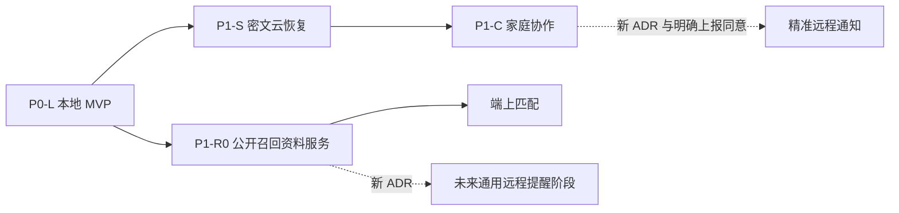
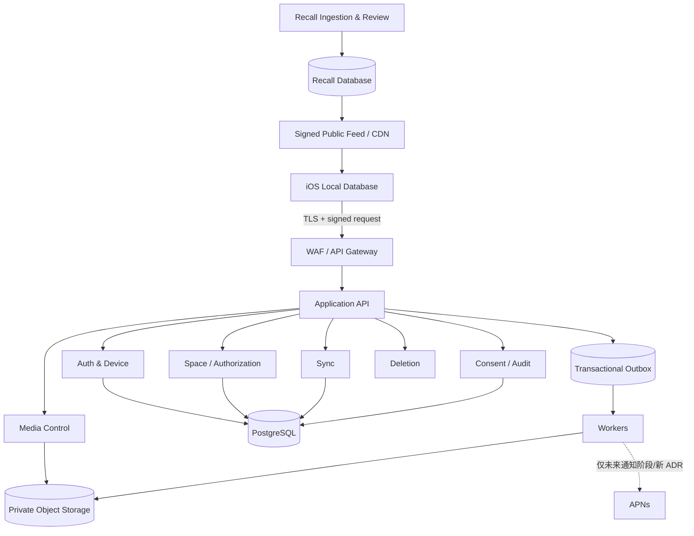

# Mom-Baby 服务端与云能力详细设计

| 项目 | 内容 |
| --- | --- |
| 文档版本 | v1.1 |
| 日期 | 2026-08-21 |
| P0-L 结论 | 不建设业务服务端 |
| 后续推荐 | 公开召回资料服务与用户密文云分开建设 |
| 文档状态 | **P1 架构与安全基线；不是可独立实现的 wire protocol** |

> **基线说明：** 本文固定对应 [`MVP-PRD.md`](./MVP-PRD.md) v0.4 和已接受的 [`ADR-001`](./ADR-001-MVP-SCOPE-AND-DATA-BOUNDARY.md)。P0-L 明确不建设业务服务端；本文定义 P1-S/P1-C/P1-R0 各自立项时必须继承的架构、状态机和安全不变量，**不要求 P0-L 预埋客户端代码、部署空服务或提前承担云合规成本**。P1 开始实现前还必须按 §20.2 冻结机器可读 wire/crypto/客户端合同；本文不能代替这些交付物。

## 1. 服务端是否必要

### 1.1 P0-L：不必要

单设备上的全部 MVP 核心能力均可端上闭环：

- 档案、同意、记录、计时和汇总；
- 奶粉/奶瓶身份、证据、搜索和使用反查；
- 生长标准、趋势和图表；
- 照片导入、相机、EXIF 清理、OCR、缩略图；
- CSV/证据导出、完整加密归档和本地删除。App 锁属于可选安全加固，固定/相对提醒属于尚未分期的未来 Backlog，不计入 P0 服务端判断。

因此 P0 不应部署一个只为“以后可能使用”而存在的空 API，也不应收集安装 ID、设备 token、业务日志或用户网络信息。

### 1.2 以下能力出现时，服务端才成为必要条件

| 触发能力 | 服务端要求 |
| --- | --- |
| 本人跨设备同步/独立恢复 | 云身份、增量同步、对象存储、冲突与删除 |
| 家庭成员协作 | 邀请、服务端授权、撤权、共享密钥和审计 |
| 精准远程删除/注销 SLA | 服务端资源状态、删除任务和备份淘汰 |
| 主动召回资料更新 | 来源采集、人工审核、规则版本和分发 |
| 远程通知（不属于 P1-R0） | 新阶段的 APNs token 管理、通知同意和无敏感内容任务 |
| Android/Web | 与 Apple 账号体系无关的跨平台 API |

## 2. CloudKit 决策

### 2.1 技术优势

CloudKit private database 默认只由当前 iCloud 用户访问，开发者后台不可直接查看，数据计入用户 iCloud 配额；private/shared database 支持加密字段和加密资产。`CKSyncEngine` 还允许客户端保留自己的本地数据模型与冲突策略。

这里的“加密字段/资产”不能直接等同于 App 可保证的 E2EE：`CKRecord.Reference` 等元数据不加密，只有用户启用 Advanced Data Protection 时相关内容密钥才由所有者/共享参与者独占。因此即使没有下述政策阻断，也必须按“Apple 账号访问控制 + 有条件的增强加密”评估，不能宣传为无条件零知识云。

这些能力使 CloudKit 在普通的“本人文档同步”场景中很有吸引力。

### 2.2 当前项目的阻断项

1. **健康数据政策风险。** Apple App Review Guidelines 5.1.3(ii) 明确限制在 iCloud 中存储个人健康信息；Apple Developer Program License Agreement 对使用 iCloud/CloudKit 维护或传输敏感、可识别健康信息也有额外限制。宝宝生长、喂养、睡眠、尿布及哺乳者记录极可能落入该范围。没有 Apple 书面确认前，完整业务数据不应上 CloudKit。
2. **身份不一致。** CloudKit 使用设备系统 iCloud 账号，不等于 App 内 Sign in with Apple 账号，用户不能像普通账号一样在 App 内自由切换数据空间。
3. **权限粒度不足。** `CKShare` 主要提供 share 级 read-only/read-write；无法天然强制“可查看家庭全部记录，但只能修改自己创建项”，也不能让宝宝所有者绝对看不到另一成人域的存在与数量。
4. **选择性同步复杂。** 当前 PRD 要求宝宝、照片、用品、成人哺乳数据分别授权，且引用依赖不能泄露。自动镜像整个对象图不适合这条边界。
5. **删除和配额承诺不可控。** 用户配额、账号状态和 CloudKit 生命周期由 Apple 管理，难以独立证明 PRD 的每宝宝 1 GB、24 小时活动副本删除和 30 天备份淘汰。
6. **召回服务不可读取私有库。** 后台无法扫描所有用户 private database 做统一匹配。

同一政策 Gate 也适用于系统 iCloud Backup 的解释：当前 Apple 文本使用广义 “iCloud”，不能仅禁用 CloudKit 却默认让相同照护数据库随设备备份上传。P0 客户端在取得 Apple 书面解释前请求排除敏感文件，并以用户主动加密归档管理恢复；详见 iOS 方案 §15。

### 2.3 结论

- P0 不使用 CloudKit。
- CloudKit 在当前 ADR 下不是 P1-S 可选实现。只有先取得 Apple 对健康信息口径的书面确认、完成能力验证，并由新的 Accepted ADR 证明它满足零知识承诺或明确撤销该承诺，才允许进行会影响选型的 `CKSyncEngine` Spike；此前只允许不接触用户数据的研究。
- 家庭协作采用自建服务端，不用 CloudKit Shared 充当授权系统。
- CloudKit public database 可以作为不含任何用户数据的公开召回 feed 候选，但普通 HTTPS 静态 feed 更跨平台、更容易审计。

## 3. 推荐演进路线



### 3.1 P1-R0：公开召回资料服务

P1-R0 只处理官方公开资料，不接受宝宝、家庭、奶粉罐、喂养历史或 APNs token，可以先于账号云独立上线；App 仅在前台拉取 feed 并在端上使用本地通知。任何通用 APNs 更新提醒都属于未来通知阶段（名称由新 ADR 冻结），必须另行定义同意、短 TTL、注销入口和与用户业务云的隔离，不能作为 P1-R0 配置开关。

### 3.2 P1-S：本人密文云恢复

用户留存和访谈证明跨设备恢复是强需求后再建设。服务端保存密文和最小路由元数据，明文只在用户授权设备出现。

### 3.3 P1-C：家庭协作

在 P1-S 的设备、密钥和同步能力之上增加邀请、角色、逐资源授权、撤权和共享密钥轮换。

## 4. 自建云总体架构

初期使用**模块化单体**，不要过早拆微服务。单一部署单元内保持清晰模块、独立数据库 schema 和异步 outbox；达到独立扩缩容或安全隔离需求后再拆。



### 4.1 基础设施

- 中国大陆地域的负载均衡/WAF、计算、PostgreSQL、对象存储、KMS、队列和备份；
- 生产 PostgreSQL、队列和应用至少跨同地域两个可用区部署；同步确认写不能只落单可用区，对象存储/KMS 的可用区冗余和故障语义必须写入供应商验收清单；
- 生产、预发布、测试使用完全不同账号/项目和密钥；
- 对象存储禁止 public ACL，默认拒绝所有匿名访问；
- PostgreSQL 不开放公网，按模块服务账号最小授权；
- 出站网络使用 allowlist，召回采集与用户云运行在不同网络安全域；
- 管理后台独立域名、强 MFA、VPN/零信任接入和双人审批。

P1-S 立项时必须先冻结容量基线，而不是从 1 GB 配额直接倒推机器规格。容量表至少包含：目标注册/日活云账号、每账号活跃设备、日增 record/change/conflict、日增媒体字节、首次迁移和整库恢复峰值、30 天对象版本/备份放大、CDN 出流量、KMS/签名调用和队列重试放大。初始压测按“稳态峰值 × 2”和“单可用区失效后的剩余容量”两条曲线验收；超过预算阈值时只限流云同步/媒体，不影响客户端本地保存。

## 5. 身份与设备

### 5.1 登录

P1-S 的 iOS 首选 Sign in with Apple：

1. App 先生成 signing/agreement key pair，向 `/auth/bootstrap/challenge` 提交公钥 hash、client nonce 和可选 App Attest，取得短时 server challenge；
2. App 以同一 nonce 向 Apple 请求 authorization code/identity token；
3. `/auth/apple/exchange` 同时提交 Apple 凭证、完整设备公钥、challenge transcript，以及 pending signing key 对 transcript 的签名，证明调用方持有待注册私钥；
4. 服务端验证 Apple 签名、issuer、audience、nonce、过期时间及设备 proof-of-possession，并用 authorization code 向 Apple token endpoint 完成服务端 exchange；
5. 只把稳定 `sub` 与内部 `user_id` 关联；姓名/邮箱不是核心功能必需字段，不主动索取或长期保存；
6. 新账号的第一台设备可在同一事务成为 active；已有账号的新设备只得到短时、限 scope 的 `device_enrollment_token`，必须经旧设备批准或恢复密钥流程后才得到业务 access token；
7. App 业务 access token 短期有效，自有 refresh token 轮换后原文只放客户端 Keychain；Apple refresh token 用 KMS envelope 加密保存，仅用于 re-auth/revocation，不写应用日志或通用 token 表。

Bootstrap challenge 必须是服务端持久、单次消费的安全状态，而不是只把随机串回传给客户端。记录绑定 `challenge_id + environment + issuer + client_id/audience + app/bundle version + client nonce + pending signing/agreement key hashes + optional App Attest key + expires_at`；Apple exchange 在一个事务中完成 challenge 消费、authorization code 去重、Apple 身份 upsert、device 创建和 token family 创建。challenge 过期、已经消费、任一 key hash/nonce/audience 改变或同一 authorization code 重放均返回同一类不可枚举错误。

Apple 身份键不是孤立的 `sub` 字符串。配置表把每个允许的 `client_id/audience` 映射到稳定 `identity_scope_id`（当前 primary App ID/app group 的 Apple subject 命名空间）；服务端用专用、版本化 HMAC key 生成 `subject_pseudonym = HMAC(issuer || identity_scope_id || sub)`，并对 `(issuer, identity_scope_id, subject_pseudonym)` 建唯一约束。轮换时用当前和仍有效旧 key 双查，在成功登录事务中迁移 pseudonym；没有保存原始 `sub` 的 dormant 身份迁移完成前不得销毁旧 HMAC key。这样未来关联的 Services ID 不会因 audience 不同创建第二账号，同时未登记 audience 仍会被拒绝。两个并发的首次 exchange 只能创建一个账号，失败事务不得遗留 active device。App 转移开发者团队时必须按 Apple `transfer_sub` 时限执行迁移 runbook，在迁移完成前禁止用新 team-scoped `sub` 静默创建第二个账号。

Apple 登录只能证明该 Apple 账号的控制权，不能证明用户一定是法定监护人。产品仍只能保存“监护人声明”，除非未来另建真实核验流程；不应为了形式上的实名额外收集宝宝证件。

### 5.2 设备注册

每个安装注册：

```text
device_id
user_id
signing_public_key
agreement_public_key
access_state (pending|active|access_blocked|revoked)
app_attest_key_id (optional)
app_version / platform_version (coarsened)
registered_at / last_seen_at / revoked_at
credential_generation
```

两类设备私钥按能力存 Secure Enclave/ThisDeviceOnly Keychain，不上传、不进系统备份；签名和 key agreement 不复用同一把 key。App Attest 可作为风控信号，不作为用户认证的唯一依据，且必须有服务不可用时的安全降级策略。

设备的 `access_state` 只回答“现在能否访问”；撤销进度属于独立 `device_revocation_job.state`，两者禁止混用：

```text
requested → access_blocked → credentials_revoked → category_rotation_pending
                                              ├──→ blocked_waiting_owner
                                              │             └──→ category_rotation_pending
                                              └──→ completed
任一非终态 ──暂时故障──→ failed_retryable(resume_state) ──重试──→ resume_state
```

同一安全事务先把 `device.access_state` 置为 `access_blocked`、递增 credential generation 及它能访问的每个资源/category authorization generation，撤销本服务 access/refresh token family、device lease、未消费 join challenge、download grant 和该设备的全部 server-side key envelope，并创建 job 与逐 category step。该 post-state 写入 security ledger 且达到 quorum 后，撤销请求才返回签名 access-block receipt；从此即使后续换钥等待用户，设备也不能重新访问。

所有受影响类别进入 `rekey_required`；若被撤销设备曾取得 owner root key，还必须递增 resource security generation 并进入 `root_rotation_required`，由仍有效 owner 设备生成新 root version，再从新 root 派生后续 category epoch。完成前拒绝这些类别的新 mutation、下载授权和新设备/成员加入。无 owner 在线时 job 是 `blocked_waiting_owner`，不是 completed 或 failed；若撤销的是最后一台 owner 设备，只能凭高熵恢复密钥重新建立 owner 设备后继续。`completed` 只在 token/lease/envelope 已撤销、全部 category step 已换钥、必要 root rotation/coverage 已完成且 completion event 达到 ledger quorum 后成立。服务端不得为提高可用性解封根密钥；已被该设备解密、导出或截图的历史明文仍无法远程收回。

### 5.3 Token

- access token 建议 15 分钟；
- refresh token 30 天滑动有效并每次轮换；
- refresh reuse 触发整条 token family 撤销；
- 删除空间、成员、密钥 envelope 等高风险请求需最近认证和设备签名；
- 服务端日志只记录 token family/请求 ID 的不可逆标识，不记录 token 原文。

账号删除先立即阻断本服务登录和资源访问，再使用保存的 Apple refresh/access token 调用 Apple token revocation endpoint；失败进入专用 outbox 指数重试并告警，成功后销毁 Apple token、`sub` 关联和本服务 token family。业务数据删除与 Apple revoke 分别记录无敏感内容的完成状态，不能因 Apple 暂时不可用而重新开放账号。

在 Apple Developer 配置 TLS 1.2+ server-to-server notification endpoint。Webhook 验证 Apple JWS 的签名、issuer/audience、时间和 `jti` 幂等后处理事件：`consent-revoked`/Apple 账号删除立即撤销本服务 session、阻断资源并触发账号删除/支持流程；未使用的 email-forwarding 事件只记无用户内容的结果，不为此新增邮箱字段。原始 JWS 不进入日志。客户端同时监听 credential revoked notification/查询 credential state；服务端 Apple refresh token 按 Apple 建议至多每日验证一次，以发现漏失通知。

Apple 事件、本产品账号删除和临时认证故障不得共用一个含糊状态。冻结以下转换：App 内明确删除请求进入 §12 删除状态机并调用 Apple revoke；合法 `consent-revoked/account-deleted` 事件先原子撤销 session、阻断业务访问、销毁失效 Apple token，再按已经披露并经法律确认的保留/删除策略进入专用 job；Apple/JWKS/token endpoint 暂时不可用只允许既有本服务短 token 到期和后台重试，不创建新 session，也不能误触数据删除。每个事件保存 `jti` 去重结果和状态转换证据，但不保存原始 JWS。

## 6. 数据安全域与端到端加密

### 6.1 独立安全域

```text
Child Space Vault
└── 宝宝档案、CareEvent、Growth、用品、Moment、宝宝媒体

Adult Lactation Vault
└── NursingSideDetail、PumpingRecord、成人 TimerSession
```

`related_baby_id` 是两个 vault 之间的可撤销关联，不产生读取授权。服务端所有 API 先按真实 vault ownership/ACL 校验，再处理关系；任何“已知 UUID”请求都不能绕过。

### 6.2 推荐密钥层级

- 每个宝宝空间在 owner 设备生成随机 256-bit `SpaceRootKey(root_version=1)`；每个成人 vault 在本人设备生成独立 256-bit `AdultVaultRootKey(root_version=1)`；两者都不以明文离开授权设备；
- `CategoryKey(resource, category, epoch)` 由该 epoch 指定的 root key version，通过版本化 HKDF、resource ID、category 和严格单调 epoch 派生；category 至少包括 `profile/care/growth/supplies/moments/adult_lactation`，不同资源/root version/类别/epoch 之间域分离；
- owner 设备通过每个仍需历史访问的 `owner_root_key_envelope(root_version)` 获得 root key；高熵恢复密钥为每个仍被引用 root version 保存 `recovery_root_envelope`。Caregiver **永远不取得任何 SpaceRootKey**，只取得其 grant 覆盖的 category/epoch envelope；
- 每个媒体对象生成随机 `MediaContentKey`；`storage_object_path` 只是服务端路径，任何代码和字段名都不得把两者统称 object key；
- 每条结构化记录使用 category key、record ID、revision 与 key epoch 派生的 record key；
- 服务端只保存加密 payload、nonce、算法版本和每台授权设备的 key envelope；
- 对象存储只保存客户端已经压缩、去 EXIF、分块加密的 ciphertext；
- 服务端 KMS 只保护服务自身签名、数据库凭证和备份密钥，不托管能够解开全部用户内容的 vault master key。

每个 record、conflict snapshot、media manifest 都保存 `crypto_suite`、`root_key_version`、`key_epoch`、`aad_version`。AAD 至少绑定 protocol/schema version、scope type/id、category、entity/media ID、被请求的 `proposed_version`、root/key epoch、operation、author device、purpose，分块媒体还绑定 chunk index/count 和 plaintext length；这些字段任何一个变化都必须认证失败。`MediaContentKey` 由对应 root/category epoch 包装，wrapped key 随媒体 metadata 保存。旧 epoch 只向仍授权设备保留解封能力；撤权后不再下发旧 envelope，是否重加密历史内容按明确产品策略执行。

服务端为每个 resource 保存当前 `root_key_version/root_rotation_state`，为每个 `resource × category` 保存唯一权威 `resource_category_key_state`，至少包含 `current_root_key_version`、`current_epoch`、`authorization_generation`、`bound_membership_generation`、`rekey_state`、`current_roster_hash` 和 revision；每次 epoch 都追加不可变 `resource_key_epoch(root_key_version)`。`baby_space.content_key_epoch` 之类的资源级单值不得再充当多类别权威值。grant 明确 `history_from_epoch`；P1-S owner 和现行 P1-C caregiver 默认取得获授类别的全部既有历史，若未来允许“仅加入后数据”，必须另立产品/协议版本。

资源访问 generation 只有以下三层权威，禁止在两张表保存两个可独立递增的同名值；device credential、token family 和 account 自身的 generation 是不同作用域，不计入这三层：

- `resource_security_state.security_generation` 是整个资源的全局访问代次；空间阻断/删除、owner root 疑似泄露或需要让全部资源凭证失效时递增；
- `resource_security_state.membership_generation` 是整个资源成员 roster 的全局代次；membership 新增、移除、退出或角色变化时递增；
- `resource_category_key_state.authorization_generation` 是单一 category 的授权/envelope 代次；该类别 grant、历史范围、envelope roster 或可用 epoch 变化时递增。`bound_membership_generation` 只是生成当前 roster hash 时看到的全局 membership generation 快照，不是第四个计数器。

单类别请求显式携带 `security_generation + membership_generation + category + authorization_generation + grant_version + root_key_version + key_epoch`。resource-scoped 的多类别 snapshot/lease/checkpoint 不使用含糊的单个 authorization 标量，而绑定 `category_access_vector_hash`：对按 category UTF-8 字节序排序的 `(category, grant_version, authorization_generation, history_from_epoch, current_root_key_version, current_epoch, epoch_coverage_hash)` 使用协议 canonical encoding 后做 SHA-256。服务端每次签发和使用 artifact 都从当前 grant/key-state 重算，不能相信客户端提交的 hash。设备身份 credential 只绑定用户、设备、公钥和 `credential_generation`，不复制任何 resource/category 授权状态；每次资源访问仍按上述 generation/vector 独立检查。

递增矩阵固定如下；同一业务事务先锁 resource state，再按 category 排序锁 key-state：

| 事件 | security | membership | 受影响 category authorization | epoch/root |
| --- | --- | --- | --- | --- |
| 普通业务 mutation | 不变 | 不变 | 不变 | 使用当前值 |
| grant/history/envelope 变化 | 不变 | 不变 | `+1` | 撤权时进入 rekey_required |
| member 加入/角色变化/移除 | 不变 | `+1` | 所有受影响类别 `+1` | 移除时新 epoch |
| 设备撤销 | owner root 未泄露时不变；泄露则 `+1` | 不变 | 该设备可访问类别 `+1` | 类别换钥；owner 泄露再换 root |
| 空间 access block/delete | `+1` | 不变 | 全部 active category `+1` | envelope 立即吊销 |
| rekey commit | 不变 | 不变 | `+1` 并结束 rekey | epoch 严格 `+1`；root rotation 另按 transcript |

每个 artifact 验证失败统一返回 `authorization_changed/resync_required`，不得猜测“取 global 或 category 中较大值”。

以下是不允许靠实现习惯替代的密钥不变量：

1. 任一未物理删除的 record version、conflict 或 media manifest 引用的 epoch，必须存在 `resource_key_epoch`；
2. 每个仍有该历史访问权的 owner/recovery path 必须拥有所有被引用 root version 的 envelope，并能恢复全部被引用 epoch；caregiver 只拥有其 grant 历史范围内的 category envelope；
3. 新 owner 设备通过旧设备或恢复密钥取得 root 后，先验证服务端签名的 epoch coverage manifest，再派生/解封历史 key；缺任一引用 epoch 时不得把恢复标为完成；
4. 删除最后一个历史 root/category envelope、销毁 root version/epoch 或提高 `history_from_epoch` 前，必须证明相关密文已删除或用新 epoch 完成可验证重加密；
5. root/recovery secret/category epoch 的创建、轮换、撤销、恢复和销毁均产生不含密钥材料的审计状态；服务端永远不能从 KMS 或备份恢复用户 root key。

普通 create/update/delete 只能使用提交时权威 `current_root_key_version + current_epoch`；历史 root/epoch 永远只读。唯一例外是带 owner 签名 re-encryption job ID、源/目标 epoch 和 expected state revision 的历史重加密事务，且它不能改变业务明文版本语义或绕过授权 generation。

密码协议必须使用经过评审的标准构造与平台实现，例如版本化 HPKE/envelope encryption、HKDF 和 AES-GCM；不能在业务代码中随意拼接 ECDH、nonce 或 key reuse 规则。每台设备分别生成签名 key 与 HPKE/key-agreement key，禁止同一私钥跨用途。上线前安排独立密码学设计评审、互操作测试向量与版本降级测试。

E2EE 的明确代价是：服务端只能校验身份、授权、引用、版本、幂等和 ciphertext 完整性，无法验证奶量范围、亲喂快照是否等于分段之和或备注内容。业务语义校验必须由所有受支持客户端执行，服务端不能再被描述成内容权威源；若未来要求服务端诊断、全文检索或直接匹配召回，必须重新取得同意并调整“服务端不可见”的产品承诺。

### 6.3 新设备恢复

真正 E2EE 必须选择恢复模型。本方案采用“已授权旧设备批准 + 高熵恢复密钥”，协议如下：

1. 新设备在本机生成不可导出的 P-256 signing 与 key-agreement key pair，向服务端注册为 `pending` 并取得短时 join challenge；
2. 新设备显示包含 device ID、两把公钥 hash、challenge nonce 和 expiry 的 QR；旧设备扫码，或双方人工比对由完整 transcript 派生的短认证串（SAS）；
3. 旧已授权设备核对后签名 transcript：若新设备属于对应 resource owner，则封装其有权持有的全部历史 `SpaceRootKey/AdultVaultRootKey` versions；caregiver 账号的新设备只取得 grant 历史范围内的 category epoch envelopes。批准签名、approver device credential、root/category envelopes 和 epoch coverage manifest 原子提交；
4. 新设备验证 challenge、SAS/transcript、已有设备签名链、envelope AAD 和全部历史 epoch coverage 后才转为 `active`；超时、key hash 改变、coverage 缺口或重放全部失败；
5. 恢复密钥必须是客户端生成的至少 256-bit 随机秘密，以恢复词/QR 交给用户保存；由其通过 HKDF 派生 wrapping/verifier keys，服务端为每个仍被引用 root version 保存 recovery envelope 与域分离 verifier，不接受低熵自选密码替代。恢复成功后新设备必须轮换整套 recovery envelopes；用户主动轮换恢复密钥时，旧 verifier/envelopes 在全部新 envelope 和 coverage manifest 验证完成后原子撤销；若怀疑旧 owner root 已泄露，还必须生成新 root version，旧 root 只保留历史读取；
6. 设备 signing/agreement private key、云绑定 sentinel 和 lease key 使用 ThisDeviceOnly，不随系统备份迁移。检测到数据库恢复但这些材料缺失时，新设备必须重新走批准/恢复，不得继承旧授权。

若所有授权设备和恢复密钥都丢失，密文无法恢复，启用云时必须明确告知。若产品选择服务端托管恢复密钥追求无感恢复，服务方就具备解密能力，不能再宣传“只有你的设备可以查看”。

### 6.4 家庭共享密钥

- owner 按已同意的共享类别和 `history_from_epoch`，为 caregiver 经过人际核验的 agreement public key 创建范围内每个仍被引用 category epoch 的 envelope；任一历史 epoch 缺失都不能激活 membership；
- adult vault key 永不因家庭成员关系自动分享；
- 移除成员时服务端只能阻断访问并协调换钥，不能自己生成新 category key。它在先锁定 `resource_security_state`、再按 category 排序锁定全部受影响 `resource_category_key_state` 的同一事务中撤销 membership/grant/envelope、递增 membership/authorization generation 并把相关类别置为 `rekey_required`；此时拒绝该类别新 mutation、pull page、download grant 和新成员加入；
- 若撤销/疑似泄露主体曾取得 owner root，仍有效 owner 设备先生成全新 `root_key_version`，为所有仍有效 owner 设备建立新 root envelopes，并要求用户重新输入现有高熵恢复密钥或生成新恢复密钥来创建该 root version 的 recovery envelope；coverage 完成前保持 `root_rotation_required`。所有后续 category epoch 必须从新 root 派生，旧 root version 只保留解密历史密文，绝不再派生新 epoch；
- owner 设备取得带 generation 的该 `resource + category` 授权 roster，用当前 `SpaceRootKey(root_version) + category + new epoch` 派生新 category key，只为“仍有该类别 active grant 且设备 active”的设备生成 envelope，再提交 owner-signed rekey transcript；服务端以这一精确集合生成并校验 roster hash，同时校验 expected root version/generation、epoch 单调增加、envelope 集合恰好覆盖该集合且不含被移除或无该类别授权的设备，随后在一个事务切换 epoch 并解除 `rekey_required`；
- 并发成员变化使 expected generation 失效时整次 rekey 返回 conflict 并重做；owner 不在线时保持阻断，本地仍可记录到 outbox，但服务端绝不能为了可用性代生成 key 或继续接受旧 epoch 新内容；
- 历史内容默认继续使用原 epoch，仍授权主体可由 root/历史 envelope 解密；被撤权主体已经保存的旧 ciphertext+key 无法收回。若产品要求对服务端仍存历史密文做密码学前向撤权，owner 客户端必须执行可续跑 re-encryption job，逐版本写新密文并在引用计数归零后退休旧 epoch；服务端不能替代这一步；
- 离线缓存访问由设备本地租约和 key envelope 状态共同控制。

跨用户公钥不能只信任服务端目录。Caregiver 认领邀请时提交 active device credential 和 agreement key hash，并显示包含 `invite_id + claimant_user/device + key hashes + nonce` 的 QR/SAS transcript；owner 必须扫码或线下比对后，对同一 transcript、授权类别和 envelopes 签名确认。服务端只有在 hash 完全一致时激活 membership。若产品允许纯远程、无第二信道的确认，只能标为 server-mediated TOFU，不能宣称可抵抗服务端公钥替换。

### 6.5 选择性云类别、授权与依赖

云端同意和同步策略至少区分：

| 类别 | 内容 | 依赖 |
| --- | --- | --- |
| `profile` | 云 ID、宝宝昵称、出生日期、家庭时区 | 任何宝宝云类别的必要最小项 |
| `care` | 宝宝喂养、尿布、睡眠 | `profile` |
| `growth` | 生长测量 | `profile` |
| `supplies` | 奶粉/奶瓶结构化身份和引用 | `profile`；完整证据媒体另需媒体同意 |
| `moments` | 成长时光元数据和照片密文 | `profile` |
| `adult_lactation` | 左右侧、吸奶和成人 session | 独立成人同意，不从儿童同意继承 |

append-only 同意事件保存历史事实，真正授权由通用 active `resource_category_grant` 强制执行。grant 唯一确定 `recipient user × resource type/id × category × consent version × validity window`：P1-S owner 和成人本人使用 `membership_id=NULL` 的直接 grant，P1-C recipient 同时绑定有效 membership；没有 active grant 就不能列举、拉取、下载或取得 key envelope。扩大类别必须追加新 consent grant event 和新 grant，不能改写旧事件。

用户选择 `care` 但不选择 `supplies` 时，瓶喂事件仍可同步实际喝下量和时间，但远端设备只显示“用品关联仅保存在原设备”，不能偷偷上传产品/批次。选择 `supplies` 也不自动包含证据图；证据媒体单独列数量与容量。被其他已同意类别引用的本地实体不删除，云端保存显式 unresolved reference；服务端不得为了引用完整性扩大原同意范围。

“撤回同意”必须先区分动作主体，不能把以下三类请求共用一个含糊的删除开关：

1. **本人撤回某 category 的云处理同意：** 进入下述 category disposition，选择 `retain_disabled/delete`；
2. **所有者撤回对某个 P1-C recipient 的分享同意：** 只原子撤销该 recipient 的 grant/envelope、递增对应 category authorization generation 并进入 §6.4 rekey；保留 owner/其他成员的同类别数据，绝不创建 category delete disposition；owner 不在线时持久化 `grant_revocation_job=blocked_waiting_owner`，访问阻断不回滚；owner 或恢复路径重新可用后转回 `rekey_pending`，只在换钥和 ledger quorum 完成后标记 completed；
3. **撤回 `adult_lactation` 或其宝宝 `care` 投影同意：** 除执行相应本人 category disposition/分享撤权外，同一事务把所有相关 `vault_relation` 置为 `projection_blocked` 并向成人 scope 投递解绑 change；不得等待成人上线才阻断，也不得删除另一数据主体的 ciphertext。

本人 category disposition 必须携带用户确认的 disposition，不能只撤 grant 后让 worker 猜测：

```text
requested → access_blocked → ledger_durable → primary_processing
                                            ├──→ primary_retained_disabled → completed
                                            └──→ primary_purged → backup_pending → completed
任一 processing/backup 非终态 ──暂时故障──→ failed_retryable(resume_state) ──重试──→ resume_state
```

- 输入为每个 category 的 `retain_disabled` 或 `delete`；“关闭全部云功能”是服务端生成并让客户端再次确认的全类别计划，不是第三种模糊删除语义。UI 默认推荐 `delete`，`retain_disabled` 只有在法律/隐私政策允许且用户明确选择时出现；
- 请求先在同一事务撤销 grant/download grant/category envelope、递增该 category authorization generation、阻断新同步，并把选择写入 `category_cloud_disposition_job`；安全 ledger 达到 quorum 后才返回“云访问已停止”；
- `profile` 是其他宝宝类别的依赖。撤回它时，服务端先返回确定性 dependency plan：要么所有依赖类别一起 `delete`，要么全部 `retain_disabled`；禁止留下仍 active 的 care/growth/supplies/moments。成人 `adult_lactation` 独立处理；
- `retain_disabled` 保留不可读取的 ciphertext 和 deletion guard，不再签发 grant/lease/snapshot/download；重新同意必须创建新 consent/grant、递增 authorization generation 并重新校验 root/epoch coverage，不能复用旧 lease；
- `delete` 为该 category 建立逐载体 job step，覆盖 record/version/reference/conflict/change/snapshot/media/multipart/receipt/lease/envelope/cache。活动载体 24 小时内清理、备份最长 30 天淘汰；任何 retained category 对已删对象只保留不可反查内容的 unresolved reference/guard；
- `delete` 完成后重新同意从空 category 或新的本地迁移开始，旧 entity ID/version 不得通过重新 grant 复活。客户端在收到 access-block receipt 前不删除唯一完整本地副本；
- worker 失败只影响清理进度，不重新开放 grant。status 在原 access token 已被 category 撤权时，使用请求时签发的短期、只读、绑定 user/device/job 的 disposition receipt 查询；它不能读取任何业务内容。

### 6.6 成人域与宝宝域的可撤销关联

E2EE 服务端不能替客户端改写成人 ciphertext，因此 `related_event_id/related_baby_id` 不能只埋在密文里。服务端另存最小 `vault_relation`：只包含随机 relation ID、adult scope、baby scope、可选 baby event ID、双方 category、generation、状态和时间，不包含侧别、奶量、时长或备注。状态机为：

```text
active → revoke_requested → projection_blocked → detached_confirmed
                               └──────────────→ retained_until_adult_returns
```

- 成人到宝宝的 compound mutation 必须携带 relation ID/generation；服务端在同一事务验证成人 ownership、宝宝写权限和 relation=active，才允许更新宝宝权威快照；
- 删除宝宝事件/空间、成员移除或退出时，事务先把 relation 置为 `projection_blocked`，此后任何成人 mutation 都不能读取、探测或更新宝宝域；宝宝最后确认快照保持不变；
- 同一事务向 adult scope 写入不含宝宝内容的 `relation_revoked` change。成人客户端下次拉取后解密本地成人记录、清空关联并用新 revision 重加密；本人可继续编辑、导出或删除成人数据；
- 成人设备长期离线时 relation 保持 `retained_until_adult_returns`，它只用于阻断投影和投递解绑指令，不授予任何宝宝读取权；宝宝域清理不得等待成人上线，也不得级联删除 adult record；
- `detached_confirmed` 仅表示成人客户端已确认新密文不再引用宝宝。关系元数据按成人/宝宝双方删除政策去关联，所有未授权探测统一返回同类错误。

## 7. 服务端数据模型

服务端将可授权元数据和加密业务 payload 分开。

### 7.1 身份/授权元数据

| 表 | 核心字段 |
| --- | --- |
| `user_account` | id, state, security_generation, created_at, access_blocked_at, deleted_at |
| `auth_client_registry` | environment, provider, issuer, client_id, identity_scope_id, state, valid_from, valid_until |
| `auth_identity` | user_id, provider, issuer, identity_scope_id, subject_hmac_version, subject_pseudonym, transfer_subject_ciphertext, state, created_at, migrated_at |
| `auth_bootstrap_challenge` | id, environment, issuer, client_id, client_nonce_hash, signing_key_hash, agreement_key_hash, app_attest_key_hash, expires_at, consumed_at, result_user_id |
| `apple_code_receipt` | authorization_code_hash, challenge_id, received_at, consumed_at, result_group |
| `apple_credential` | user_id, refresh_token_ciphertext, kms_key_id, last_validated_at, revoked_at |
| `apple_notification_receipt` | jti_hash, event_type, subject_pseudonym, received_at, processed_at, result |
| `token_family` | id, user_id, device_id, generation, current_refresh_hash, state, rotated_at, expires_at, revoked_at |
| `device` | id, user_id, signing_public_key, agreement_public_key, state, credential_generation, revoked_at, last_seen_at |
| `device_revocation_job` | id, user_id, device_id, expected_credential_generation, state(requested/access_blocked/credentials_revoked/category_rotation_pending/blocked_waiting_owner/completed/failed_retryable), affected_category_count, completed_category_count, access_block_receipt_hash, created_at, completed_at |
| `device_revocation_step` | job_id, resource_type/id, category, expected_security/membership/authorization_generation, root_rotation_required, state, operation_id, lease_until, evidence_hash, updated_at, completed_at |
| `baby_space` | id, owner_user_id, region, state, migration_session_id, deleted_at |
| `adult_vault` | id, owner_user_id, state, deleted_at |
| `resource_security_state` | resource_type, resource_id, security_generation, current_root_key_version, root_rotation_state, membership_generation, revision, access_state, updated_at |
| `resource_category_key_state` | resource_type, resource_id, category, current_root_key_version, current_epoch, authorization_generation, bound_membership_generation, rekey_state, current_roster_hash, revision |
| `resource_root_key_version` | resource_type, resource_id, root_key_version, state, owner_coverage_hash, recovery_coverage_hash, created_by_device_id, activated_at, retired_at |
| `resource_key_epoch` | resource_type, resource_id, category, root_key_version, key_epoch, crypto_suite, aad_version, state, created_by_device_id, activated_at, retired_at |
| `membership` | id, space_id, user_id, role, membership_version, joined_at, revoked_at |
| `resource_category_grant` | recipient_user_id, resource_type, resource_id, membership_id NULL, category, consent_id, history_from_epoch, valid_from, valid_until, revoked_at, grant_version |
| `device_key_envelope` | vault_type, vault_id, category, device_id, root_key_version, key_epoch, crypto_suite, aad_version, wrapped_key, created_at, revoked_at |
| `owner_root_key_envelope` | vault_type, vault_id, owner_device_id, root_key_version, crypto_suite, aad_version, wrapped_root_key, created_at, revoked_at |
| `recovery_root_envelope` | user_id, vault_type, vault_id, root_key_version, recovery_version, crypto_suite, wrapped_root_key, verifier, created_at, revoked_at |
| `consent_event` | id, subject_type, subject_id, actor_user_id, event_type(granted/withdrawn), policy_version, scope, notice_hash, prior_event_id NULL, occurred_at；append-only |
| `grant_revocation_job` | id, resource_type/id, recipient_user_id, membership_id NULL, grant_id, category, expected_membership/authorization_generation, state(access_blocked/rekey_pending/blocked_waiting_owner/completed/failed_retryable), resume_state NULL, operation_id, created_at, completed_at |
| `device_lease` | id, resource_type, resource_id, device_id, role, security_generation, membership_generation, category_access_vector_hash, issued_at, expires_at, revoked_at, signature |
| `invite` | id, space_id, token_hash, expected_user_id, expires_at, claimed_by, claimant_device_id, claimant_key_hashes, transcript_hash, confirmed_at, revoked_at |
| `rekey_transaction` | id, resource_type, resource_id, category, expected_authorization_generation, expected_membership_generation, expected_state_revision, old_root_version, new_root_version, old_epoch, new_epoch, roster_hash, epoch_coverage_hash, owner_device_id, owner_signature, state, expires_at |
| `device_join_challenge` | id, pending_device_id, nonce_hash, transcript_hash, expires_at, approved_by, approval_signature, consumed_at |
| `device_credential` | device_id, user_id, credential_generation, approved_by_device_id NULL, signing/agreement_public_key_hashes, protocol_version, signature, issued_at, expires_at, revoked_at |
| `vault_relation` | id, adult_scope_id, baby_scope_id, baby_event_id, adult_category, baby_category, generation, state, revoked_reason, created_at, projection_blocked_at, detached_at |
| `category_cloud_disposition_job` | id, user_id, resource_type/id, category, consent_id, requested_disposition, dependency_plan_hash, expected_security/membership/authorization_generation, state, access_blocked_at, primary_completed_at, backup_expired_at |
| `category_cloud_disposition_step` | job_id, carrier, generation, state, attempt_count, lease_until, evidence_hash, last_error_group, updated_at, completed_at |

P1-S 首版按现行 PRD 保持一个账号最多一个 provisioning/active `baby_space`，用 `UNIQUE(owner_user_id) WHERE state IN ('provisioning','active')`（或等价约束表）强制；再次创建返回稳定 `already_has_active_space`，客户端不得按昵称/生日自动合并。多宝宝立项时通过版本化 migration 和能力标志显式放开。

数据库还必须强制：`auth_client_registry(environment,client_id)`、`auth_identity(issuer,identity_scope_id,subject_pseudonym)` 唯一；active device 两把公钥 hash 分别唯一且不可原地替换；`resource_security_state(resource_type,resource_id)`、`resource_category_key_state(resource_type,resource_id,category)`、`resource_root_key_version(resource,root_version)` 唯一；`resource_key_epoch(resource,category,epoch)` 唯一且 root version 必须存在对应 owner/recovery coverage；每台设备/恢复路径对同一 root version、每台非 owner 设备对同一 category epoch 最多一个 active envelope；`membership(space_id,user_id)` 同时最多一个 active；`vault_relation` 的 generation 单调。上述 generation/root version/epoch 只由持有对应 state 行锁的事务递增。

同一 owner 同时最多存在一个 `baby_space.state IN ('provisioning','active')`，同一 `user + local_vault_id_hash + target_resource_type` 最多一个未终结 migration；`cloud_migration_item(migration_id,entity_id,version)`、各 migration category 和 activation operation 均唯一。数据库约束和锁必须让并发 start 返回同一 session，而不是先创建两个 provisioning space 再由定时任务猜测合并。

### 7.2 同步元数据

| 表 | 核心字段 |
| --- | --- |
| `sync_scope` | scope_type, scope_id, generation, next_sequence, minimum_retained_sequence, state, deleted_at |
| `sync_record` | scope_type, scope_id, generation, category, entity_type, entity_id, current_version, current_scope_sequence, state, created_by, updated_by, deleted_at |
| `sync_record_version` | scope_type/id, entity_type/id, version, scope_sequence, operation, root_key_version, key_epoch, crypto_suite, aad_version, ciphertext, nonce, payload_hash, reference_set_hash, author_device_id, client_signature, protocol_version, schema_version, created_at |
| `sync_reference` | from_scope_type/id, from_entity_type/id/version, to_scope_type/id, to_entity_type/id, relation_type, required_category, state |
| `change_log` | scope_type, scope_id, generation, scope_sequence, category, entity_type, entity_id, version, operation, committed_at |
| `snapshot_session` | id, user_id, device_id, scope_type/id, scope_generation, security_generation, membership_generation, category_access_vector_hash, watermark_sequence, state, expires_at, completed_at |
| `snapshot_item` | snapshot_id, ordinal, category, entity_type, entity_id, version, operation |
| `device_scope_checkpoint` | user_id, device_id, scope_type/id, scope_generation, security_generation, membership_generation, category_access_vector_hash, acknowledged_sequence, last_full_snapshot_at, retired_at |
| `mutation_receipt` | user_id, device_id, operation_id, request_hash, result_code, result_version, created_at, expires_at |
| `conflict_snapshot` | id, scope_type/id, entity_type/id, base_version, proposed_version, server_version, root_key_version, key_epoch, crypto_suite, aad_version, incoming_ciphertext, nonce, payload_hash, reference_set_hash, author_device_id, client_signature, created_at, expires_at, resolved_at |
| `deleted_entity_guard` | scope_type, scope_id, entity_id, last_version, deleted_at, expires_at_or_scope_lifetime |
| `active_timer_status` | space_id, status_id, creator_user_id, origin_device_id, revision, type, ciphertext, root_key_version, key_epoch, crypto_suite, aad_version, received_at, refreshed_at, expires_at |
| `cloud_migration_session` | id, user_id, source_device_id, local_vault_id_hash, target_resource_type/id, selected_categories_hash, local_snapshot_revision, activation_barrier_revision, manifest_hash, expected_record_count, expected_media_count, state, expires_at, activated_at |
| `cloud_migration_category` | migration_id, category, consent_id, key_epoch, record_count, media_count, bytes, manifest_hash, snapshot_uploaded_at, delta_watermark, state |
| `cloud_migration_item` | migration_id, category, local_entity_id_hash, entity_id, version, media_id NULL, state, receipt_hash |
| `scope_resource_quota` | scope_type/id, max_records, max_ciphertext_bytes, max_conflicts, max_references, used_records, used_ciphertext_bytes, active_conflicts, active_references, revision |
| `audit_event` | id, actor_pseudonym, action, resource_type, resource_pseudonym, result, reason_group, request_id, occurred_at |

`sync_record` 是当前 head，所有 ciphertext 只追加到 `sync_record_version`；版本行至少保留到不存在任何未过期 snapshot/conflict/活跃设备 checkpoint 引用，之后才按 GC 水位清理。`snapshot_item` 固定 watermark 时点的确切版本，跨请求分页不得回查会变化的 current head。表约束至少包括 `(scope,entity,version)`、`(scope,generation,scope_sequence)`、`(snapshot_id,ordinal)`、`(device,scope,generation)` 唯一；change sequence 只能在业务 mutation 同一事务分配。

敏感业务字段不作为数据库明文列。服务端仍会看到账号/成员关系、IP 与网络时间、scope/category/entity type、实体数量、随机 ID、created/updated actor、版本、密文/媒体大小、purpose 和删除状态，因此能够推断使用频率、家庭关系或大致媒体活动。这些不是“无害路由信息”：隐私说明和 PIA 必须逐项列用途、处理者与保留期；route type 尽量粗化，change/audit 缩短保留，大小采用 bucket/配额结算所需精度，后台上传适度批处理，监控不保留原 IP。

### 7.3 媒体元数据

| 表 | 核心字段 |
| --- | --- |
| `media_object` | id, scope, category, owner, purpose, storage_object_path, immutable_object_version, ciphertext_size, cipher_hash, crypto_suite, aad_version, wrapping_root_key_version, wrapping_key_epoch, wrapped_media_content_key, chunk_manifest_hash, state, created_at, ready_at, deleted_at |
| `upload_session` | id, media_id, device_id, expected_authorization_generation, expected_root_key_version, expected_key_epoch, reserved_ciphertext_bytes, expected_cipher_hash, part_count, expires_at, state |
| `upload_part` | upload_session_id, part_number, expected_bytes, checksum, provider_etag, uploaded_at |
| `media_access_grant` | id, media_id, user_id, device_id, expires_at, revoked_at |
| `storage_quota` | scope_id, limit_ciphertext_bytes, used_bytes, reserved_bytes, revision |

`storage_object_path` 是服务端对象路径，`MediaContentKey` 是永不上传明文的随机加密密钥。任何日志、报错、API 或变量名都不得混用这两个概念。

### 7.4 删除与安全恢复元数据

| 表 | 核心字段 |
| --- | --- |
| `deletion_request` | id, subject_type, subject_id, subject_token, requested_by, state, requested_at, access_blocked_at, primary_purged_at, backup_expired_at |
| `deletion_job_step` | deletion_id, carrier, generation, state, attempt_count, lease_until, evidence_hash, last_error_group, updated_at, completed_at |
| `security_ledger_event` | ledger_sequence, event_id, payload_version, event_type, subject_type/token, resource_type/token NULL, target_type/token, category NULL, operation_id, job_id NULL, post_credential/security/membership/authorization_generation NULL, post_root_key_version NULL, post_key_epoch NULL, post_state_revision NULL, post_access_state NULL, post_rekey_state NULL, commit_evidence_hash, occurred_at, previous_hash, event_hash, replica_quorum_at |
| `security_ledger_checkpoint` | environment, ledger_sequence, event_hash, signed_head, signer_key_id, replica_set_hash, created_at |
| `security_restore_checkpoint` | environment, restored_business_watermark, required_signed_ledger_sequence, applied_ledger_sequence, applied_event_hash, verification_hash, verified_at, traffic_opened_at |

`subject_token/resource_token/target_token` 是专用 security-ledger HMAC key 对稳定内部 ID、类型和环境的域分离 HMAC；恢复出的业务行必须能计算同一 token。该 key 只存在于独立安全恢复域，和用于日志去关联的短期 link key 分离，在全部相关备份过期前不得销毁。版本化 replay payload 按 target type 冻结必填 post-state，不保存业务内容；同一 `operation_id + event_type + target token + category` 唯一。rekey/root rotation 事件必须保存提交后的 root version、category epoch、state revision、确切 rekey/access 终态及覆盖 manifest/transcript 的 `commit_evidence_hash`，device/member/grant 事件必须保存目标 token 和相应确切终态。恢复器只能应用明确的 post-state，不能从泛化 generation 猜测，也不能让 generation 提高而 current root/epoch 留在旧值；恢复库缺新 root/epoch state、必要 envelope/coverage 或 commit evidence 时把资源置为 `recovery_required/rekey_required` 并 fail closed，绝不恢复为 active。每个 quorum 水位产生签名 checkpoint，DR 必须验证 hash chain 和签名 head 后才重放。

## 8. API 设计

本节是端点族、授权边界和状态机的**架构草案**，用于证明方案可闭环并约束后续 OpenAPI；它不是客户端可以据此猜测字段并开始联调的 wire contract。请求/响应 schema、状态枚举、错误、幂等、分页、限制与密码字节编码必须在 P1 实施前按 §20.2 生成机器可读制品并通过跨实现测试；正文示例与制品冲突时停止实施，先修订 ADR/本文和制品，不允许由任一端自行选择解释。

统一前缀 `/v1`，JSON metadata；媒体内容直接上传对象存储。完成设备绑定后的所有写请求必须有：

```http
Authorization: Bearer <access-token>
X-Device-ID: <uuid>
X-Protocol-Version: <integer>
Idempotency-Key: <operation-uuid>
X-Request-Timestamp: <unix-seconds>
X-Request-Nonce: <128-bit-base64url>
Content-Type: application/json
Content-Digest: sha-256=:<base64-digest>:
X-Request-Signature: <device-signature>
```

设备使用独立 P-256 signing key 对规范串签名：`protocol-version + method + fixed route template + content-type + device-id + idempotency-key + timestamp + nonce + content-digest`；字段使用固定 UTF-8/换行规则，签名格式和 canonical JSON 规则发布正反测试向量。所有写请求 body 内 `operation_id` 必须与 `Idempotency-Key` 一致。服务端校验 5 分钟时间窗并在至少 10 分钟内原子记录 `(device, nonce)` 防重放，密钥轮换通过旧设备签名或新设备批准协议完成。私密资源 UUID、cursor、邀请 bearer token 不放 URL path/query；边缘层只记录 route template 与 allowlist 字段，WAF/LB/CDN 同样禁记原始 body/header/token。

用户发起的 bootstrap 只有三个窄例外：challenge 无 access token，但有速率限制/App Attest 风控；Apple exchange 无 access token，但必须同时通过 Apple nonce 和 pending device transcript 签名；refresh 无 access token，但必须带轮换 refresh token 和 active device 签名。Apple account-event webhook 是独立 machine-to-machine 例外，只接受通过 Apple JWS 验证且未重放的事件。`device_enrollment_token` 只能调用 join/recovery/status，不能读取任何业务记录。其他 route 缺 access token 或 active device signature 一律拒绝。

### 8.1 身份与设备

```text
POST   /v1/auth/bootstrap/challenge
POST   /v1/auth/apple/exchange
POST   /v1/auth/refresh
POST   /v1/auth/logout
POST   /v1/webhooks/apple/account-events
POST   /v1/protocol/capabilities
GET    /v1/devices
POST   /v1/devices/revoke
POST   /v1/devices/revoke/status
POST   /v1/devices/join/challenge
POST   /v1/devices/join/approve
POST   /v1/devices/join/complete
POST   /v1/recovery/envelopes
POST   /v1/recovery/unwrap-request
POST   /v1/recovery/rotate
```

### 8.2 空间与同意

```text
POST   /v1/spaces
GET    /v1/spaces
POST   /v1/spaces/get
POST   /v1/consents/grant
POST   /v1/consents/withdraw
POST   /v1/consents/withdraw/plan
POST   /v1/consents/withdraw/status
POST   /v1/category-grants/list
POST   /v1/category-grants/upsert
POST   /v1/category-grants/revoke
POST   /v1/category-keys/rekey/prepare
POST   /v1/category-keys/rekey/commit
POST   /v1/cloud-migrations/start
POST   /v1/cloud-migrations/manifest
POST   /v1/cloud-migrations/commit-snapshot
POST   /v1/cloud-migrations/commit-delta
POST   /v1/cloud-migrations/activate
POST   /v1/cloud-migrations/abort
POST   /v1/cloud-migrations/status
POST   /v1/spaces/delete
POST   /v1/account/delete
```

`/consents/withdraw*` 的机器合同必须要求 `withdrawal_kind=cloud_processing|recipient_share|cross_vault_projection`，并按 §6.5 返回不同 plan/job 类型；服务端不得仅凭 `consent_id` 推断是删整个 category 还是只撤一个 recipient。`recipient_share` 复用成员/grant revoke status，不接受 `retain_disabled/delete`；`cloud_processing` 才接受 category disposition。

Consent 记录不可变事实；category grant 是实时授权。撤回先调用 plan，用户确认每类 disposition 后提交；接口按 §6.5 在一个事务中关闭 grant、吊销相应 envelope/download grant、递增授权 generation 并创建持久 job，返回 access-block receipt 与 job ID。原 category 权限失效后只能用该 receipt 调 status；status 不返回记录数、密文或可探测其他 category 的字段。

### 8.3 同步

```text
POST /v1/sync/push
POST /v1/sync/pull
POST /v1/sync/conflicts/resolve
POST /v1/sync/status
POST /v1/sync/snapshots/ack
POST /v1/timer-status/publish
POST /v1/timer-status/list
POST /v1/timer-status/remove
```

Push 示例：

```json
{
  "groups": [
    {
      "atomic_group_id": "uuid",
      "mutations": [
        {
          "scope": {
            "type": "space",
            "id": "uuid",
            "generation": 4,
            "security_generation": 6,
            "membership_generation": 3
          },
          "category": "care",
          "category_authorization_generation": 9,
          "grant_version": 2,
          "operation_id": "uuid",
          "protocol_version": 1,
          "schema_version": 1,
          "entity_type": "care_aggregate",
          "entity_id": "uuid",
          "base_version": 3,
          "proposed_version": 4,
          "root_key_version": 2,
          "key_epoch": 7,
          "crypto_suite": "v1-hpke-p256-hkdf-sha256-aes256gcm",
          "aad_version": 1,
          "ciphertext": "base64url",
          "nonce": "base64url",
          "payload_hash": "sha256-base64url",
          "reference_set_hash": "sha256-base64url",
          "references": [{"scope_type": "space", "type": "baby_profile", "id": "uuid"}],
          "client_signature": "p256-signature-base64url"
        }
      ]
    }
  ]
}
```

服务端要求 create 的 `base_version=0, proposed_version=1`，update/delete 的 `proposed_version=base_version+1`；客户端把 proposed version 写入 AAD，冲突解决必须按新版本重新加密，不能复用旧 ciphertext/nonce。批次只允许“组间部分成功、组内全成全败”，响应按 group 返回 `applied/conflict/gone/forbidden/invalid_dependency/resync_required/authorization_changed/protocol_upgrade_required`。一个 `CareEvent + FeedingDetail + FormulaUse/BottleUse` 优先编码为单一聚合密文；必须拆记录时放在同一 group。亲喂成人详情与宝宝权威快照可在一个 group 带两个 scope，服务端逐 scope/category/grant/relation generation 校验后在单一事务提交；任一 scope 无权则整组失败。`sync_reference` 持久保存跨记录引用，E2EE 服务端只验证授权与声明的引用存在性，不验证密文中的业务数值一致性；不存在/未授权/已删除的跨 scope 目标必须返回同类 `invalid_dependency`，不能把引用校验变成 UUID oracle。

### 8.4 媒体

```text
POST   /v1/media/uploads
POST   /v1/media/uploads/complete
POST   /v1/media/uploads/status
POST   /v1/media/download-grant
POST   /v1/media/delete
```

下载 grant 最长 5 分钟。授权时再次检查 user、device、membership、scope 和 key epoch；对象 URL 只指向 ciphertext，即使泄露也不包含明文。

### 8.5 家庭协作

```text
POST   /v1/invites/create
POST   /v1/invites/claim
POST   /v1/invites/confirm
POST   /v1/members/list
POST   /v1/members/remove
POST   /v1/spaces/leave
```

打开邀请只返回最小、无宝宝数据的邀请状态；claim 后仍无数据权限。claim 固定 claimant active device credential、agreement key hashes 和一次性 transcript；owner 扫描/比对 QR/SAS 后提交对 transcript、grant set、`history_from_epoch`、epoch coverage manifest 与 key envelopes 的签名确认。服务端验证每个获授类别从 history 起所有仍被引用 epoch 恰好覆盖且没有越权类别，才原子创建 membership/grants/envelopes；邀请过期、token 重放、claimant key 变化、历史 envelope 缺失或 owner 用旧 transcript 确认均失败。

### 8.6 授权线性化、错误与 admission control

所有读取、mutation、pull page、snapshot 创建、媒体 upload/download grant 和邀请确认均在数据库提交点重新校验 `user/device state + resource security generation + global membership generation + category authorization generation + grant version + root/key epoch`；多类别 artifact 还重算 `category_access_vector_hash`。事务按 `resource_security_state → resource_category_key_state（category 排序）→ target head/quota` 的固定顺序加锁或做等价 CAS。撤权和业务请求并发时只能产生两种可证明结果：业务先提交并被随后撤权/rekey 覆盖，或撤权先提交且业务返回 `authorization_changed`；禁止“检查通过、撤权完成后旧写再落盘”。

冻结机器可判定错误，不以本地化文案作为协议：

| HTTP/错误 | 语义 | 客户端动作 |
| --- | --- | --- |
| `400 invalid_request` | schema/签名字段不合法 | 不重试，记录本地诊断组 |
| `401 reauthentication_required` | token/Apple credential 失效 | 进入重新认证，不清空本地事实 |
| `403 forbidden` | 当前无权；不区分资源不存在 | 不探测、不自动重试 |
| `409 conflict` | base version 过期 | 保存两版并走显式解决 |
| `409 idempotency_mismatch` | 同 operation 不同请求 | 停止并告警客户端 bug |
| `409 authorization_changed` | grant/generation/epoch 已变化 | 拉取新授权状态，旧 mutation 留本地待处理 |
| `410 gone` | 已删除且 guard 存在 | 本地形成墓碑，不以新 create 复活 |
| `412 protocol_upgrade_required` | 版本/crypto/schema 不再允许写 | 本地只读/导出并提示升级 |
| `413 request_too_large` | 任一静态上限超限 | 客户端拆批或拒绝 |
| `429 rate_limited` | 主体/端点预算耗尽 | 遵守 `Retry-After` 加抖动退避 |
| `503 dependency_unavailable` | 可恢复依赖故障 | 保持本地 outbox，按上限重试 |

每个 route 在 OpenAPI 旁冻结 body bytes、group/mutation/reference/page 数、单 ciphertext 和总 ciphertext、并发请求、数据库执行时间及响应 bytes 上限。限流同时按匿名 IP/attestation、user、device、scope 和 route 令牌桶执行；invite/recovery/bootstrap 另有低速猜测预算。`scope_resource_quota` 限制 record、ciphertext、active conflict 和 reference，媒体仍使用独立 1 GB 配额。超过软阈值先背压/告警，超过硬阈值拒绝云写但不把客户端本地保存显示为失败。任何压缩请求先按解压后上限校验，禁止无限嵌套、超大 base64 和高基数 header 消耗。

## 9. 同步协议

### 9.1 本地档案首次上云

首次上云不是普通的一批 `create`，而是不可被其他设备看见的 provisioning 会话：

```text
created → keys_and_consents_ready → snapshot_uploading → snapshot_committed
        → delta_catching_up → ready
        └──────────────────────────────────────────────→ aborting → aborted
```

1. `start` 以稳定 operation ID、本地 vault ID 的 HMAC、源 device 和选择类别幂等创建 `cloud_migration_session`，目标 resource 保持 `provisioning`；同一账号并发 start 由唯一约束收敛到同一结果；
2. 源设备生成 root/category epoch 1、owner root envelope 和 recovery root envelope，分别提交儿童/成人同意。服务端验证 envelope/consent/category 集合齐全后才进入 `keys_and_consents_ready`；儿童与成人迁移是两个安全 scope，不能用儿童同意激活成人 vault；
3. 客户端在一个本地事务记录 `local_snapshot_revision=R`，冻结所选类别 manifest（实体 ID/version、媒体 ID/hash/bytes、依赖、总数和总 hash），之后的新修改继续正常写本地 outbox，revision 均大于 R；
4. snapshot record/version 和媒体先写 staging，只对源设备的 migration route 可见。每个 item 由 `migration_id + local_entity_id_hash + version` 幂等，重启/重试不重复计数；
5. `commit-snapshot` 核对各类别 manifest hash、记录/媒体数量、配额、全部 ready 媒体、必要引用、epoch coverage 和客户端签名；任一类别不完整则保持 provisioning，不得返回“云已开启”；
6. 源设备在本地事务取得 `activation_barrier_revision=B`，冻结“所选类别中 `(R,B]` 的 outbox operation 集合及 rolling hash”并作为 delta 上传；B 之后的新写仍留在普通 outbox。服务端按各类别 manifest/operation-set hash 和 watermark 确认该集合全部有 receipt 后允许 activate，不能因为未选择类别或本地 revision 合法跳号而要求数字连续；
7. `activate` 在同一数据库事务把 resource、选择类别、baseline sequence 和 migration 置为 `ready/active`。事务提交后其他已批准设备才能创建 snapshot；B 之后的 mutation 走普通 sync；
8. abort/过期会撤销 staging grant、abort multipart、释放 record/media reservation、删除未激活 envelope 和目标 resource。已经 active 的 migration 不允许 abort，只能走正常选择性撤回/空间删除。

客户端只有在 `ready` receipt 落入本地同一事务后才显示“已安全同步”；在此之前不得删除本地源数据。服务端看不到明文，所以 manifest 证明的是“客户端声明的密文集合完整到 B”，不是业务语义正确；恢复页必须如实显示最后成功同步时间和仍在本地 outbox 的数量。

### 9.2 本地先写

客户端事务：

1. 写业务实体；
2. 增加 local revision；
3. 写同一事务内的 outbox mutation；
4. UI 立即读取本地提交结果；
5. Sync worker 后台发送 outbox。

服务端永远不是高频记录按钮的同步依赖。

### 9.3 幂等

- `operation_id` 对 user+device 唯一；
- 服务端保存 request hash；相同 ID+相同 hash 返回原结果；
- 相同 ID+不同 hash 返回 `409 idempotency_mismatch`；
- mutation receipt 初始至少保留 90 天并覆盖支持的最大离线/重试期；到期后，稳定 entity ID/version、不可变 version 唯一约束和 `deleted_entity_guard` 仍必须阻止重复 create/复活，receipt 不能是唯一防线；
- migration、删除、rekey、device revoke 的 operation receipt 保留到对应 job 完成且其灾备/申诉窗口结束。

### 9.4 版本与冲突

- 创建使用 `base_version=0`，同时携带客户端已完成基线的 scope generation；
- 更新/删除必须携带客户端最后读取的 server version；
- 匹配则原子 version+1；
- 不匹配则返回当前密文与版本，并保存 incoming conflict snapshot；
- 客户端让用户保留本地、云端或手工合并，不按“最后写入时间”静默覆盖；
- 更新已删除实体返回 gone；`deleted_entity_guard` 至少保留到 scope 销毁，旧客户端不能用相同 UUID 和 `base_version=0` 复活墓碑。

成功 mutation 在同一事务追加 `sync_record_version`、更新 head、分配 scope sequence、写 change log/receipt/audit；任何一步失败全回滚。被拒绝的 incoming 版本按 `scope + entity + author device + base/proposed version + payload hash` 去重，每实体/设备只保存一个等价 conflict。初始上限为每 scope 1,000 个 active conflict、每实体 8 个；超限仍返回当前 server version，但不吞掉客户端本地副本，并提示先解决/导出。Conflict 默认保留至解决并被提交设备确认，兜底 90 天到期前在客户端显著提示；到期只清服务端 incoming ciphertext，不改当前权威 head。

### 9.5 Pull snapshot、cursor 与 GC

- 每个安全 scope 有单调 `scope_sequence`；sequence 在 mutation 事务中分配，事务回滚可以留空洞，客户端只依赖严格递增而不依赖连续；
- 空 cursor 在一个一致性数据库事务读取 `watermark=next_sequence-1` 和当时授权 head，把确切 `(entity,version,operation)` 物化为 `snapshot_item`，并创建带 TTL 的 `snapshot_session`。版本 ciphertext 从 append-only `sync_record_version` 读取，不能在后续页面查询会变化的 current head；
- snapshot cursor 是服务端签名的不透明 token，绑定 user/device、snapshot ID、scope generation、`security_generation + membership_generation + category_access_vector_hash`、watermark、next ordinal 和 expiry，只放请求 body；每页从当前 grant/key-state 重算 vector 并重新检查 user/device。任一授权/rekey 变化立即使 snapshot 失效，不继续吐出旧权限页面；
- snapshot 分页只按固定 ordinal 读取 item；最后一页返回 baseline cursor=`watermark`。客户端验证所有页的 item count/rolling hash 后调用 `snapshots/ack`，服务端更新 `device_scope_checkpoint`；snapshot 过期返回 `snapshot_expired` 并重开，不混合两个基线；
- baseline 后按 change log 拉 `>watermark` 增量。若同一实体在窗口内多次变化，服务端可合并到最新 version，但 cursor 只能推进到已经包含其结果的最大 sequence；delete 对客户端未知实体也按幂等墓碑处理；
- 撤权时先使旧 cursor/lease 失效，再停止返回资源；
- grant 类别变化需要新 baseline；scope generation 变化或 cursor 过期返回 `resync_required`，客户端以新 snapshot 替换该 scope 并显式处理尚未上传的本地 outbox；
- tombstone/version/change 的 GC 水位取所有 active `device_scope_checkpoint`、未过期 snapshot 和 unresolved conflict 的最小值。超过最大离线期且 lease 已失效的设备先标记 checkpoint retired；它下次只能 full resync，不能要求旧 delta；
- tombstone 在所有 active checkpoint 确认或保留期到达前不清理；压缩后仍保留 scope-lifetime `deleted_entity_guard`，避免旧 UUID 复活。GC 每次保存水位、删除数量和抽样验证 evidence。

### 9.6 计时同步

- P1-S/P1-C 默认只同步完成记录，不同步成人运行中 session；
- P1-C 可发布宝宝亲喂/睡眠的短期只读 `ActiveTimerStatus`，TTL 12 小时；
- 其他设备永远不能控制发起设备的 session；
- 两台离线设备产生的同侧重叠记录都保留，客户端本地解密后检测冲突；
- 服务端只需保证两条 distinct UUID 不互相覆盖。

`active_timer_status` 是独立短期密文资源，不进入正式 record/change history。服务端从 token 固定 `creator_user_id/origin_device_id`，客户端不能指定他人；只有原 user+device 可 refresh/remove，revision 使用 CAS，其他成员只有宝宝 `care` grant 下的 list 权限。每设备/空间同时最多 8 条状态，publish 受独立限流。`expires_at <= received_at + 12h` 只按服务端时间计算，每分钟清理过期项；remove 与正式完成尽量同 group/outbox，但即使丢失也会 TTL 淘汰。禁止发布/列举成人吸奶运行态。

### 9.7 协议版本、客户端签名与信任边界

`/protocol/capabilities` 返回服务端允许的 read/write protocol、payload schema、crypto suite、AAD 和最低 App 版本，并由服务端发布密钥签名。每个 mutation 都携带版本；服务端对低于 minimum-write、未知 crypto/AAD 或声明依赖不兼容返回 `protocol_upgrade_required`，不能“尽力解析”。仍可读取但不能写的旧客户端进入只读/导出模式；客户端遇到未知 payload schema 时先把 ciphertext 隔离为 `unsupported/quarantined`，不得让一次解码失败破坏整个本地 scope。

E2EE payload 之外再保存客户端签名 mutation envelope，规范字段至少包括：protocol/schema、scope/security/authorization/membership generation、category、entity/version、operation、root/key epoch、crypto suite/AAD version、nonce、payload/reference-set hash、author user/device、operation ID 和客户端发生时间。服务端验证当前 active signing key 后原样保存，pull 客户端再次验证；`created_by/updated_by` 只采用服务端认证主体并与 envelope 一致，不能相信密文自报。

这提供内容不可篡改和作者设备证据，但当前方案仍**信任服务端**正确执行授权、完整列举、排序和可用性：恶意服务端仍可隐藏最新版或拒绝服务。若未来宣传“可检测服务端删改/回滚”，必须另加客户端共同见证的 Merkle/checkpoint/transparency 协议；不能仅凭 E2EE 作此承诺。

## 10. 离线租约与撤权

租约包含：

```text
lease_id, user_id, device_id,
resource_type, resource_id, role,
security_generation, membership_generation,
category_access_vector_hash,
issued_at, expires_at,
last_server_time, signature
```

- owner 最长 7 天，caregiver 最长 24 小时；
- 官方客户端在同一可验证 boot session 内以服务端时间锚点加包含休眠的 continuous monotonic source 判断，不信任可手改 wall clock；
- App/boot 连续性无法验证、ThisDeviceOnly restore sentinel 缺失、账号变更或签名失败时 fail closed 并要求联网续租；
- 客户端只允许解锁 lease 的 grant-set/epoch coverage 覆盖且本地签名校验通过的类别；任一 generation/hash 不一致、缺历史 epoch 或服务端返回 rekey/security change 都使整份旧 lease 失效，不从过期 lease 拼接权限；
- 在线撤权立即拒绝被移除主体的 API、撤销 envelope/grant，并按 §6.4 进入 owner 驱动的原子 rekey；服务端不声称能自行轮换内容密钥；
- 官方客户端下次运行/解锁并检测到到期时删除可再下载缓存密钥并锁定数据；设备关机或 App 未运行时不能承诺在真实世界某一秒主动擦除；
- 用户已经另存、导出或截图的副本无法远程撤回，必须在邀请与撤权文案中说明。

离线租约是由官方 App 执行的访问控制，不能对越狱设备、被篡改客户端、关机设备或成员已经导出的明文提供密码学远程擦除保证。安全承诺是“官方客户端在下次运行且租约到期，或联网发现撤权后，拒绝解密并清理可再下载缓存”，不是“任何离线副本会在精确时间被远程销毁”。

因此 PRD 的 7 天/24 小时是“可验证连续运行状态下的最长离线访问上限”，不是每次都保证可离线使用满该时长；重启、恢复或时间连续性无法证明时可能提前要求联网。若产品要求“重启后仍保证离线满 7 天”且同时抵抗系统时间倒拨，需先证明 iOS 上存在可信时间来源，否则这两个承诺必须二选一。

选择性类别、active grant 和引用依赖见 §6.5；这套复杂度正是 P0 不应提前携带云能力的原因。

## 11. 媒体上传与下载

### 11.1 上传

媒体跨 PostgreSQL 和对象存储，不能声称是一个 ACID 事务。权威状态机为：

```text
reserved → uploading → uploaded_unverified → ready
    └──────────────→ aborting → purged
ready → delete_requested → object_deleted → purged
ready → media_corrupt → repaired_with_new_version | purged
```

1. 客户端完成格式验证、尺寸限制、方向校正和 EXIF 最小化；
2. 客户端生成随机 `MediaContentKey`，用相应 category key epoch 包装，按 AAD 约定分块 AES-GCM 加密并计算 cipher hash；
3. 请求一次性 multipart upload session；服务端在持有 quota 和 category key-state 锁的数据库事务中校验 authorization generation/current root+key epoch、原子预留声明的 ciphertext bytes，并生成不可猜、不可复用、不可覆盖的 `storage_object_path`；
4. 每个 presigned part grant 固定 method、bucket/path、upload ID、part number、精确或窄范围 Content-Length、checksum、Content-Type=`application/octet-stream` 和 ≤15 分钟 TTL；禁止客户端指定 bucket/path、覆盖已有 object version 或借同一 grant 上传第二个对象；
5. 客户端直接上传 ciphertext；服务端不相信客户端/provider ETag 等于内容 hash，使用供应商原生强 checksum 或受控流式 hash 校验总大小、part 顺序、chunk manifest hash 和 cipher hash，先进入 `uploaded_unverified`；
6. `complete` 以 upload operation ID 幂等，在事务提交点再次校验 device/grant/authorization generation/current root+key epoch；对象确实存在且校验通过后，结算实际使用量、追加 media sync version 并把 metadata 置 `ready`。数据库提交失败时对象仍非 ready，由 reconciler 重试或删除；
7. 失败/过期 multipart 由 worker abort 并释放预留。只有确认 provider multipart/object 已清除后才释放对应 used/reserved bytes；worker crash 可按状态和 lease 续跑。

每 15 分钟运行双向 reconciler：数据库非 ready 但对象存在时按 session/TTL 完成或删除；数据库 ready 但对象缺失/校验不符时立即禁止新 download grant、标记 `media_corrupt` 并告警客户端保留本地副本；对象存在但没有数据库 session/metadata 时按 server-owned path 前缀和安全年龄清理。任何 purge 都以 immutable object version 为精确目标，不能只写 delete marker 后宣称物理删除。

服务端看不到明文时无法做图片内容审核/病毒扫描；本产品没有公开展示和任意文件下载，风险通过客户端白名单、服务器大小限制、不可执行 Content-Type、Content-Disposition attachment 和不在服务端解码来控制。

### 11.2 下载

- 客户端请求短时 ciphertext URL；
- 下载到受保护 temp；
- 先校验 cipher hash，再逐块认证解密；
- 原子移动到本地 media store；
- 失败不生成 ready replica；
- URL、对象路径和解密错误不得进入第三方监控。

下载 grant 在签发事务中锁定/校验 media=ready、device/grant、authorization/membership generation、root/category epoch 和 deletion state。Presigned URL 是可转交 bearer，即使只含 ciphertext 也只允许 HTTPS、最长 5 分钟、固定 object version 和响应头；对象存储/CDN/WAF 的原生日志必须禁记完整 path/query/signature，不能只清理应用日志。

### 11.3 配额

- 按现行 PRD 固定每个宝宝空间 1 GB，成长照片与追溯证据图计入同一配额并按 purpose 分项展示；成人 vault 若需要媒体必须另行定义，不借用宝宝额度；
- 服务端按实际 ciphertext byte size（包含认证 tag、chunk manifest 与加密开销）计量，界面明确它与本机展示副本大小可能不同；
- `storage_quota` 行以 revision/row lock 原子更新 `reserved + used <= limit`，两台设备并发创建 upload session 也不能超额；
- upload session 过期或 abort 释放 reserved，complete 把 reserved 转 used，删除在对象和 metadata 确认清理后释放 used；
- 每账号/设备/scope 同时 active upload session、每日上传/下载 grant 和恢复出流量另有限流；1 GB 媒体配额不能替代 §8.6 的 record/conflict/reference/请求预算；
- 超额不影响本地记录和查看；
- 首版无订阅降级；未来商业化必须在变更前定义额度降低、宽限期、只读与导出/删除路径，不能静默删除用户媒体。

## 12. 删除、注销与备份

### 12.1 删除状态机

```text
active → deletion_requested_and_access_blocked → ledger_durable
       → primary_purged → backup_expired
```

- delete operation ID 幂等；服务端先在本地安全事务把空间置为 access_blocked、递增 security/authorization generation 并写 security-outbox，所有 read/write/pull/grant 从该提交点起拒绝；
- 随后计算 §7.4 的稳定 subject token，把 deletion/security event 写到与业务备份不同故障域的同步复制 ledger。只有 ledger 达到配置 replica quorum 后才返回“删除请求已接受”；若 ledger 暂不可用，空间保持 fail closed，重试沿同一 operation/ledger event 续跑，不能返回已完成或自动重开；
- 立即删除 key envelopes，先实现 crypto-shred；
- 24 小时内删除/去关联所有活动载体，而不只是主业务表和对象；
- 备份最长 30 天自然淘汰，不用于产品恢复；
- deletion ledger 只保留无业务内容的合规证明、请求时间和完成时间；
- 法律强制保留例外必须事前定义，不能在删除后临时改变。

删除任务使用以下全载体矩阵，并为每项保存无业务内容的 completion evidence：

| 载体 | 阻断/清理动作 | 时限 |
| --- | --- | --- |
| `sync_record`、reference、conflict snapshot、change payload/tombstone | access block 后级联删除；仅保留防复活所需、不可反查业务内容的 keyed guard | 主存储 24 h |
| media object、multipart、upload session、download grant、CDN/cache | 吊销 grant、abort multipart、删除 ciphertext、purge cache；释放配额 | 活动副本 24 h；已签 URL ≤ 5 min |
| mutation receipt、outbox、retry/DLQ、timer status | 删除 payload/关联；停止未执行 worker，过期 timer 立即清理 | 24 h |
| device lease、category grant、envelope、invite；仅未来通知阶段才有 APNs token | 立即撤销访问；无其他资源需要时删除 | 访问即时，主存储 24 h |
| application/WAF/APM/security logs | 从源头不含 body/token/raw UUID；可关联 pseudonym 通过销毁 subject-specific link key 去关联 | 既定短 TTL；删除时去关联 |
| audit | actor/resource 使用可销毁 keyed pseudonym；保留动作/结果/时间，不保留可回连资源 ID | 合规期内去关联记录 |
| backup/PITR/object versions | 不提供产品恢复；到期清除，恢复演练先重放独立 deletion ledger | 最长 30 d |

每个载体对应一个幂等 `deletion_job_step`，worker 通过短 lease 认领；超时可由另一 worker 续跑。Step 只有在目标查询/对象 HEAD/缓存 purge 返回可验证结果后才能 completed，并保存不含业务 ID 的 evidence hash。定时 reconciler 扫描“状态超过 SLA、对象存在但 DB 已 purge、DB 已删但安全 ledger 未完成”的差异；重复执行不得重建 envelope、grant 或对象。

删除 baby space 前先按 §6.6 将所有 `vault_relation` 置 `projection_blocked` 并向成人 scope 投递解绑 change；这不等待成人上线，也不删除成人 ciphertext。账号删除则分别创建其 baby space、adult vault、设备/token 和身份 carrier 的子 job，父 job 只有全部子 job 完成后才进入 `primary_purged`。

deletion/security ledger 除删除外也追加账号 access block、device revoke、membership/grant revoke 和 generation post-state。`subject_token/resource_token` 按 §7.4 可由恢复业务行确定性重算；每条事件使用版本化 replay payload 明确目标、category、operation/job 和确切终态，不能只写事件名称。ledger 使用单调 sequence、previous hash，确认 quorum 至少覆盖主地域和另一个中国大陆恢复地域/独立安全账号（或经演练证明能承受同等级地域故障的等价设施）。每个已确认水位写 `security_ledger_checkpoint` 的签名 head；它不声称不可被任何管理员修改，但写账号、签名账号与读/恢复账号分离，checkpoint 进入不可覆盖存储并双人校验。

### 12.2 备份

- PostgreSQL point-in-time recovery 与对象版本备份均在中国区；
- 备份使用独立 KMS key、独立账号和只写策略；
- 常规业务 ciphertext 建议目标 RPO ≤ 15 分钟、RTO ≤ 4 小时；已经向用户确认的 deletion/access-block/device/member/grant revoke 采用独立 security-state 目标：不允许丢失已确认 ledger event。无法证明 ledger 覆盖的恢复点一律 fail closed；
- 恢复控制器读取备份的 `restored_business_watermark`，验证最新 `security_ledger_checkpoint.signed_head` 与 hash chain，把独立 ledger 的版本化 post-state 重放至该水位，重新应用 access block、credential/security/membership/category generation、current root/epoch/state revision、rekey/crypto-shred 和 deletion job；缺任一已提交 root/epoch 的 envelope/coverage/evidence 时资源保持 `recovery_required/rekey_required`。生成 `security_restore_checkpoint` 并完成全载体抽样后，双人批准才开放业务流量；未知 payload version、断链或未覆盖签名水位一律 fail closed；
- 每季度做完整地域恢复演练；每次 schema/ledger 变更和至少每月做自动化 restore smoke test，验证已删除空间、旧 tombstone、revoked device/grant 均不能恢复到可服务状态；
- 恢复点落后导致客户端已收到的普通云 mutation 暂缺时，客户端本地 outbox/版本可重新同步；服务端不得因此倒退已确认 security generation。

### 12.3 注销

账号持有空间必须先删除或完成受支持的所有权处理；成人 vault 由本人单独导出/删除。注销不能把成人数据交给宝宝空间 owner，也不能留下无人负责的可访问空间。注销状态机还必须完成 §5.3 的 Apple token revocation 与自有 token family 撤销；Apple 调用失败只允许后台重试，账号始终保持 access blocked。

## 13. 家庭协作授权

服务端每次操作执行：

1. token/user 有效；
2. device 有效且未撤销；
3. 不可变 consent ledger 存在，且当前接收人 × 资源 × 类别的 active grant 覆盖请求；
4. 若 grant 带 `membership_id`，membership 必须有效且与 grant 的接收人、资源一致，role 必须允许动作；
5. 若 grant 的 `membership_id=NULL`，必须改验资源 ownership：baby space 只接受其 owner 的直接 grant，adult vault 只接受本人 owner 的直接 grant；不得要求或伪造 membership；
6. 若 caregiver 修改/删除，`created_by == current_user`；
7. vault 类型与请求路径一致；
8. adult vault 必须 `owner_user_id == current_user`，不接受 baby membership 代替；
9. 跨 adult/baby 投影还必须验证 `vault_relation=active` 及 expected relation generation；
10. 在提交事务中重新校验 expected security/authorization/membership generation、grant version、key epoch、base version 和 idempotency；
11. 写使用可销毁 pseudonym 的不可变 audit event，并保存已验证客户端 mutation signature，不写原始资源 UUID。

所有未授权查询统一使用不能泄露资源是否存在的响应。列表计数、搜索、导出、运行态和错误时延也不能形成成人数据存在性的侧信道。

## 14. 召回资料服务

### 14.1 数据流


### 14.2 服务端只保存公开资料

- source registry、抓取频率、法律/使用边界；
- 每次 source run 的 completed/partial/unavailable；
- 原始 HTML/PDF、内容 hash、发布时间；
- 不可变 notice version、更正/撤回链；
- 食品与消费品分开的 coverage policy/rule version；
- 人工审核身份、时间和双人确认；
- 签名 feed 和客户端最低兼容版本。

采集器运行在与用户云、管理后台和签名服务隔离的无凭据网络域。每个 source 固定 scheme/host/允许路径和法律边界；DNS 解析后拒绝 loopback、link-local、RFC1918、云 metadata 和解析漂移地址，redirect 每跳重新校验。请求限制响应 bytes、耗时、redirect、压缩展开比和 MIME magic；HTML/PDF/图片先以不可执行对象保存 hash，再交给无出站网络、只读输入、CPU/内存/时间限额的沙箱解析器。管理后台只展示严格消毒后的文本/静态渲染图，绝不直接执行原 HTML、PDF JavaScript、外链资源或任意 URL，避免 SSRF、解析器逃逸和存储型 XSS。

规则包只能使用冻结的、非图灵完备声明式 DSL，不能下载脚本、Wasm、模板表达式或客户端动态代码。初始 schema 至少包含：

```text
package_version, subject_type, normalization_version,
coverage_policy_version, required_source_runs[],
rules[] {
  rule_id, notice_version_id, priority,
  all_of/any_of predicates,
  result (exact|possible), explanation_field_ids[]
}
predicate {
  field, operator (equals|one_of|prefix|date_range|numeric_range|safe_pattern),
  normalized_values, missing_behavior
}
```

字段 allowlist、类型、正规化和 missing behavior 由 schema 决定；`safe_pattern` 只接受经线性时间引擎/RE2 子集编译且长度受限的锚定模式，禁止回溯正则。客户端在验签后、解析前检查 payload ≤10 MiB、rules ≤50,000、嵌套深度 ≤8、单字符串 ≤2,048 bytes、集合/模式上限和唯一 rule ID；任一超限整包拒绝并保持上一已验证警示。编译器在发布前生成跨 Swift/服务端实现的确定性测试向量，覆盖 Unicode、大小写、前导零、日期边界、批次范围和缺字段。

### 14.3 签名 feed 与防回滚

每个 feed 发布一个 RFC 8785 JCS（或立项时冻结的等价 canonical encoding）manifest，签名输入不含可变空白或未排序 map：

```text
manifest_version, feed_id, sequence,
issued_at, expires_at, key_id, algorithm,
previous_manifest_hash, payload_sha256,
payload_bytes, payload_schema_version, dsl_version,
coverage_policy_version, rule_version,
normalization_version,
minimum_app_version, emergency_state
```

- `sequence` 对每个 feed_id 严格单调；相同 sequence+hash 可幂等重放，相同 sequence 不同 hash 或更低 sequence 永久拒绝；
- payload content-addressed，校验 hash 后才解析；delta 必须接上 `previous_manifest_hash`，缺链时获取带已知 checkpoint 的完整 snapshot；
- 签名输入使用固定 domain separation `MomBabyRecallFeed/v1`；客户端只接受 App 内协议 allowlist 的算法/key purpose，不能根据 manifest 的 `algorithm` 任意启用弱算法；
- App bundle 内置离线 root trust key；root 签版本化 keyset（signing key ID、公钥、用途、algorithm、not-before/not-after、revoked-at）。日常 feed key 放 HSM/受保护签名服务，轮换有重叠窗口；紧急 key revoke/checkpoint 由 offline root 签名，必要时以 App 更新替换 root；
- 客户端在业务数据库和 ThisDeviceOnly Keychain 各保存 `feed_id + highest_sequence + manifest_hash + highest_issued_at`，两者不一致、系统时间倒退到可信锚点之前或收到降级 manifest 时 fail closed；
- 过期、签名/链失败、key 已撤销或 minimum app 不满足时保留过去已命中的警示，但本轮状态只能是 `source_unavailable/stale`，禁止输出 `not_matched`；
- 新安装没有历史 checkpoint 时，从主站与独立只读镜像取得一致的当前 signed head，并受短有效期限制。必须如实记录：在首次安装且攻击者同时控制所有分发源、旧 feed 仍在有效期内时，只靠签名无法完全消除有限重放窗口；若威胁模型不接受，需引入公开透明日志/第三方 witness。

发布状态机为 `draft → parsed → reviewer_1_approved → reviewer_2_approved → compiled_and_tested → signed → published`。签名服务只接收包含双人审批 ID、黄金测试 hash、payload hash 和预期 previous head/sequence 的 release request。发布先写 immutable payload/manifest 并从主站和镜像读回验证，再用 compare-and-swap 切换 signed head；任何一步失败保持旧 head。错误规则、公告更正或运营回滚只能发布更高 sequence 的 corrected/withdrawn 包，绝不能重新指向较低 sequence。签名 key 不能读取用户云，采集/审核账号不能直接调用 HSM。

每个 coverage policy 为 required source 定义 `max_source_age` 和最大 review/publish lag。任何必需来源超过年龄、run=partial/unavailable、待审公告超时或 signed head 过期，聚合 coverage 自动变为 stale/source_unavailable；服务恢复也必须经一次完整 required-source run 和新 higher-sequence feed 才能重新给出 `not_matched`。

### 14.4 端上匹配

- App 验证 feed 签名、版本和有效期；
- 在本地用已确认的产品/批次字段匹配；
- 输出只允许 exact、possible、insufficient_data、source_unavailable、not_matched；
- `not_matched` 只有所有 required source completed 且对象 recall_ready 时成立；
- UI 永不显示 safe/not_recalled；
- 服务端不知道用户拥有哪些产品或何时喂过。

`RecallCheck`、逐来源 `RecallEvaluation` 和 `RecallNotification` 都是端上实体，幂等键为 `subject_version + feed_version + rule_version + semantic_result`。P1-R0 本地状态只记录 `computed / local_notification_scheduled / user_opened`，不能把本地调度误称为用户“已送达/已看到”；未来独立通知阶段的 APNs 回执也不得回写成 P1-R0 命中状态。公告更正或撤回以新 notice/rule version 重算，并保留端上可回放链。

### 14.5 通知（P1-R0 仅本地；以下 APNs 只属于未来新 ADR）

若未来新 ADR 建立远程通知阶段，APNs 也只能发送通用 `feed_version` 或“召回资料已更新，请打开核对”，payload 不含品牌、批次、宝宝或命中结论。后台通知不保证及时送达，App 每次前台启动必须补拉并本地检查，因此产品不能承诺“第一时间必达”。该段不是 P1-R0 的实现开关。

P1-R0 只在前台更新 feed，不收集 APNs token。若产品未来选择通用远程提醒，须先由新 Accepted ADR 命名并建立独立通知阶段，再单独同意；该新阶段至多保存 token、粗粒度 locale/最低兼容 feed version，不绑定宝宝、用品或命中结果，token 失效、关闭通知或 90 天无活动即删除。它不能复用 P1-R0 的范围批准。

精准服务端通知不属于 PRD v0.4 的 P1-R0。若产品未来坚持该能力，就需要用户明确同意上传产品/批次或匹配结果、重新完成 PIA，并另立数据最小化、保留、误报责任和删除方案，不能复用 P1-R0 的“服务端不知道用户用品”承诺。

## 15. 中国大陆合规与治理

这部分是架构基线，不是法律意见；上线前必须由有儿童和健康数据经验的律师复核。

- 儿童信息和哺乳者健康信息按敏感个人信息处理；
- 儿童建档、云端、照片、成人数据、家庭分享、分析和通知按目的分别同意，不默认勾选；
- 保存政策版本、内容 hash、范围、时间、撤回和处理结果；
- 云端供应商、对象存储、监控、短信/邮件、客服逐一登记并签委托处理协议；
- 在敏感信息、委托处理、家庭共享和任何出境前完成个人信息保护影响评估；
- 用户有便捷的查阅、复制、更正、删除、撤回和注销入口；
- 生产数据访问最小授权、临时授权、双人审批和不可变审计；
- 制定儿童专门处理规则、事件响应预案、负责人制度和年度合规审计；
- 中国用户数据默认全链路境内，禁止监控、CDN、客服或备份形成未评估跨境；
- 上线前完成适用的 APP 备案、等保和供应商安全工作；
- 不用“加密了”替代个人信息处理者责任，ciphertext、账号元数据和密钥 envelope 仍需纳入合规治理。

“全链路境内”只描述 Mom-Baby 可控制的用户云数据面，不能掩盖 Apple 和官方公告来源的外部网络流。P1 立项 PIA 必须冻结以下数据流矩阵，并用实际供应商合同/region 配置替换“候选”：

| 流向 | 最小字段 | 地域/接收方边界 | 上线条件 |
| --- | --- | --- | --- |
| iOS ↔ Apple Sign in with Apple | Apple authorization request、nonce、code/token；不含宝宝/成人业务数据 | Apple 控制的系统与路由，Mom-Baby 不承诺其为自有境内处理链路 | 单独列为身份依赖；核对 Apple 条款、PIA、失败降级和 token 保留 |
| 中国区 API → Apple token/JWKS/revoke | code/refresh/access token、client credential、App 标识 | 仅 allowlist Apple 官方域名；秘密不经通用代理/APM | 出站字段抓包验收、TLS 与 JWK cache/轮换验证策略、超时/熔断、供应商清单 |
| 中国区 worker → APNs（未来独立阶段） | 随机 device token、通用 feed version；不含宝宝/用品/命中 | 仅未来远程通用提醒，Apple 控制链路 | 新 ADR、独立通知同意、90 天 TTL、关闭即删；P1-R0 不存在 |
| 中国区用户云 ↔ 云供应商 | E2EE ciphertext、最小账号/授权/网络元数据 | 明确中国大陆 region；DB、对象、备份、KMS、队列、CDN/日志不得自动复制出境 | 合同/委托处理、控制台和技术支持访问地域、子处理者逐项验收 |
| Recall fetcher → 官方来源 | source URL、标准 HTTP 元数据；无用户数据 | 可能访问境外品牌官方站，仅运行在公开资料隔离域 | 来源合法性、出站 allowlist、原文存储许可和采集频率审批 |
| 运维/客服 → 生产控制面 | 工单号、短期 request ID/假名；默认无业务明文 | 境外人员/厂商远程支持同样可能构成跨境或提供 | JIT 最小权限、双人批准、会话审计；未评估前禁止境外访问 |

DNS、证书、崩溃/APM、安全防护、邮件/短信、工单和对象存储访问日志也必须进入同一矩阵，不能因“不在业务代码里”漏项。每条流记录 controller/processor、目的、字段、region、传输/静态保护、保留、删除和跨境 Gate；实际流量与矩阵 diff 是发布阻断。

初始技术保留上限在法律复核后冻结：bootstrap/join challenge 到期后 24 小时内清除；nonce replay 项 10 分钟；原 IP 安全日志默认不超过 7 天；request pseudonym/路由诊断默认 30 天；未解决 conflict 90 天；过期 invite token 原文从不保存、hash/evidence 默认 30 天；Apple/security event evidence 和去关联 audit 的期限由法律/等保目的逐项确定，不能用“永久”或无期限默认值。任何延长必须有目的、批准人和自动到期。

## 16. 监控与运维

### 16.1 可观测性

允许采集：

- HTTP route 模板、状态码、耗时桶、响应大小桶；
- 数据库连接/锁等待、队列积压、对象存储错误；
- sync result group、snapshot 创建/过期率、migration 各阶段时长、最老 outbox/change lag、冲突数/配额拒绝；
- rekey/device revoke 阻断年龄、授权 generation conflict、媒体 orphan/corrupt/预留年龄、删除任务最老阶段和 security ledger replica/high-watermark lag；
- Apple exchange/JWKS/revoke 的结果组和依赖熔断状态；
- recall source run 状态/年龄、待审核年龄、publish lag、feed/head 签名与镜像一致性。

禁止采集：

- URL/path/query 中的资源 UUID、cursor、邀请 token、昵称、备注、业务时间、奶量、体重；私密标识统一放受签名 body，且 body 禁记；
- 批次、溯源码、ciphertext、nonce、key envelope；
- 媒体签名 URL、对象完整路径、APNs token；
- 请求/响应 body 的通用抓包或 session replay。

上述规则从 CDN/WAF/LB 开始实施，不等应用日志再脱敏。边缘访问日志使用 route-template allowlist，安全排障若必须关联请求只使用短期 request ID 与不可逆 device/user pseudonym；原 IP 仅按法定安全目的使用短 TTL，并纳入处理者清单。

### 16.2 SLO 建议

| 能力 | 初始目标 |
| --- | --- |
| Bootstrap/refresh 月可用性 | 99.9%；Apple 外部故障单独标记但计入用户可见 SLI |
| Sync/API 月可用性 | 99.9% |
| 创建 upload grant p95 | < 500 ms |
| 结构化 sync push p95 | < 800 ms（不含媒体） |
| 已接受 mutation 到另一在线设备可 pull p95 | < 10 s |
| 首次 migration activate | 基准网络下 10,000 records、无媒体时端到端 p95 < 10 min；媒体另按实测吞吐展示进度 |
| Snapshot 正确性 | 100% 页面属于同一 snapshot/watermark；不以可用性抵消错误版本 |
| Security ledger 确认 | p99 < 2 s；未达 quorum 不确认删除/撤权完成 |
| 删除/撤权请求到本地访问封锁 | p99 < 1 s；security ledger quorum 确认另见上项 |
| 主存储清理 | < 24 h |
| 备份淘汰 | < 30 d |
| Recall signed head 可用性 | 99.9% |
| Recall 必需来源新鲜度 | 100% 不超过各 coverage policy 的 `max_source_age`；超时即 stale/source_unavailable |
| Recall 已批准更正到 signed feed | p95 < 15 min |
| 安全事件值班 | 7×24 告警；按事件等级响应 |

本地记录不受服务端 SLO 影响；网络故障只显示待同步。

每个 SLO 定义 numerator/denominator、排除项、测量窗口和 owner；发布前配置 burn-rate 告警。错误预算耗尽时冻结非安全功能发布，优先修复同步/删除/召回可靠性。不能通过丢弃失败请求日志、把 Apple 故障排除或延长 feed expiry 美化 SLI。

## 17. 威胁模型摘要

| 威胁 | 主要控制 |
| --- | --- |
| IDOR/已知 UUID 越权 | 每资源真实归属链授权、统一 deny、负向测试 |
| 首次登录并发/身份重复 | 单次 bootstrap challenge、Apple code receipt、身份唯一约束、事务 upsert |
| 恶意 caregiver | creator ownership、adult vault 隔离、撤权与 key epoch |
| token 窃取 | 短 token、refresh rotation、Keychain、设备签名、撤销 |
| 重放/双击 | operation UUID、request hash、mutation receipt |
| 撤权竞态 | security/authorization/membership generation、提交点重验、固定锁顺序 |
| 上云中断/半份恢复 | provisioning migration、manifest/barrier、ready 前隔离、abort GC |
| 分页混合版本 | 物化 snapshot item、append-only record version、cursor 绑定 watermark/generation |
| 服务端/运维人员窥视 | E2EE payload、最小元数据、双人审批、审计 |
| 旧/恶意客户端密文 | protocol/schema Gate、客户端签名 envelope、解码隔离、大小/配额上限 |
| 对象 URL 泄露 | ciphertext、5 分钟 TTL、每次授权、不可 public cache |
| 对象/数据库跨系统半失败 | media 状态机、不可覆盖 object version、双向 reconciler、配额 reservation |
| 备份恢复旧数据 | ThisDeviceOnly sentinel、server state/lease 校验、key envelope 撤销、删除 ledger 重放 |
| 删除/撤权事件在灾备中丢失 | security ledger quorum、确定性 subject token、restore watermark、未覆盖 fail closed |
| 离线设备延长权限 | 签名 lease、可验证 boot 内 continuous clock；连续性不明即联网，且不承诺关机时实时擦除 |
| 日志泄露 | schema allowlist、body 禁采、自动日志扫描 |
| 供应链/SDK | 依赖最小化、SBOM、锁版本、签名和漏洞处理 |
| 召回采集/规则包攻击 | 隔离 fetcher/parser、有限 DSL、大小/复杂度上限、双人发布与签名 |
| 召回误报/漏报 | 来源新鲜度、不可变版本、人工审核、黄金测试、克制文案 |

## 18. 测试与上线门槛

### 18.1 同步

- 同一 Apple 身份/本地 vault 并发 start 只产生一个 provisioning 目标；
- migration 在 keys、manifest、record、每个 multipart、snapshot commit、delta barrier、activate 的每个故障点杀 worker/客户端后可续跑或完整 abort，ready 前第二设备不可见；
- snapshot manifest 数量/hash/媒体缺失/依赖缺失/epoch coverage 缺口均不得 activate；activate receipt 丢失可幂等查询；
- 创建/更新/删除/墓碑/重放；
- 两设备同 version 并发编辑；
- 两设备离线同侧计时重叠；
- atomic group 内任一步失败全回滚、组间 conflict 不影响其他组；
- 双 scope compound mutation 任一授权失败全回滚；
- 空 cursor 一致性快照、分页 watermark、首次历史、grant 变化重基线；在任意两页之间并发 update/delete/create/rekey/revoke，所有返回 item 仍严格属于创建时 snapshot version，授权变化后旧页立即失效；
- cursor 丢失/过期、scope generation 变化、重复页、乱序、服务重启与 full resync；
- version/change/tombstone GC 被 active checkpoint、snapshot、conflict 正确 pin；retired device 只能 full resync；
- client mutation signature/author/reference hash 篡改、未知 schema/crypto、低于 minimum-write、支持读但禁止写的旧客户端；
- body/group/reference/ciphertext/record/conflict 上限和 `413/429 Retry-After`，限流不能影响本地保存；
- tombstone 压缩后旧 UUID/base_version=0 仍不能复活；
- 账号切换、设备撤销、备份恢复。

### 18.2 授权

- bootstrap challenge/Apple nonce/pending-key PoP，existing account 只能取得 enrollment token；
- 两个并发 Apple exchange、authorization code/challenge 重放、issuer/client/environment mix-up 和 app-transfer `transfer_sub`；
- refresh 必须绑定 active device；Apple revoke outbox 与 server notification JWS/jti 重放测试；
- owner/caregiver 权限矩阵逐接口；
- known UUID、列表、搜索、计数、导出、媒体 grant 负向用例；
- adult vault 零侧信道；
- 邀请过期、重放、claim 未 confirm；
- recipient × category × consent version grant 的扩大、撤回、历史访问和 unresolved reference；
- owner/adult direct grant（无 membership）与 caregiver membership grant；
- invitation QR/SAS key hash 替换、TOFU 标记、`history_from_epoch` coverage 缺失/越界、rekey roster 篡改和 generation 并发冲突；
- mutation/pull/download grant 与 member/grant/device revoke 逐指令交错，结果只能线性化在撤权之前或返回 `authorization_changed`；
- device revoke 每阶段崩溃可续跑，token/lease/envelope/download grant 全部阻断；撤销持有 root 的 owner 设备会生成新 root version，旧 root 不能派生/解密任何新 epoch，恢复 envelope coverage 完成前不接受新写；
- vault relation 在宝宝事件/空间删除、成员移除/退出，以及撤回 `adult_lactation`/`care` 投影同意时先 projection_blocked；成人离线后回来仍能保留/编辑本人数据且不能投影或探测宝宝；
- 撤权在线即时、离线到期、旧 URL TTL。

### 18.3 密码与媒体

- 算法版本测试向量、nonce 唯一、篡改检测；
- signing/agreement key 分离、QR/SAS 新设备批准、challenge 重放/替换 key；owner root envelope 绝不发给 caregiver；
- 只剩恢复密钥时可恢复 root 和每个仍被引用历史 epoch；coverage 缺一项 fail closed；恢复密钥轮换后旧 envelope 不可用；设备与恢复密钥全部丢失时密文永久不可恢复；
- resource current root version、`resource × category` current epoch、authorization/membership generation 单调与并发 CAS；record/media/conflict 的 root/key epoch、AAD 字段替换、历史 root/epoch 引用计数/重加密/退休；
- 分块中断/续传/错块/大文件；
- 服务端数据库和对象泄露模拟，确认无法得到明文；
- key rotation 和成员撤权；
- 两设备并发配额预留、session 过期释放、complete 结算和 1 GB 边界。
- presigned part 不能改 path/part/长度/checksum 或覆盖旧对象；DB commit/object complete 在每个故障点由 reconciler 收敛，ready-but-missing 立即禁发 download grant。

### 18.4 删除与灾备

- 删除后立即拒绝读取/写入/grant；
- ledger 未达 replica quorum 时不能确认删除/撤权完成；相同 operation 重试只产生一个 deletion/security event；
- 24 小时全载体扫描：conflict/change/receipt/outbox/DLQ/multipart/CDN/audit 去关联；只有未来通知阶段存在时才把 APNs token/任务纳入同一删除测试；
- 30 天后用真实备份恢复演练；
- 数据库/对象单区故障；
- 恢复点分别位于 deletion/device revoke/member revoke 之前和之后；只有 security ledger 应用到签名 high-watermark、subject token 可匹配且 checkpoint 双人确认后才开流量；
- ledger 副本滞后、HMAC key 不可用、watermark gap 时服务 fail closed；已删空间、旧 tombstone、revoked device/grant 均不复活；
- 每个 deletion_job_step 在 worker crash/重复执行/供应商超时后可续跑，成人 vault 不因 baby space 删除被级联清除。

### 18.5 召回 feed

- canonical encoding 跨实现生成完全相同签名字节；
- source fetch SSRF/DNS rebinding/redirect/压缩炸弹、恶意 HTML/PDF、解析超时和后台 XSS 全部被隔离；
- DSL 未知 operator/field、深度/集合/字符串/规则数超限、灾难性模式和 Unicode/前导零边界整包拒绝；Swift/服务端黄金向量结果一致；
- sequence 降级、同 sequence 不同 hash、断链、payload hash 错误全部拒绝；
- signing key 正常轮换、过期、root-signed emergency revoke 与未知 key；
- manifest 过期、系统时间倒退、数据库/Keychain checkpoint 不一致时不输出 `not_matched`；
- payload 落地、镜像读回、head CAS 每一步失败保持旧 head；纠错只发更高 sequence；
- required source 超过 `max_source_age`、审核/发布积压或镜像不一致时自动 stale/source_unavailable；
- 全量 snapshot 跳跃、独立镜像不一致和首次安装有限重放窗口演练。

### 18.6 上线 Gate

- 独立渗透测试和代码安全审查；
- 密码方案专项评审；
- 个人信息保护影响评估和儿童专门规则；
- 供应商与数据流清单；
- 中国/Apple/召回/运维逐字段数据流矩阵与真实网络抓包一致，任何未评估跨境/子处理者为零；
- 删除/恢复演练证据；
- App Store 隐私标签、隐私政策与真实流量一致；
- 新设备/恢复协议、同步 protocol version 和 crypto suite 已冻结并通过互操作测试；
- migration、snapshot、resource/category key state、device revoke、vault relation、media 和 security ledger 状态机已做数据库约束与故障注入；
- 单可用区失效后容量压测、每活跃云宝宝单位成本和 50/80/100% 预算告警通过评审；
- WAF/LB/CDN/APM 日志抽样确认无 token、UUID、body、对象路径；
- P1-C 全部负向授权测试通过，否则不开放协作。

## 19. 成本与团队门槛

自建云的主要成本不是机器，而是持续责任：

- 安全响应、数据库与对象备份、KMS 和流量；
- 双端同步与冲突支持；
- 渗透测试、依赖治理和删除演练；
- 儿童信息年度合规审计、供应商管理和客服；
- 召回来源维护、人工审核、公告更正和责任边界。

进入 P1-S 前至少需要明确以下长期 owner：iOS 同步、后端、SRE/安全、隐私合规和用户支持。若无法持续承担，不应通过降低安全标准来勉强上线云功能。

P1-S 评审必须附一张可复算的月度单位经济表，至少分开：

| 成本项 | 计量公式 |
| --- | --- |
| 结构化同步 | record versions + change/conflict/snapshot 临时放大 × PostgreSQL/备份单价 |
| 媒体主存储 | active ciphertext GB × 多可用区/对象单价 |
| 版本与备份 | 每日变更 GB × 版本保留/30 天备份放大 × 单价 |
| 下载/恢复 | 正常查看、换机全量恢复和故障重试出流量 GB × CDN/公网单价 |
| 请求与密码 | API、对象请求、KMS/HSM、Apple/通知相关调用量 × 单价 |
| 固定平台 | WAF/LB、数据库最低规格、队列、日志、安全审计和多环境 |
| 人员/合规 | SRE 值班、安全测试、年度审计、律师/供应商和召回人工审核 |

表中同时给出 p50/p95 用户和“每个宝宝用满 1 GB + 每季度一次整库恢复”的压力情景，计算 `每活跃云宝宝/月` 和总毛成本；对象版本、multipart orphan、snapshot/conflict、日志和出流量不能当成零。财务预算达到 50%/80%/100% 分级告警，100% 只暂停新云上传/降低后台并发并提供导出，不能删除已有数据或影响本地记录。机器采购只有在单可用区失效后仍满足压测和删除/召回 worker SLA 时通过。

## 20. 服务端 ADR 结论

| 决策 | 结论 |
| --- | --- |
| P0 是否建业务服务端 | 否 |
| P0 是否使用 CloudKit | 否 |
| 公开召回资料能否独立建设 | 能，且不接收用户业务数据 |
| 未来本人云推荐 | 中国区自建；客户端端到端加解密，服务端仅持有密文与最小路由元数据 |
| P1-S 首次上云 | provisioning migration + manifest/barrier；ready 前其他设备不可见 |
| P1 零知识恢复 | 既有 owner 设备或用户保存的高熵恢复密钥；两者全部丢失即永久不可恢复 |
| 密钥权威状态 | resource 级 security/membership generation；category 级 authorization generation/epoch；root 只给 owner/recovery path |
| 同步基线 | append-only record version + 物化 snapshot item；current head 不能充当跨页快照 |
| 撤权一致性 | generation 在提交点线性化；device/member/grant revoke 触发对应类别换钥 |
| 删除灾备 | 独立高耐久 security ledger、可重算 subject token、restore watermark 未覆盖则 fail closed |
| 家庭协作推荐 | 自建服务端逐资源授权 |
| 召回匹配推荐 | 服务端发签名规则，设备本地匹配 |
| 远程推送 | 不属于 P1-R0；通用或精准形态都必须新阶段、新 Accepted ADR 和独立同意/数据设计 |

### 20.1 PRD → 服务设计 → 测试追踪

| PRD v0.4 阶段 | 服务设计章节 | 最小测试族 |
| --- | --- | --- |
| FR-08 账号/本人同步 | §5～§12 | `SRV-AUTH-*`, `SRV-CRYPTO-*`, `SRV-SYNC-*`, `SRV-DELETE-*` |
| FR-07 云媒体/1 GB | §7～§8、§11～§12 | `SRV-MEDIA-*`, `SRV-QUOTA-*` |
| FR-09 云删除/注销 | §8、§12 | `SRV-ERASURE-*`, `SRV-DR-*` |
| P1-C 家庭协作 | §6.4～§6.6、§8.5、§10、§13 | `SRV-GRANT-*`, `SRV-IDOR-*`, `SRV-LEASE-*`, `SRV-RELATION-*` |
| P1-R0 召回 | §14 | `RECALL-SOURCE-*`, `RECALL-FEED-*`, `IOS-RECALL-MATCH-*` |

每个 API contract、migration 和 test plan 标注 PRD version/FR 与 test ID。P0-L 没有业务服务端；FR-08 的 P1-S 测试族只有在该阶段完成独立立项、客户端同步设计与全部 Gate 后才允许进入发布候选。

### 20.2 P1 实施冻结包

本文接受的是 P1 的架构与安全边界，不代表 P1-S、P1-C 或 P1-R0 已经可以独立编码。每个阶段只需冻结下表标记适用于自己的制品，P1-R0 不等待用户云，P1-S 也不等待召回 feed；该阶段任一必需项缺失时，只允许隔离的可丢弃 Spike，不允许合并到发布主线，也不能让 P0 预埋半成品协议。

| 制品 | 适用阶段 | 最低内容 | 通过条件 |
| --- | --- | --- | --- |
| `openapi/mombaby-cloud-v1.yaml` | P1-S、P1-C | OpenAPI 3.1；全部 request/response/error enum、幂等、分页、状态查询、删除回执、限额和过期时间 | Swift 与服务端从同一合同生成/校验；契约、重放和错误矩阵测试通过 |
| `crypto-profile-v1` | P1-S、P1-C | 唯一算法套件与 ID；签名 DER/P1363、HPKE mode/KEM/KDF/AEAD、公钥编码、HKDF salt/info、AAD 字节序、nonce/tag、base64url padding、recovery verifier | 独立密码评审；Swift/服务端正反 golden vectors 逐字节一致；nonce 唯一性和降级拒绝测试通过 |
| PostgreSQL DDL/migrations | P1-S、P1-C；P1-R0 使用自己的审核/feed schema | 可执行 schema、FK/check/unique、状态枚举、RLS/服务账号边界、forward/rollback 与恢复演练 | 空库、升级库和故障中断测试通过；禁止只靠 prose 维持不变量 |
| P1 iOS 同步设计 | P1-S、P1-C | outbox、首次 snapshot、cursor/lease、选择性 cache、冲突 UI、媒体 journal、设备加入/撤销、恢复与迁移 cutover | 双设备、离线、撤权竞态、跨页 snapshot、杀进程、全恢复路径 E2E 通过 |
| Security Ledger Replay Profile v1 | P1-S、P1-C | target-type replay schema、root/epoch/revision 终态、commit evidence、签名 checkpoint、unknown/missing state 的 fail-closed 规则 | 备份点位于 deletion/device/member/grant revoke 及 root/category rekey 前/中/后的黄金恢复夹具全部通过 |
| Recall Feed Profile v1 | P1-R0 | manifest/keyset/head/snapshot/delta JSON Schema；唯一 canonical encoding、签名算法/公钥编码；审核数据库 schema；完整字段 allowlist、正规化、missing behavior、predicate/aggregation、更正与撤回语义 | 发布端与 Swift 的签名/规则 golden vectors、错误包与回滚/过期测试通过；P1-R0 仍不收用户用品、命中或 APNs token |
| Capabilities/limits profile | 各阶段各自版本 | 云端返回协议版本、兼容窗口、quota、分页、snapshot/upload/session TTL；feed manifest 返回 source age/兼容边界 | 客户端只接受已签名/受认证且在内建安全边界内的值；未知或降级值 fail closed |
| 运行与合规包 | 各阶段独立 | 数据流/PIA、供应商与地域、密钥仪式、SLO、删除/灾备演练、成本模型、值班与事故响应 | 对应阶段 Gate 的证据绑定 commit、环境、构建和批准人；不得拿另一阶段批准代替 |

各制品必须带 `protocol/profile/schema version`、兼容窗口、废弃日和责任人。任何会改变数据可见性、恢复承诺、上报范围或 P1-R0 “公开 feed + 端上匹配”边界的变更，都先走新 ADR；普通向后兼容字段演进才走协议版本流程。用户云的 `/v1/protocol/capabilities` 与召回 feed manifest 都只能声明已经冻结的 stage-specific profile，不能把安全算法、授权语义、数据上报或用户同意降级为远程配置。

## 21. 参考资料

- [Apple App Review Guidelines](https://developer.apple.com/app-store/review/guidelines/)
- [Apple Developer Program License Agreement](https://developer.apple.com/support/terms/apple-developer-program-license-agreement/)
- [CloudKit private database](https://developer.apple.com/documentation/cloudkit/ckcontainer/privateclouddatabase)
- [Encrypting User Data in CloudKit](https://developer.apple.com/documentation/cloudkit/encrypting-user-data)
- [CloudKit encryptedValues](https://developer.apple.com/documentation/cloudkit/ckrecord/encryptedvalues)
- [CKSyncEngine](https://developer.apple.com/documentation/cloudkit/cksyncengine-4b4w9)
- [CKShare](https://developer.apple.com/documentation/cloudkit/ckshare)
- [Apple 中国大陆 iCloud 数据说明](https://support.apple.com/zh-cn/121767)
- [Sign in with Apple REST API](https://developer.apple.com/documentation/signinwithapplerestapi)
- [Sign in with Apple token revocation](https://developer.apple.com/documentation/signinwithapplerestapi/revoke-tokens)
- [Sign in with Apple account change notifications](https://developer.apple.com/documentation/signinwithapple/processing-changes-for-sign-in-with-apple-accounts)
- [Sign in with Apple app/user transfer](https://developer.apple.com/documentation/signinwithapple/transferring-your-apps-and-users-to-another-team)
- [RFC 8785 JSON Canonicalization Scheme](https://www.rfc-editor.org/rfc/rfc8785)
- [RFC 9530 HTTP Digest Fields](https://www.rfc-editor.org/rfc/rfc9530)
- [App Attest](https://developer.apple.com/documentation/devicecheck/establishing-your-app-s-integrity)
- [APNs 后台更新](https://developer.apple.com/documentation/usernotifications/pushing-background-updates-to-your-app)
- [中华人民共和国个人信息保护法](https://www.cac.gov.cn/2021-08/20/c_1631050028355286.htm)
- [儿童个人信息网络保护规定](https://www.cac.gov.cn/2019-08/23/c_1124913903.htm)
- [未成年人网络保护条例](https://www.cac.gov.cn/2023-10/24/c_1699806932316206.htm)
- [网络数据安全管理条例](https://www.cac.gov.cn/2024-09/30/c_1729384452307680.htm)
- [个人信息保护合规审计管理办法](https://www.cac.gov.cn/2025-02/14/c_1741233507681519.htm)
- [APP 备案通知](https://www.miit.gov.cn/zwgk/zcwj/wjfb/tz/art/2023/art_920db564162e4312916a01bed6540ad8.html)
