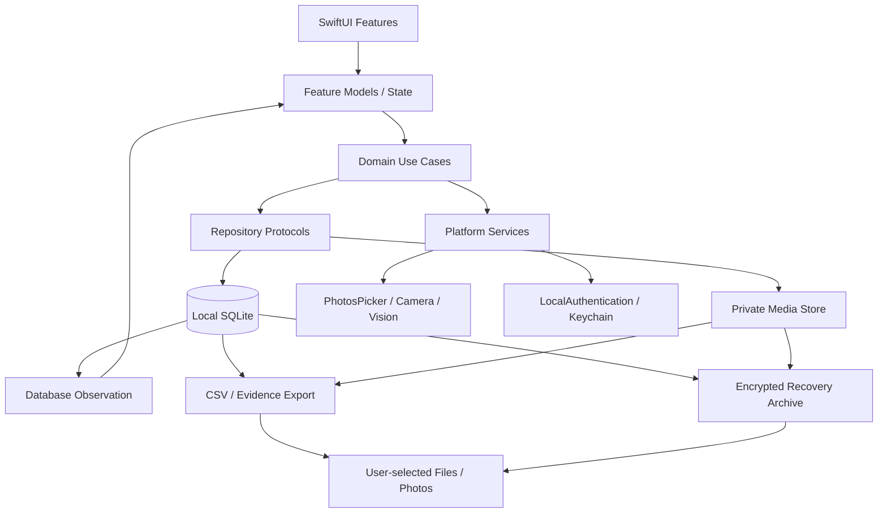

# Mom-Baby MVP 技术架构方案

| 项目 | 内容 |
| --- | --- |
| 文档版本 | v1.1 |
| 日期 | 2026-08-21 |
| 对应产品文档 | `MVP-PRD.md` v0.4 |
| 目标平台 | iPhone，简体中文，中国大陆首发 |
| 推荐发布形态 | 本地优先、无账号、无业务服务端 |
| 文档状态 | **Accepted；P0-L 实施基线** |

> **版本约束：** 本文固定对应 [`MVP-PRD.md`](./MVP-PRD.md) v0.4，并由 [`ADR-001`](./ADR-001-MVP-SCOPE-AND-DATA-BOUNDARY.md) 冻结 P0-L 范围和数据边界。若实现、测试或上架文案与 ADR 冲突，必须先修订 ADR 和 PRD，不能由代码或运营配置静默改变边界。

文档权威顺序为：已接受 ADR 决定边界与不可变约束，PRD 定义产品承诺和验收，本文件分配系统职责；iOS 与归档详细设计定义 P0 实施合同，服务端详细设计定义 P1 架构/安全基线及其协议冻结 Gate。发现冲突时停止受影响项实施并回到上一级文档决策。

## 1. 结论先行

推荐把当前 MVP 拆成四个边界清楚的版本，而不是在首发同时建设本地记录、账号、云同步、多人权限和召回平台。

| 阶段 | 产品能力 | 是否需要 Mom-Baby 服务端 | 建议 |
| --- | --- | --- | --- |
| **P0-L：本地 MVP** | 单宝宝、全部记录、计时、用品追溯、成长、相册、加密归档、导出与删除 | **不需要业务服务端** | 首发范围 |
| **P1-S：本人多设备同步** | 本人账号、跨设备恢复、选择性同步、远程删除 | 需要云能力 | 验证留存后再做 |
| **P1-C：家庭协作** | 邀请、角色权限、撤权、共享照片和记录 | **需要自建服务端** | 独立安全项目 |
| **P1-R0：召回监测** | 官方公告采集、规则版本、疑似匹配、本地通知 | 只需公开签名 feed；匹配在端上完成 | 独立合规项目 |

阶段命名与 PRD v0.4 一致：P0-L 是首发本地范围；P1-S 是本人密文同步；P1-C 是家庭协作；P1-R0 是只分发公开资料、不收用户使用史的最小召回服务。更高级的远程通知或结果上报不属于 P1-R0。

P0-L 的业务数据只写入 App 沙盒，不接账号、不上传业务日志、不接第三方分析 SDK、不需要推送或后台网络权限。上架所需的静态隐私政策、儿童信息处理规则、支持与投诉页面可以由无行为追踪/无分析的静态站点承载，它们不是业务数据服务；静态主机/CDN 的必要 IP 日志和用户主动来信仍按其处理者、用途与保留期披露。P0-L 能完整回答当前 MVP 最重要的问题：快速记录、准确回看、可靠计时、用品批次反查和私密成长记忆。

需要明确的代价是：**“所有业务数据只在端上”与“换机后自动恢复、本人多设备同步、家庭成员共享”不能同时成立。** P0-L 通过本机风险说明和用户主动创建的完整加密归档管理数据丢失风险，不能把本地功能称为 Mom-Baby 云备份。CSV、照片、分享内容或完整归档一旦被用户保存到 Files、Photos 或第三方 App，可能进入 iCloud Drive、iCloud Photos 或其他服务；这些副本由用户和目标服务控制，不再属于“只在 App 私有端上”或 App 删除范围。系统 iCloud Backup 是否可承载这些照护数据也必须单独通过 Apple 政策 Gate，不能当作默认恢复方案。

## 2. 已接受的范围调整

旧版 PRD 把“宝宝私密云空间”列为 P0，但它会立即引入账号、儿童敏感信息上云、选择性迁移、冲突解决、远程删除、设备租约和双设备验收。这一项的工程与合规规模接近第二个产品。自 v0.4 起，以下调整已由 ADR-001 接受：

1. 将 FR-08“账号、宝宝私密云空间与单所有者同步”整体移动到 **P1-S**。
2. P0 文案统一使用“添加照片”“保存在 App 中”，不使用“上传”“云空间”“仅此 iPhone”或“跨设备备份”。
3. 未取得 Apple 对个人健康信息进入 iCloud Backup 的书面解释前，P0 请求将敏感数据库及 App 管理媒体排除系统备份；这仍是系统执行的属性，产品不作“绝不会备份”的绝对承诺。
4. P0 增加“本机数据风险”常驻说明和导出入口；完整可恢复的加密归档不阻塞首轮内部可用性测试，但属于 **公开发布硬 Gate**，除非另一个通过 Apple/法律 Gate 的恢复方案经新 ADR 取代它。
5. P1-C 家庭协作继续保持独立增强包；P1-R0 召回监测继续保持独立能力声明。
6. P0 不申请 CloudKit、Push Notifications 或 Remote notifications 能力；只有进入相应阶段后才增加 entitlement。
7. P0 不上传随机 `install_id` 埋点；PRD §13 改用 Apple 聚合数据和有主持研究。若坚持逐安装 D1/D7，必须另立明确同意、境内短 TTL 遥测服务，并承认 P0 不再是“无服务端”。
8. P1-R0 的 exact/possible 匹配与通知账本为端上实体，状态只承诺已计算/已调度/用户已打开；服务端不保存 `recipient_user_id`。精准服务端推送若保留，必须作为新的显式上报与同意方案。
9. P0 的身份边界为“一次安装对应一个受信任成人”。App 锁只能验证有权使用本机凭证的人，不能识别具体家庭成员；共享设备解锁后不提供人员级隔离，不作“他人无法沿用成人身份”的承诺。
10. P1-S/P1-C 若立项，默认采用零知识 E2EE：恢复只依赖仍获授权的设备或用户持有的高熵恢复密钥；二者全部遗失意味着云端密文永久不可恢复。服务托管恢复属于不同的隐私产品，必须另立 ADR。
11. Files、Photos、Share Sheet 和文档提供程序属于用户主动外部导出边界。导出前必须提示可能发生云同步、App 无法追踪或删除外部副本，并记录的只是本机导出事实而非外部去向。

具体决策、替代方案与后果见 [`ADR-001`](./ADR-001-MVP-SCOPE-AND-DATA-BOUNDARY.md)。

## 3. 方案比较

| 维度 | 纯端上 | CloudKit 私有库 | 自建服务端 |
| --- | --- | --- | --- |
| 首条记录是否依赖账号/网络 | 否 | 本地可用，云同步依赖 iCloud 账号 | 本地可用，云同步依赖账号 |
| 数据是否离开设备 | App 不主动上传；默认请求排除系统备份。用户主动外部导出的副本可能进入云或第三方 | 是，进入用户 iCloud | 是，进入服务控制的基础设施 |
| 本人多设备 | 仅支持用户手动导入完整加密归档；系统整机恢复不属于产品承诺 | 适合 | 适合 |
| 家庭细粒度权限 | 不支持 | 原生共享权限粒度不足 | 可完整实现 |
| 成人与宝宝数据分域 | 本地可严格分表/分仓 | 需要复杂拆区与共享图设计 | 可按安全域强制校验 |
| 冲突策略可控性 | 无跨设备冲突 | `CKSyncEngine` 可控，但需自行解决冲突 | 完全可控 |
| 中国区数据与儿童合规工作 | 最小 | 仍属于云端处理，需专项确认 | 最大，但边界可控 |
| 运维成本 | 最低 | 低到中 | 高 |
| P0 推荐度 | **最高** | 暂不采用 | 暂不建设 |

### 3.1 为什么不把 CloudKit 直接作为首发答案

CloudKit 私有数据库只允许当前 iCloud 用户访问，数据不显示在开发者后台，并计入用户自己的 iCloud 配额；它也支持加密字段、加密资产和 `CKSyncEngine`。这些特性使它很适合普通的“本人多设备同步”候选方案，但“加密字段/资产”不等于 App 可无条件保证的端到端加密：仍有未加密元数据，且只有用户开启 Advanced Data Protection 时相关内容密钥才由所有者/共享参与者独占。

但本产品有四个特殊约束：

- Apple 当前 App Review Guidelines 5.1.3(ii) 对在 iCloud 中存储个人健康信息有明确限制。宝宝生长、喂养和照护记录是否全部落入该口径，需要在采用前取得 Apple 与法律层面的明确结论，不能靠工程团队自行解释。
- CloudKit 写权限是共享记录层级权限，不能直接表达“照护者只允许修改自己创建的记录、所有者不能读取另一位成人的吸奶明细”这一整套资源级授权。
- PRD 要求选择性上传不同数据类别、显式冲突保留、设备租约和服务端删除时限；自动镜像式同步不适合隐藏这些关键状态。
- CloudKit 仍然是云端处理，不等于“所有数据只在端上”。

因此 CloudKit 仅保留为研究项，在当前 ADR 下不是 P1-S 可选实现。只有先取得 Apple 书面确认、完成能力验证，并由新的 Accepted ADR 证明它满足零知识承诺或明确撤销该承诺，才允许进入选型；届时若使用，应以 `CKSyncEngine` 对接自有本地模型，不直接让 SwiftData/Core Data 自动镜像全部数据。

## 4. P0-L 总体架构

关键原则：

- **本地写入是唯一提交点。** UI 只有在数据库事务成功后显示保存成功。
- **原始事实是权威源。** 汇总、计时时长、月龄和图表全部可重算。
- **网络不是依赖。** P0 没有“网络失败导致记录失败”的状态。
- **大文件不进数据库。** SQLite 只保存媒体元数据和相对路径，图片保存在受保护的 App 私有目录。
- **未来同步不污染领域层。** `SyncEngine` 是可选适配器；P0 使用 `NoSyncService`。
- **儿童与哺乳者是两个授权域。** 即使都在一个本地数据库中，也不通过 `baby_id` 推导成人数据读取权。
- **本机不是多用户安全域。** P0-L 一次安装只绑定一个受信任成人；系统生物认证只作为设备凭证门禁，不证明操作者姓名或家庭角色。
- **外部导出是显式边界穿越。** 系统选择器中的 iCloud/第三方位置由用户控制，App 在确认前提示风险，之后无法撤回或级联删除副本。

### 4.1 PRD 需求分配

| PRD 章节 | P0-L 客户端 | 后续云/服务端 |
| --- | --- | --- |
| FR-01 首次使用与档案 | 全部实现；同意记录保存在设备 | 云端时重新取得对应范围同意 |
| FR-02 今日与时间线 | 全部本地查询、汇总和观察 | 协作版增加记录人和同步状态 |
| FR-03 喂养/吸奶/用品 | 全部实现；OCR、扫码与追溯反查均端上 | 只同步完成事实；召回规则由 P1-R0 分发 |
| FR-04 尿布 | 全部实现 | 可选同步 |
| FR-05 睡眠 | 全部实现；不依赖后台常驻 | 协作版只发布短期只读状态 |
| FR-06 生长 | 全部实现；标准数据随 App 版本发布 | 可选同步，不做服务端诊断 |
| FR-07 照片 | PhotosPicker/相机、本地展示副本、导出 | 云上传和短时下载授权移到 P1-S |
| FR-08 账号与云空间 | 不实现 | 整体属于 P1-S |
| FR-09 导出/删除/注销 | 本地导出、完整加密归档与删除；无账号所以无注销 | 云删除、注销和备份淘汰属于 P1-S |
| FR-C01 家庭协作 | 不实现 | 整体属于 P1-C |
| P1-R0 召回监测 | P0 仅保存证据和主动打开官方入口 | 公开公告服务 + 端上匹配 |

## 5. 客户端技术基线

| 项目 | 推荐 |
| --- | --- |
| 语言 | Swift 6 严格并发检查 |
| UI | SwiftUI，Observation，NavigationStack/TabView |
| 最低系统 | 暂定 iOS 18.0；在目标用户设备调研后最终确认 |
| 持久化 | SQLite + GRDB；不用当前模板中的 `Item`/SwiftData 模型 |
| 媒体 | PhotosPicker、相机、ImageIO、Vision，全程端上处理 |
| 安全 | Data Protection Complete、Keychain、可选 Face ID/Touch ID App 锁 |
| 通知 | P0 不请求通知权限；未来 Backlog 的本机提醒只使用本地通知，锁屏文案不含敏感值 |
| 依赖管理 | Swift Package Manager；首发尽量只保留 GRDB 一个运行时依赖 |
| 日志 | Unified Logging，敏感字段统一标记 private；不上传业务日志 |
| 测试 | Swift Testing/XCTest、数据库集成测试、XCUITest、真实设备恢复测试 |

选择 GRDB 的原因不是偏好某个 ORM，而是当前领域存在复合唯一约束、部分唯一索引、不可变版本行、显式事务、幂等操作和未来手写同步协议。SwiftData 足以实现一般本地记录；本项目基于约束表达力、故障注入能力和迁移可控性选择 GRDB，并且只保留一套生产持久化模型。

详细客户端设计见 [`MVP-IOS-TECHNICAL-DESIGN.md`](./MVP-IOS-TECHNICAL-DESIGN.md)，公开发布所需的恢复格式见 [`MVP-LOCAL-ARCHIVE-SPEC.md`](./MVP-LOCAL-ARCHIVE-SPEC.md)。

## 6. 服务端结论与演进路径

### 6.1 P0-L

不建设 API、账号系统、数据库、对象存储、推送和管理后台。App 也不预埋空请求、不生成或上传远端设备标识，不接“以后再用”的第三方 SDK；客户端内部仍可使用不出设备的安装/数据集 UUID 保证引用稳定。

### 6.2 P1-S 本人同步

立项时先做两周技术/合规 Spike：

1. **默认路线：中国区自建密文同步服务。** 能完整控制数据域、删除、审计和未来协作，但需要更高安全与合规投入。
2. **仅作为不可选研究项：CloudKit 私有库 + CKSyncEngine。** 运维最轻，但 Apple 当前协议对敏感、可识别健康信息使用 iCloud/CloudKit 有明确限制；当前 ADR 只允许调研。采用前必须取得 Apple 书面确认、解决选择性同步/删除，并由新 Accepted ADR 处理其与零知识承诺的冲突。

无论选择哪条路径，P0 的本地数据库仍是 UI 的读取源；云端只是增量复制目标，不能把联网请求放到保存主路径。

默认恢复模型为零知识：服务端只保存密文、设备 envelope 和恢复 envelope，无法代替用户解密。新设备必须由仍获授权的设备批准，或由用户输入单独保存并已校验过的高熵恢复密钥；全部恢复路径丢失时，服务端不能恢复业务内容。首次上云、恢复密钥 UX、历史 epoch 和迁移 cutover 均属于 P1-S 上线 Gate，而不是 P0 预埋能力。

### 6.3 P1-C 家庭协作

采用自建服务端。原因是必须服务端强制执行成员角色、创建者权限、邀请认领、撤权、短期媒体 URL、成人数据隔离和离线租约。只在客户端隐藏按钮不构成授权。

### 6.4 P1-R0 召回监测

服务端负责抓取/人工审核官方公告、生成不可变规则版本和签名规则包；客户端在端上用自己的奶粉/奶瓶数据完成匹配。P1-R0 只在前台拉取 feed，因此服务端不接收 APNs token、宝宝喝过什么、何时喝过或具体批次。通用远程更新提醒和精准远程推送都**不属于 P1-R0**：前者需要新 ADR、独立通知阶段、通知同意和短期 token，后者还需要另行批准的结果上报与更严格的数据最小化方案。

P1 架构与安全蓝图见 [`MVP-SERVER-TECHNICAL-DESIGN.md`](./MVP-SERVER-TECHNICAL-DESIGN.md)。该文档不代替 OpenAPI、密码 profile、可执行服务端 schema 或 P1 iOS 同步设计；这些机器可读合同是各 P1 阶段开始 production 实现前的独立 Gate。

## 7. 数据边界

### 7.1 P0 会保存在设备上的数据

- 宝宝昵称、出生日期、参考分组、家庭时区和头像；
- 喂养、尿布、睡眠、生长、照片和备注；
- 哺乳者左右侧与吸奶明细；
- 奶粉产品、实体包装、批次、溯源码、奶瓶和证据图；
- 监护人/成人同意记录；
- 计时 session、channel、segment 和幂等操作记录；
- 导出历史、数据库版本和本地维护状态。

### 7.2 P0 不收集或不保存的数据

- 手机号、邮箱、通讯录、精确位置、广告标识符；
- 未经用户选择的照片库内容；
- 用户扫描的未知二维码对应网页内容；
- 第三方分析标识或跨 App 行为；
- App 与 Mom-Baby 业务后端不收集远端 IP、服务端业务日志或云端账号，因为 P0 没有业务后端；静态主机/CDN 的必要访问日志和用户主动联系内容按 ADR-001 §2.3/§9 单独披露与限期保留。

### 7.3 系统备份政策 Gate

Apple 当前 App Review Guidelines 5.1.3(ii) 使用广义的 “iCloud”，Developer Program License Agreement 也把 iCloud 与 CloudKit 一并列入相关 Apple 服务。没有 Apple 书面解释前，不能推定“只禁止 CloudKit、允许相同数据进入 iCloud 设备备份”。P0 采用保守基线：

- 数据库、WAL/SHM、用户媒体、trash、导入 journal 和迁移快照均请求 `isExcludedFromBackup=true`；
- 每次创建、复制、下载或最终原子移动后重新设置并读回校验，而不是依赖目录继承；
- 该属性由系统执行，App 只能请求并测试，不能宣传“绝不进入任何备份”；
- Finder/iCloud 的历史备份无法由 App 远程清除；从旧版本备份恢复时必须检测并提示重新核对；
- 排除备份且没有用户主动归档时，卸载、设备丢失或损坏会造成永久丢失；
- 若 Apple 书面确认设备备份可用，再通过单独 ADR 决定是否改为 opt-in，而不是静默改变已告知的边界。

### 7.4 用户主动导出的边界

- CSV、证据图、成长照片和加密归档仅在用户明确操作后交给系统选择器或分享面板；App 不预选云端目的地。
- 目标可以是“在我的 iPhone 上”、iCloud Drive、iCloud Photos 或第三方 File Provider/App。确认页必须说明目标方可能复制、同步和保留内容。
- 明文 CSV、照片及分享内容不提供“仍仅在端上”承诺；完整恢复归档必须始终加密，但加密不等于 App 能控制其外部生命周期。
- App 内删除只删除 App 管理的数据库、媒体和临时文件，不声称会删除用户已导出的外部副本。
- 保存成长照片到 Photos 前单独说明其可能随 iCloud Photos 同步；权限拒绝不影响 App 私有副本。

## 8. 安全与隐私基线

| 控制点 | P0-L 要求 |
| --- | --- |
| 文件保护 | 数据库、WAL/SHM、照片、证据图均使用 `NSFileProtectionComplete` |
| 系统备份 | 未通过 Apple 政策 Gate 前，对全部敏感持久文件逐次请求排除并读回验证；不作绝对保证 |
| App 锁 | 用户可开启 Face ID/Touch ID；进入后台立即遮挡应用快照 |
| 人员边界 | 一次安装对应一个受信任成人；LocalAuthentication 不是家庭成员身份识别，设备凭证共享会共享 App 访问能力 |
| Keychain | 仅保存设备侧认证机密和 App 锁保护材料；使用 ThisDeviceOnly 可访问级别。可跨设备恢复的归档密钥不能只存在本机 Keychain |
| 日志 | 不记录昵称、备注、奶量、体重、批次原文、路径或照片标识 |
| 权限 | PhotosPicker 不申请完整照片库；相机仅在主动拍摄时申请 |
| EXIF | 导入后移除 GPS、设备序列等非必要元数据，只保留方向与经确认的拍摄时间 |
| 剪贴板/分享 | 不自动写剪贴板；导出只能由用户主动触发，确认页明确外部副本、云同步和删除边界 |
| 第三方 SDK | 无广告、无分析、无行为回放、无远端配置 SDK |
| 医疗边界 | 只展示事实、趋势和来源，不输出正常/异常或安全结论 |

中国《个人信息保护法》将不满十四周岁未成年人的信息列为敏感个人信息，要求取得监护人同意并制定专门处理规则；《儿童个人信息网络保护规定》还要求显著告知、明确存储地点/期限和最小授权。纯端上会显著缩小攻击面和外部处理者范围，但不替代同意、删除、隐私说明和安全设计。

## 9. 非功能目标分解

| 目标 | 技术落点 |
| --- | --- |
| 冷启动 p95 < 2 秒 | 启动只开数据库与读取首页小查询；媒体和历史分页延迟加载 |
| 保存反馈 p95 < 300 ms | 单一 SQLite 事务；不做网络或图像处理同步阻塞 |
| 10,000 条事件 | 时间、宝宝、类型、删除状态复合索引；首页只查目标日 |
| 1,000 张照片 | 数据库仅存元数据；缩略图按可见区域解码；原图不进内存缓存 |
| 杀进程计时恢复 | 保存绝对时间和原始分段，不依赖内存计数器 |
| 可迁移 | 版本化数据库 migration；每次迁移前完成一致性检查和恢复演练 |
| 可访问性 | 语义标签、动态字体、44 pt 点击区、图表文本替代和非颜色编码 |
| 可审计 | consent、operation id、不可变用品版本、删除时间和导出清单均结构化保存 |

## 10. 交付计划

| 里程碑 | 主要交付 | 退出条件 |
| --- | --- | --- |
| T0 架构基线 | Swift 6、App/MainActor 与 Core 非隔离模块、GRDB、完整 v1 DDL、migration、时钟/UUID 注入、测试基座 | 并发诊断为零；所有 schema 不变量、空库创建、升级、损坏恢复测试通过 |
| T1 档案与首页 | 基础同意、宝宝/哺乳者档案、时间线查询、首页汇总、模块偏好持久化 | 离线重启后数据一致；模块隐藏不影响历史入口 |
| T2 核心记录 | 亲喂/吸奶状态机、奶瓶、尿布、睡眠 | 双击、后台、杀进程、异常时钟用例通过 |
| T3 用品追溯 | 奶粉/奶瓶版本、端上 OCR/扫码、证据图、使用反查 | 历史版本不静默变化，证据可放大/解码 |
| T4 成长与相册 | 标准数据、曲线、PhotosPicker、相机、缩略图 | 月龄、EXIF、批量跨日和容量用例通过 |
| T5 数据控制 | 同意撤回/重新同意、CSV/证据导出、加密恢复归档、删除、可选 App 锁、备份排除和恢复提示 | 撤回状态机、归档跨版本恢复、数据主体隔离、最佳努力物理清理和旧备份恢复旅程通过 |
| T6 上线准备 | 无障碍、性能、Privacy Manifest、隐私标签、静态政策/支持页、法律复核与真实网络流量核验 | PRD 全部 P0-L 旅程和发布 Gate 通过；归档或经新 ADR 批准的恢复替代方案可用 |

P1-S/P1-C/P1-R0 分别立项，不在 P0 工程中预先实现半成品。

### 10.1 P0-L 指标如何验证

无服务端、无分析 SDK 时，PRD 中部分漏斗指标不能自动回传。首发阶段采用：

- App Store Connect/TestFlight 在用户同意范围内提供的聚合安装、崩溃和使用指标；
- 不少于 10 名目标用户的有主持任务测试，测首次记录、尿布和常规瓶喂耗时；
- 自动化测试记录计时完整性、保存延迟和数据一致性；
- 可选的本地诊断页只展示无业务值的耗时桶和结果，由内测用户主动导出给团队。

因此“激活率、首条记录耗时、D1/D7”在 P0-L 应标注为研究样本或 Apple 聚合口径，不能假装拥有逐用户服务端埋点。若未来增加自有分析收集，必须独立同意、更新隐私标签，并继续禁止上传记录类型和业务值。

### 10.2 P0-L 主发布 Gate

| Gate | 必须提供的证据 | 未通过时的处理 |
| --- | --- | --- |
| G0 范围与出站 | Release entitlement/二进制/真实设备流量审计证明无 CloudKit、APNs、remote notification、账号、分析或业务 API | 禁止提交审核 |
| G1 数据正确性 | v1 DDL 全部约束测试、计时状态机随机序列、时区/出生日期/用品版本/汇总 golden tests 通过 | 阻断对应功能合并 |
| G2 崩溃与迁移 | 每个媒体导入/删除 journal 状态的 kill-and-resume、低空间迁移、newer-schema fail-closed、数据库恢复演练通过 | 禁止升级或公开发布 |
| G3 恢复能力 | 完整加密归档格式冻结；真机跨版本导出/导入、错误口令、损坏、资源耗尽和取消清理测试通过 | 内测可继续；禁止公开发布 |
| G4 删除与残留 | 业务不可访问、文件/journal 清理、WAL 截断、快照/导出 staging 清理和整库删除扫描通过；文案不承诺闪存取证擦除 | 禁止宣称删除完成 |
| G5 隐私与合规 | 律师复核、儿童专门处理规则、Privacy Manifest、App Store 隐私标签、静态隐私/支持/投诉页和权限文案签字 | 禁止提交审核 |
| G6 体验与质量 | PRD P0-L 旅程对应 test ID 全绿；性能、VoiceOver、动态字体、320 pt、iPad 兼容与支持系统真机 smoke 通过 | 禁止发布候选版本 |

Gate 证据必须绑定 commit、构建号、测试环境和审核人；口头确认或只在模拟器通过不算完成。P1-S/P1-C/P1-R0 使用各自详细设计中的独立 Gate，不能复用 P0 的“无服务端”结论。

## 11. 当前工程审计

当前原生工程仍是 Xcode SwiftData 模板：`ContentView.swift` 只展示 `Item` 列表，`Mom_BabyApp.swift` 只注册一个 `Item` 模型。开始正式开发时应删除模板领域模型，按客户端设计文档建立数据库和功能壳。

另外当前工程存在七个需要在 T0 处理的问题：

1. 最低部署版本为 iOS 26.5，覆盖面过窄；建议先改为 iOS 18.0，再用真实目标用户设备数据确认。
2. entitlements 已声明 CloudKit，但容器列表为空。
3. `Info.plist` 已声明 `remote-notification`，entitlements 也声明 APNs development；本地 P0 不需要这些权限。
4. App target 仍是 Swift 5，并设置 `SWIFT_DEFAULT_ACTOR_ISOLATION = MainActor`；这与非主线程数据库/媒体设计冲突。T0 将 App/Feature 保持 MainActor，同时把 Domain/Persistence/Media worker 放入 Swift 6、默认 nonisolated 的 Local Swift Package targets。
5. iPhone 当前仍声明左右横屏，与首版只支持竖屏的产品假设不一致；产品确认后统一工程配置和 UI 测试矩阵。
6. 工程还没有 Local Swift Package 或测试 target，无法兑现模块隔离、数据库集成测试和 XCUITest Gate；T0 必须先建立测试基座再开发业务页面。
7. 工程未冻结 `zh-Hans` 开发语言/本地化资源，AppIcon 与 AccentColor 也仍是模板资产；分别纳入 T0 配置核验和 T6 上架资产验收。

本轮只冻结产品与技术文档，不修改工程配置；T0 开始时按上述清单执行并以工程 diff 复核所有签名能力。

## 12. 已接受决策登记

| ID | 已接受决定 | 实施影响 |
| --- | --- | --- |
| D-01 | P0 移除 Mom-Baby 云空间 | 无账号/业务后端；FR-08 移至 P1-S |
| D-02 | 系统备份在 Apple 书面确认前请求排除 | 设备损坏可能丢失；属性必须逐文件校验，不能作绝对保证 |
| D-03 | 完整加密归档是公开发布硬 Gate | 冻结格式、恶意导入防护和跨版本恢复测试 |
| D-04 | 最低 iOS 版本暂定 18.0 | T0 用目标用户设备数据复核覆盖率后方可提高 |
| D-05 | P1 默认境内自建零知识密文云；CloudKit 仅可研究，采用须 Apple 书面确认和新 ADR | 服务端不可解密；恢复密钥丢失可能永久丢失 |
| D-06 | P0 不上传 `install_id` 或行为分析 | 指标使用 Apple 聚合、有主持研究和用户主动导出诊断 |
| D-07 | P1-R0 不上传用品或命中结果 | 公开签名 feed，端上匹配与本地通知 |
| D-08 | 一次安装对应一个受信任成人 | 不承诺共享设备上的人员级隔离；LocalAuthentication 只作设备门禁 |
| D-09 | 用户主动导出会离开 App 控制边界 | 导出前告知；App 删除不级联到 Files/Photos/第三方副本 |
| D-10 | 上架必须完成法律、隐私标签与实际流量复核 | 即使无业务后端，也必须提供无行为分析的静态政策、支持和投诉页面，并披露托管/邮件必要处理 |

以上决定已由 ADR-001 接受，客户端方案可进入技术拆分。任何改变数据离机方式、身份信任边界或恢复能力的需求都必须先提交新 ADR。

## 13. 参考资料

- [Apple：App Privacy Details](https://developer.apple.com/app-store/app-privacy-details/)：只在设备处理的数据不属于 App Store 隐私标签口径下的“收集”。
- [Apple：Encrypting Your App’s Files](https://developer.apple.com/documentation/uikit/encrypting-your-app-s-files)：个人数据应使用最强文件保护等级。
- [Apple：PhotosPicker](https://developer.apple.com/documentation/swiftui/view/photospicker%28ispresented%3Aselection%3Amaxselectioncount%3Aselectionbehavior%3Amatching%3Apreferreditemencoding%3A%29)：只访问用户明确选择的照片，无需完整照片库授权。
- [Apple：CloudKit private database](https://developer.apple.com/documentation/cloudkit/ckcontainer/privateclouddatabase)：私有库默认仅用户访问并计入用户 iCloud 配额。
- [Apple：CloudKit encryptedValues](https://developer.apple.com/documentation/cloudkit/ckrecord/encryptedvalues)：加密字段的范围、未加密引用及 Advanced Data Protection 条件。
- [Apple：Deciding whether CloudKit is right for your app](https://developer.apple.com/documentation/cloudkit/deciding-whether-cloudkit-is-right-for-your-app)：自动镜像、`CKSyncEngine` 与底层 API 的选择边界。
- [Apple：App Review Guidelines](https://developer.apple.com/app-store/review/guidelines/)：儿童、健康数据、隐私政策和 iCloud 存储要求。
- [Apple Developer Program License Agreement](https://developer.apple.com/support/terms/apple-developer-program-license-agreement/)：除非 Apple 书面允许，不得用包括 iCloud/CloudKit 在内的 Apple 服务维护或传输敏感、可识别健康信息。
- [Apple：Optimizing data for iCloud Backup](https://developer.apple.com/documentation/foundation/optimizing-your-app-s-data-for-icloud-backup)：备份排除属性及系统备份边界。
- [Apple：LocalAuthentication](https://developer.apple.com/documentation/localauthentication)：系统认证只返回凭证验证结果，应作为 App 自有身份边界的补充。
- [Apple：Providing access to directories](https://developer.apple.com/documentation/uikit/providing-access-to-directories)：用户可选择本机、iCloud 或第三方 File Provider 目录。
- [Apple：PhotoKit](https://developer.apple.com/documentation/photokit)：系统照片库可能由 iCloud Photos 管理和同步。
- [Apple：中国大陆 iCloud 说明](https://support.apple.com/zh-cn/111754)：中国大陆 iCloud 由云上贵州运营。
- [中华人民共和国个人信息保护法](https://www.npc.gov.cn/WZWSREL25wYy9jMi9jMzA4MzQvMjAyMTA4L3QyMDIxMDgyMF8zMTMwODguaHRtbD9yZWY9aW1i)：敏感个人信息、单独同意与未满十四周岁处理要求。
- [儿童个人信息网络保护规定](https://www.cac.gov.cn/2019-08/23/c_1124913903.htm)：监护人告知同意、专门规则和最小授权要求。
